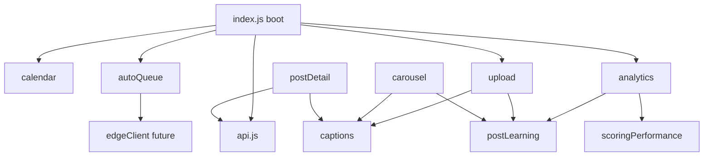

# Admin Social — Feature Responsibility Map

**Date:** 2026-05-19  
Maps **feature/process areas** to current files and proposed future modules.  
**Rule:** Behavior unchanged during refactor; moves are copy-extract-reexport first.

---

## 1. Page boot / init

| | Detail |
|---|--------|
| **Current files** | `index.js` (`init`, `DOMContentLoaded`, `setupTabs`, module `init*` calls) |
| **Future modules** | `index.js` (thin), `boot/registerModules.js`, `boot/tabRouter.js` |
| **Dependencies** | All feature `init(deps)` |
| **Risk** | **High** — wrong init order breaks page |

---

## 2. Shared state / settings

| | Detail |
|---|--------|
| **Current files** | `index.js` (`state` object), `platformSettings.js`, `api.fetchSettings` / `updateSetting`, `autoQueue.js` (`social_settings.auto_queue`) |
| **Future modules** | `state/socialState.js` (products, categories, boards, templates), `state/settingsState.js`, feature-local state where possible |
| **Dependencies** | `api.js` / `settingsApi.js` |
| **Risk** | **High** — stale state if split carelessly |

---

## 3. API / Supabase access

| | Detail |
|---|--------|
| **Current files** | `api.js` (monolithic CRUD) |
| **Future modules** | `services/postsApi.js`, `services/assetsApi.js`, `services/templatesApi.js`, `services/boardsApi.js`, `services/settingsApi.js`, `services/storageApi.js`, `api.js` (re-export barrel for compat) |
| **Dependencies** | `supabaseClient`, `postStatus` |
| **Risk** | **Medium** — keep barrel exports until imports updated |

---

## 4. Edge function access

| | Detail |
|---|--------|
| **Current files** | Scattered: `index.js`, `autoQueue.js`, `autopilot.js`, `captions.js`, `postLearning.js`, `imagePool.js`, `uploadModal.js`, `carouselBuilder.js`, `analytics.js` |
| **Future modules** | `services/edgeClient.js` — `invokeEdge(name, body)`, `getFunctionsBaseUrl()` from `env.js` only |
| **Dependencies** | `env.js`, session JWT / anon key pattern per function |
| **Risk** | **Medium** — auth header mistakes break posting |

**Functions called from admin JS:**

| Function | Callers |
|----------|---------|
| `auto-queue` | `autoQueue.js` |
| `auto-repost` | `autoQueue.js` |
| `autopilot-fill` | `autopilot.js` |
| `instagram-insights` | `analytics.js` |
| `ai-generate` | `captions.js`, `postLearning.js`, `uploadModal.js`, `carouselBuilder.js` |
| `ai-tag-assets` | `imagePool.js` |
| `instagram-oauth`, `pinterest-oauth` | `index.js` |
| `instagram-post`, `facebook-post`, `pinterest-post` | `index.js`, `postDetail` flow |
| `pinterest-boards`, `sync-pinterest-boards` | `index.js` |

---

## 5. Auto-queue

| | Detail |
|---|--------|
| **Current files** | `autoQueue.js`, HTML `#tab-autoqueue`, edge `auto-queue` |
| **Future modules** | `features/autoQueue/autoQueueController.js`, `autoQueueSettings.js`, `autoQueuePreview.js`, `autoQueueScoringUI.js`, `autoQueueRepost.js` |
| **Dependencies** | `edgeClient`, `settingsApi`, `postStatus` |
| **Risk** | **High** — Phase 3 scoring/guards recently shipped |

---

## 6. Autopilot

| | Detail |
|---|--------|
| **Current files** | `autopilot.js`, panel inside auto-queue tab |
| **Future modules** | `features/autopilot/autopilotController.js`, `autopilotSettings.js` |
| **Dependencies** | `edgeClient`, `social_settings` |
| **Risk** | **Low–medium** |

---

## 7. Image pool

| | Detail |
|---|--------|
| **Current files** | `imagePool.js`, `imageProcessor.js`, `#tab-assets` |
| **Future modules** | `features/imagePool/imagePoolController.js`, `imagePoolUpload.js`, `imagePoolFilters.js`, `imagePoolTagging.js` |
| **Dependencies** | `assetsApi`, `edgeClient` (`ai-tag-assets`) |
| **Risk** | **Medium** — hardcoded URL in pool |

---

## 8. Analytics (tab)

| | Detail |
|---|--------|
| **Current files** | `analytics.js`, `scoringPerformance.js`, `#tab-analytics` |
| **Future modules** | `features/analytics/analyticsController.js`, `analyticsOverview.js`, `analyticsTopPosts.js`, `analyticsPostModal.js`, `scoringPerformance.js` (moved) |
| **Dependencies** | `postLearning.js`, `postsApi`, `edgeClient` |
| **Risk** | **High** |

---

## 9. Scoring performance (read-only)

| | Detail |
|---|--------|
| **Current files** | `scoringPerformance.js` (imported by `analytics.js`) |
| **Future modules** | `features/analytics/scoringPerformance.js` (no logic change) |
| **Dependencies** | `postStatus`, `social_posts` read |
| **Risk** | **Low** |

---

## 10. Post learning engine

| | Detail |
|---|--------|
| **Current files** | `postLearning.js` |
| **Future modules** | `features/learning/postAnalysis.js`, `learningAggregates.js`, `learningRecommendations.js`, `categoryResearch.js`, `learningConstants.js` (`BEST_PRACTICES`) |
| **Dependencies** | `postsApi`, `edgeClient`, multiple learning tables |
| **Risk** | **Very high** — split last or in small vertical slices |

---

## 11. Post detail modal

| | Detail |
|---|--------|
| **Current files** | `postDetail.js`, post modal HTML |
| **Future modules** | `features/posts/postDetailModal.js`, `postDetailRender.js` |
| **Dependencies** | `captions` formatters, `api`, publishing from `index.js` |
| **Risk** | **Medium** |

---

## 12. Queue / calendar post management

| | Detail |
|---|--------|
| **Current files** | `index.js` (`loadQueuePosts`, `loadCalendarPosts`), `calendar.js`, `api.fetchPosts` |
| **Future modules** | `features/posts/queueList.js`, `features/calendar/calendarController.js` (rename `calendar.js`) |
| **Dependencies** | `postsApi`, `openPostDetail` |
| **Risk** | **Medium** |

---

## 13. AI generation (captions / hashtags)

| | Detail |
|---|--------|
| **Current files** | `captions.js`, call sites in upload/carousel/postLearning |
| **Future modules** | `features/ai/captionService.js`, `hashtagService.js`, `templateService.js` |
| **Dependencies** | `edgeClient` (`ai-generate`) |
| **Risk** | **Medium** |

---

## 14. Publishing / platform actions

| | Detail |
|---|--------|
| **Current files** | `index.js` (`postToInstagram`, etc.), `postDetail.js` triggers |
| **Future modules** | `features/platforms/publishActions.js`, `oauthHandlers.js` |
| **Dependencies** | `edgeClient`, tokens in `social_settings` |
| **Risk** | **High** — production posting |

---

## 15. Platform connections / OAuth / settings

| | Detail |
|---|--------|
| **Current files** | `index.js` OAuth, `platformSettings.js`, connect buttons in HTML |
| **Future modules** | `features/platforms/platformConnections.js`, `platformSettings.js`, `graphApiClient.js` (FB/IG profile) |
| **Dependencies** | `settingsApi`, Graph API tokens |
| **Risk** | **Medium** |

---

## 16. Templates & boards (legacy tabs)

| | Detail |
|---|--------|
| **Current files** | `index.js` (`setupTemplates`, `renderBoardList`, `loadBoards`) |
| **Future modules** | `features/templates/templatesController.js`, `features/boards/boardsController.js` |
| **Dependencies** | `api.js` |
| **Risk** | **Low–medium** (Templates tab hidden) |

---

## 17. Upload modal (new post)

| | Detail |
|---|--------|
| **Current files** | `uploadModal.js`, `imageProcessor.js` |
| **Future modules** | `features/upload/uploadModalController.js`, `uploadSteps/imageStep.js`, `uploadSteps/captionStep.js` |
| **Dependencies** | `captions`, `assetsApi`, `carouselBuilder` score callbacks |
| **Risk** | **High** |

---

## 18. Carousel builder

| | Detail |
|---|--------|
| **Current files** | `carouselBuilder.js` |
| **Future modules** | `features/carousel/carouselController.js`, `carouselScoring.js` |
| **Dependencies** | Same as upload for scoring hooks |
| **Risk** | **Medium** |

---

## 19. Utilities / helpers

| | Detail |
|---|--------|
| **Current files** | Duplicated in many files: `escapeHtml`, number format, date format, `$` / `getElementById` wrappers |
| **Future modules** | `utils/dom.js`, `utils/formatters.js`, `utils/dates.js`, `utils/html.js` |
| **Dependencies** | None |
| **Risk** | **Low** — **start here (Phase 4b)** |

---

## 20. DOM / render helpers

| | Detail |
|---|--------|
| **Current files** | Inline template strings in every large module |
| **Future modules** | Small render functions colocated per feature (avoid abstract “framework”) |
| **Risk** | **Low** if extracted with same HTML strings |

---

## Dependency graph (simplified)

**Refactor order implication:** `utils` → `edgeClient` → `autoQueue` split → `analytics` split → `postLearning` split → slim `index` → optional HTML.
