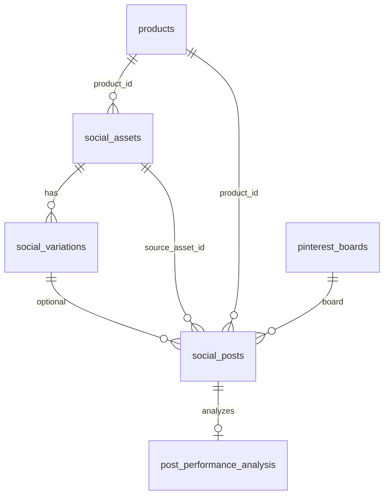

# Admin Social — Data Model

**Canonical store:** Supabase Postgres + Storage bucket `social-media` (public read).

Schema evolved across many migrations; **status values and naming may conflict** between migrations (see uncertainties).

---

## Core content tables

### `social_assets` (image pool)

| Column (important) | Purpose |
|--------------------|---------|
| `original_image_path` | Storage path in `social-media` |
| `product_id` | Optional link to `products` |
| `shot_type`, `quality_score` | Pool tagging v1 |
| `used_count`, `last_used_at` | Usage tracking |
| `is_active` | Soft hide; unique index on path when active |

### `social_variations`

Cropped/format variants per asset (`square_1x1`, `portrait_4x5`, etc.). Linked to `social_assets`. Used when creating posts via upload flow.

### `social_posts` (queue + history)

| Column (important) | Purpose |
|--------------------|---------|
| `variation_id` | FK to variation (legacy path) |
| `product_id`, `image_url` | Direct post without variation |
| `platform` | `instagram`, `pinterest` (Facebook may appear in processors) |
| `caption`, `hashtags`, `link_url` | Content; links often include UTM params |
| `scheduled_for`, `status` | Scheduling lifecycle |
| `instagram_media_id`, `instagram_permalink`, `permalink` | Platform IDs |
| `pinterest_board_id`, `pinterest_pin_id` | Pinterest |
| `media_type`, `image_urls` | Carousel support |
| `source_asset_id`, `selection_metadata` | Pool/autopilot provenance |
| `likes`, `comments`, `saves`, `reach`, `impressions`, `engagement_rate`, `engagement_updated_at` | Insights |
| `posted_at`, `published_at` | Publish timestamps |
| `error_message`, `retry_count` | Failures |

**Status uncertainty:** Migrations define overlapping sets:

- Initial: `draft`, `queued`, `approved`, `posting`, `posted`, `failed`
- `fix_social_tables`: adds `published`, migrates `posted` → `published`
- `add_deleted_status`: `draft`, `pending`, `scheduled`, `queued`, `posting`, `posted`, `failed`, `deleted`
- `process-scheduled-posts` uses **`processing`** (may not be in CHECK constraint)

UI/analytics often query `status = 'posted'` — verify live DB.

### `social_settings`

Key/value JSONB, e.g.:

- `instagram_connected`, `instagram_access_token`, token expiry
- `pinterest_connected`, boards cache
- `autopilot`, `repost`, `auto_approve`, `default_tone`, `posting_schedule`
- `autopilot_last_run` (per revamp notes)

### `pinterest_boards`

Local board registry mapped to categories / Pinterest API IDs.

### `social_caption_templates`

Tone-based templates (`casual`, `professional`, `urgency`); hidden from UI but used as fallback.

### `social_category_hashtags`

Default hashtag sets per `categories`.

---

## AI / generated content

### `social_generated_images`

AI-generated images (`pending_review`, `approved`, `rejected`); used by `generate-social-image` and optionally auto-queue. `carousel_set_id` for sets.

### `image_blacklist` (pipeline migration)

Excluded images for generation pipeline.

---

## Analytics / learning tables

| Table | Purpose |
|-------|---------|
| `post_performance_analysis` | Per-post scored breakdown |
| `post_learning_patterns` | Aggregated patterns (`pattern_type`, `pattern_key`, JSON value) |
| `hashtag_performance` | Per-hashtag aggregates |
| `posting_time_performance` | Hour/day engagement aggregates |
| `caption_element_performance` | Caption feature performance (migration) |
| `social_hashtag_analytics` | Per-post hashtag snapshots |
| `social_engagement_snapshots` | Time-series snapshots (migration name from engagement file) |

**Views:** `hashtag_performance` may exist as view or table depending on migration order (`post_learning_engine` drops/recreates).

---

## Product integration

- `products.last_social_post_at` — updated when posts created/deleted (`api.recalculateProductPostDate`)
- View `products_needing_social_posts` (migration) — catalog for auto-queue

---

## Storage

| Bucket | Access | Content |
|--------|--------|---------|
| `social-media` | Public read; auth write | Originals, variations, uploads |

`getPublicUrl()` in `api.js` builds public URLs for Graph API posting.

---

## Relationships (simplified)

---

## Schema uncertainties

1. **Which `status` CHECK is live** after multiple migrations.
2. **`posted` vs `published`** — code paths differ.
3. **`processing` status** in edge function vs DB constraint.
4. Whether all learning tables are populated in production or only seeded defaults.
5. **Facebook** as `platform` on `social_posts` vs only side-effect of IG post.
