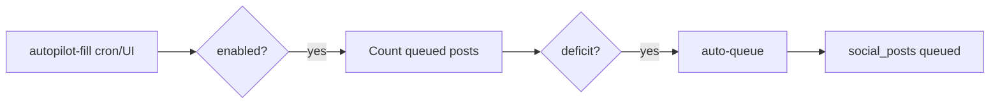
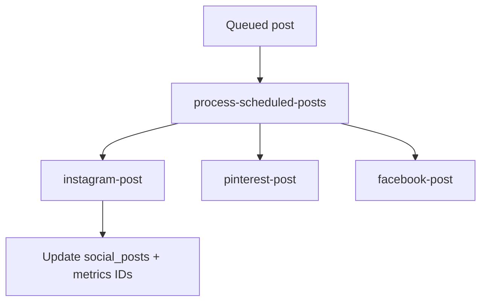
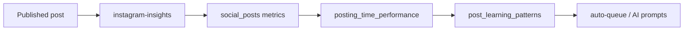

# Admin Social — Pipelines

---

## A. Manual post (New Post modal)

| Step | Actor | Action |
|------|--------|--------|
| 1 | Admin | Pick image, optional product |
| 2 | Client | `imageProcessor.js` builds variant previews |
| 3 | Client | Upload to `social-media`; insert `social_assets` + `social_variations` |
| 4 | Client | `captions.js` — templates and/or `ai-generate` for caption/hashtags |
| 5 | Client | Insert `social_posts` (`queued`, `scheduled_for`) per platform |
| 6 | Cron / manual | Publish (see D) |

---

## B. Image pool → post

| Step | Action |
|------|--------|
| 1 | Upload/tag in Image Pool (`imagePool.js`) |
| 2 | Optional `ai-tag-assets` batch tagging |
| 3 | Click asset → opens upload modal pre-filled (`openUploadModalWithAsset`) |
| 4 | Same as pipeline A from step 3 |

---

## C. Auto-Queue / Autopilot

### Auto-Queue (admin triggered)

| Step | Action |
|------|--------|
| 1 | Admin sets options in Auto-Queue tab |
| 2 | `auto-queue` edge function: pick products/assets, captions (templates + AI), hashtags, schedule slots using `posting_time_performance` / patterns |
| 3 | Inserts `social_posts` rows |
| 4 | Admin confirms preview (`btnConfirmQueue`) |

### Autopilot (scheduled / manual run)

| Step | Action |
|------|--------|
| 1 | Read `social_settings.autopilot` |
| 2 | If enabled, `autopilot-fill` compares queue depth vs `days_ahead × posts_per_day` |
| 3 | Invokes `auto-queue` internally to fill deficit |
| 4 | May trigger resurface/repost logic (per `docs/todo.md`) |

---

## D. Scheduled publishing

| Step | Action |
|------|--------|
| 1 | `process-scheduled-posts` (cron ~every minute per migration intent) |
| 2 | Select `social_posts` where `status=queued` and `scheduled_for <= now` |
| 3 | Set status `processing` (verify DB allows) |
| 4 | Resolve public `imageUrl` (variation path or `image_url`; relative path fix per todo) |
| 5 | Call `instagram-post`, `pinterest-post`, and/or `facebook-post` |
| 6 | Update post: `posted`/`published`, platform IDs, `posted_at`, errors on failure |

---

## E. Post Now (immediate)

Admin **Post Now** in post detail → `index.js` `postToInstagram` / `postToFacebook` / `postToPinterest` → same edge functions as D, without waiting for schedule.

---

## F. Carousel

| Step | Action |
|------|--------|
| 1 | Admin builds image list in Carousel tab |
| 2 | AI caption/hashtags via `ai-generate` |
| 3 | Schedule creates post with `media_type=carousel`, `image_urls[]` |
| 4 | Publish via `instagram-carousel` (when carousel) — invoked from posting path (verify in `instagram-post` / processor) |

---

## G. OAuth connect

| Platform | Flow |
|----------|------|
| Instagram | FB OAuth → `instagram-oauth` → tokens in `social_settings` |
| Pinterest | OAuth → `pinterest-oauth` → tokens + `sync-pinterest-boards` |

Redirect URI: `https://karrykraze.com/pages/admin/social.html`

---

## H. Analytics / learning loop

| Step | Action |
|------|--------|
| 1 | `instagram-insights` sync (manual button or cron) — Graph API metrics → `social_posts` columns |
| 2 | Updates `posting_time_performance`, may trigger learning aggregation |
| 3 | `postLearning.js` / `analytics.js` — patterns, recommendations, category research via `ai-generate` |
| 4 | Feeds back into auto-queue caption/hashtag/timing selection |

---

## I. AI image generation (secondary)

`generate-social-image` can create rows in `social_generated_images`; auto-queue may call it when pool lacks images (`docs/todo.md`). **Not** a primary admin UI tab anymore.

---

## External dependencies

- Meta Graph API (Instagram/Facebook)
- Pinterest API
- OpenAI API (`ai-generate`, `generate-social-image`, `ai-tag-assets`)
- Supabase Auth (admin), Storage, Edge Functions, optional pg_cron
