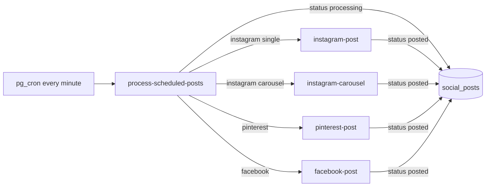

# Admin Social — Phase 2b Cron / OAuth Runbook Verification

**Date:** 2026-05-19  
**Type:** Repo-only verification (no deploys, no DB queries, no app code changes)  
**Sources:** `010_admin_social_phase1_readonly_verification.md`, `011_admin_social_phase2a_status_alignment.md`, `supabase/config.toml`, `supabase/functions/`, `supabase/SETUP_*.sql`, cron migrations, `js/admin/social/*`

---

## 1. Purpose

Provide an **operator runbook** for the Admin Social Media Manager before changing auto-queue, autopilot, or AI behavior. Publishing and insights depend on:

1. **Scheduled edge function invocations** (pg_cron + `pg_net` HTTP POST)
2. **Deployed edge functions** (including children called by `process-scheduled-posts`)
3. **OAuth tokens** stored in `social_settings`
4. **Supabase secrets** on edge functions
5. **Phase 2a migration** (`20260720_social_posts_status_alignment.sql`) so `processing` / `posted` statuses are valid

This document records what the **repo defines** vs what **requires Supabase Dashboard / production SQL** to confirm.

---

## 2. Required scheduled jobs

### Critical (publish + insights path)

| Job name (repo) | Schedule | Edge function | URL path | Defined in |
|-----------------|----------|---------------|----------|------------|
| `process-scheduled-social-posts` | `* * * * *` (every minute) | `process-scheduled-posts` | `/functions/v1/process-scheduled-posts` | `supabase/SETUP_CRON_JOB.sql` |
| `sync-instagram-insights` | `0 */6 * * *` (every 6h) | `instagram-insights` | `/functions/v1/instagram-insights` | `supabase/SETUP_INSIGHTS_CRON.sql` |
| `refresh-social-tokens-daily` | `0 3 * * *` (daily 03:00 UTC) | `refresh-tokens` | `/functions/v1/refresh-tokens` | `supabase/SETUP_CRON_JOB.sql` |

### Important (automation — do not change logic in Phase 2b)

| Job name (repo) | Schedule | Edge function | Notes |
|-----------------|----------|---------------|-------|
| `autopilot-fill-daily` | `0 2 * * *` in `SETUP_CRON_JOB.sql` | `autopilot-fill` | **Conflict:** `migrations/20260111_autopilot_cron.sql` uses `0 6 * * *` |
| `instagram-insights-sync` | `0 */6 * * *` | `instagram-insights` | `migrations/20260111_instagram_insights_cron.sql` — duplicate role vs `sync-instagram-insights` |
| `instagram-insights-weekly-sync` | `0 3 * * 0` (Sun 03:00 UTC) | `instagram-insights` | Body: `syncAll: true`, `daysBack: 30` — optional deep sync |
| `process-scheduled-posts` | `* * * * *` | `process-scheduled-posts` | **Different job name** than SETUP file; uses `app.settings.*` not hardcoded URL |

### Not in repo cron SQL (manual / UI only)

| Function | Trigger |
|----------|---------|
| `auto-repost` | Admin UI (`js/admin/social/autoQueue.js`) — **no pg_cron job found** |
| `auto-queue` | Admin UI preview/confirm; invoked by `autopilot-fill` |
| `ai-generate`, `ai-tag-assets`, `generate-social-image` | Admin UI / `auto-queue` internal fetch |

### Hardcoded project URL (operator note)

`SETUP_CRON_JOB.sql` and `SETUP_INSIGHTS_CRON.sql` use:

`https://yxdzvzscufkvewecvagq.supabase.co/functions/v1/...`

Cron migrations alternatively use:

`current_setting('app.settings.supabase_url')` and `current_setting('app.settings.service_role_key')`

**These require DB-level settings or dashboard secrets** — not verifiable from repo alone.

### Auth header for cron

All SETUP SQL templates use:

`Authorization: Bearer <SERVICE_ROLE_KEY>`

(placeholder `YOUR_SERVICE_ROLE_KEY` or `<SUPABASE_SERVICE_ROLE_KEY>`)

Child publishers invoked **from** `process-scheduled-posts` also use the service role key.

### Cannot verify from repo

- Whether `cron.job` rows exist in production
- Last success/failure (`cron.job_run_details`)
- Duplicate jobs (e.g. two publish crons with different names)
- Whether `app.settings.supabase_url` / `service_role_key` are configured
- Edge function logs for last publish/insights run

`docs/pSocial/pSocial_001.md` claims jobid 7 (autopilot) and jobid 12 (insights) were created — **historical note only; re-verify in dashboard**.

---

## 3. Edge function registration (`config.toml` vs repo)

### Social-related functions in `supabase/functions/` (focus list)

| Function | In `config.toml`? | `verify_jwt` in config | Typical caller |
|----------|-------------------|------------------------|----------------|
| `process-scheduled-posts` | **Yes** | `false` | Cron, HTTP |
| `instagram-post` | **Yes** | `false` | Cron chain, UI Post Now |
| `instagram-carousel` | **No** | — (dashboard default unknown) | Cron chain (carousel posts) |
| `instagram-insights` | **No** | — | Cron, UI Sync Insights |
| `pinterest-post` | **Yes** | `false` | Cron chain, UI |
| `facebook-post` | **No** | — | Cron chain, UI |
| `auto-queue` | **Yes** | `false` | UI, `autopilot-fill` |
| `autopilot-fill` | **Yes** | `false` | Cron, UI Run Autopilot |
| `auto-repost` | **No** | — | UI only |
| `refresh-tokens` | **No** | — | Cron |
| `ai-generate` | **No** | — | UI, `postLearning`, `auto-queue` |
| `ai-tag-assets` | **No** | — | UI `imagePool.js` |
| `generate-social-image` | **No** | — | `auto-queue` (optional image path) |
| `instagram-oauth` | **No** | — | OAuth redirect handler |
| `pinterest-oauth` | **No** | — | OAuth redirect handler |
| `sync-pinterest-boards` | **No** | — | UI Auto-Sync Boards |
| `pinterest-boards` | **No** | — | UI board helpers |

### Other social-adjacent in repo (not in focus list above)

| Function | Notes |
|----------|-------|
| `share-product` | In config; product sharing, not core publish cron |

### Assessment: unlisted functions

| Risk | Functions |
|------|-----------|
| **Deploy drift** | Any function not deployed to the Supabase project will break cron chains or UI calls even if SQL jobs exist |
| **JWT misconfiguration** | If dashboard defaults `verify_jwt=true` for unlisted functions, **cron (service role)** and **UI (anon key)** calls may 401 until set to `false` (matches listed social functions) |
| **Likely intentional** | OAuth callbacks (`instagram-oauth`, `pinterest-oauth`) — manual deploy, infrequent changes |
| **Must be deployed for production** | `instagram-carousel`, `facebook-post`, `instagram-insights`, `refresh-tokens` — required by publish cron or insights cron |

**Recommendation:** In Supabase Dashboard → Edge Functions, confirm all focus-list functions show **Deployed** and JWT verification matches automation needs (`verify_jwt = false` for service/cron + anon UI pattern used today).

`config.toml` entries are primarily for **local CLI** (`supabase functions serve`); production may have been deployed separately. **Absence from config.toml ≠ absent in production**, but it is a **repo tracking gap**.

---

## 4. Publish pipeline (for operators)



**Phase 2a dependency:** `processing` and `posted` must be allowed by `social_posts_status_check` (migration `20260720`).

---

## 5. Required environment variables

**Never commit values.** Set in Supabase Dashboard → Project Settings → Edge Functions → Secrets (or equivalent).

### All social edge functions (common)

| Variable | Used by |
|----------|---------|
| `SUPABASE_URL` | All focus functions |
| `SUPABASE_SERVICE_ROLE_KEY` | All focus functions (DB + storage + child invokes) |

### Instagram / Facebook (Meta Graph v18)

| Variable | Used by |
|----------|---------|
| `INSTAGRAM_APP_ID` | `instagram-oauth`, `refresh-tokens` |
| `INSTAGRAM_APP_SECRET` | `instagram-oauth`, `refresh-tokens` |

**UI note:** `js/admin/social/index.js` hardcodes Meta app id `2162145877936737` in the OAuth button URL. Edge functions use `INSTAGRAM_APP_ID` — **these must match** the same Meta app.

**Scopes (UI):** `instagram_basic`, `instagram_content_publish`, `instagram_manage_insights`, `pages_read_engagement`, `business_management`, `pages_show_list`

**Insights permission:** Code comments reference `instagram_manage_insights` for Graph insights API (error code 10 if missing).

### Pinterest

| Variable | Used by |
|----------|---------|
| `PINTEREST_CLIENT_ID` | `pinterest-oauth`, `refresh-tokens` |
| `PINTEREST_CLIENT_SECRET` | `pinterest-oauth`, `refresh-tokens` |

**UI note:** Pinterest OAuth button hardcodes client id `1542566` — must match `PINTEREST_CLIENT_ID` secret app.

**Redirect URI (both platforms):** `https://karrykraze.com/pages/admin/social.html` (must be allowlisted in Meta / Pinterest developer consoles).

### AI

| Variable | Used by |
|----------|---------|
| `OPENAI_API_KEY` | `ai-generate`, `ai-tag-assets`, `generate-social-image` |

### Admin browser (not edge secrets)

| Variable | Used by |
|----------|---------|
| `SUPABASE_URL` | `js/config/env.js` → admin fetch / invoke |
| `SUPABASE_ANON_KEY` | UI calls to edge functions (Authorization bearer) |

### Auto-injected by Supabase runtime

`SUPABASE_URL` and `SUPABASE_SERVICE_ROLE_KEY` are typically provided to deployed functions; still verify in dashboard.

---

## 6. OAuth / platform storage (`social_settings`)

There is **no** `platform_connections` table. Tokens and flags live in **`social_settings`** (`setting_key` / `setting_value` JSON).

### Instagram / Facebook keys (written by `instagram-oauth`, read by posters/insights/refresh)

| `setting_key` | Purpose |
|---------------|---------|
| `instagram_access_token` | Page token for Graph API |
| `instagram_user_id` | Instagram business account id |
| `instagram_username` | Display |
| `instagram_token_expires_at` | Expiry tracking |
| `instagram_connected` | Boolean flag |
| `instagram_page_name` | Display |
| `instagram_last_token_refresh` | Audit (refresh-tokens) |
| `facebook_page_id` | FB page id |
| `facebook_page_token` | Page token (also refreshed) |
| `facebook_connected` | Boolean flag |

### Pinterest keys (written by `pinterest-oauth`, read by `pinterest-post` / `refresh-tokens`)

| `setting_key` | Purpose |
|---------------|---------|
| `pinterest_access_token` | API bearer |
| `pinterest_refresh_token` | Refresh grant |
| `pinterest_token_expires_at` | Expiry |
| `pinterest_connected` | Boolean flag |
| `pinterest_last_token_refresh` | Audit |

### Other settings (automation / boards)

| `setting_key` | Purpose |
|---------------|---------|
| `posting_schedule` | Default schedule JSON |
| `auto_approve` | Upload workflow |
| `autopilot_*` / repost settings | `autopilot-fill`, `auto-repost`, `auto-queue` (see function code) |
| `pinterest_board_mapping` | Category → board (`sync-pinterest-boards`) |

### Post-level platform fields (`social_posts`)

| Column | Purpose |
|--------|---------|
| `external_id` | Platform post/media id |
| `instagram_media_id` | IG media id |
| `instagram_permalink` | IG URL (insights may backfill) |
| `posted_at` / `published_at` | Timestamps (both may exist historically) |
| `pinterest_board_id` | FK to `pinterest_boards` for pins |

### Token refresh assumptions (`refresh-tokens`)

- Runs daily via cron (expected).
- **Instagram/Facebook:** Refreshes long-lived token when within **7 days** of expiry (`fb_exchange_token` grant).
- **Pinterest:** Uses `pinterest_refresh_token` OAuth grant.
- On failure, posts continue until token expires — monitor `instagram_token_expires_at` / `pinterest_token_expires_at`.

---

## 7. Manual verification steps (production)

Run in **Supabase SQL Editor** or read-only replica. Do not run destructive SQL.

### 7.1 Phase 2a migration applied

```sql
-- Expect constraint to include 'processing' and 'posted', not 'published'
SELECT pg_get_constraintdef(oid)
FROM pg_constraint
WHERE conrelid = 'public.social_posts'::regclass
  AND conname = 'social_posts_status_check';
```

### 7.2 Status distribution

```sql
SELECT status, COUNT(*) AS n
FROM social_posts
GROUP BY status
ORDER BY n DESC;
-- After migration: expect 0 rows with status = 'published'
```

```sql
SELECT COUNT(*) AS published_legacy
FROM social_posts
WHERE status = 'published';
```

### 7.3 Stuck in-flight posts

```sql
SELECT id, platform, status, scheduled_for, updated_at, error_message
FROM social_posts
WHERE status = 'processing'
ORDER BY updated_at DESC
LIMIT 20;
```

### 7.4 Cron jobs registered

```sql
SELECT jobid, jobname, schedule, command
FROM cron.job
WHERE jobname ILIKE '%social%'
   OR jobname ILIKE '%instagram%'
   OR jobname ILIKE '%autopilot%'
   OR jobname ILIKE '%refresh%'
   OR jobname ILIKE '%scheduled%'
ORDER BY jobname;
```

### 7.5 Recent cron runs

```sql
SELECT j.jobname, d.status, d.start_time, d.end_time, LEFT(d.return_message, 200) AS msg
FROM cron.job_run_details d
JOIN cron.job j ON j.jobid = d.jobid
WHERE j.jobname ILIKE '%social%'
   OR j.jobname ILIKE '%instagram%'
   OR j.jobname ILIKE '%autopilot%'
   OR j.jobname ILIKE '%refresh%'
   OR j.jobname ILIKE '%scheduled%'
ORDER BY d.start_time DESC
LIMIT 30;
```

### 7.6 Last publish activity (proxy)

```sql
SELECT id, platform, status, posted_at, updated_at, error_message
FROM social_posts
WHERE status IN ('posted', 'failed', 'processing')
ORDER BY updated_at DESC
LIMIT 20;
```

### 7.7 Last insights sync (proxy)

```sql
SELECT id, platform, status, likes, reach, engagement_rate, updated_at
FROM social_posts
WHERE platform = 'instagram'
  AND status = 'posted'
ORDER BY updated_at DESC
LIMIT 10;
```

(Non-zero `likes`/`reach` after sync is a good sign; exact “last sync” may need edge function logs.)

### 7.8 Required `social_settings` rows

```sql
SELECT setting_key,
       setting_value->>'connected' AS connected,
       setting_value->>'expires_at' AS expires_at
FROM social_settings
WHERE setting_key IN (
  'instagram_connected',
  'instagram_token_expires_at',
  'pinterest_connected',
  'pinterest_token_expires_at',
  'facebook_connected'
)
ORDER BY setting_key;
```

```sql
-- Confirm tokens exist (do not select full token values in shared screens)
SELECT setting_key,
       (setting_value->>'token') IS NOT NULL AS has_token
FROM social_settings
WHERE setting_key IN (
  'instagram_access_token',
  'pinterest_access_token',
  'facebook_page_token'
);
```

### 7.9 Dashboard checks (no SQL)

- [ ] Edge Functions: all focus-list functions **Deployed**
- [ ] Edge Function secrets: `INSTAGRAM_APP_*`, `PINTEREST_CLIENT_*`, `OPENAI_API_KEY`, service role present
- [ ] JWT: automation functions accept service role / anon per current UI pattern
- [ ] Storage bucket `social-media` accessible for public image URLs used in publish
- [ ] Extensions: `pg_cron`, `pg_net` enabled
- [ ] Meta / Pinterest apps: redirect URI matches production admin URL

---

## 8. Known unknowns

| Item | Why unknown |
|------|-------------|
| Live `cron.job` set | Dashboard/SQL only |
| Duplicate/conflicting job names (`process-scheduled-posts` vs `process-scheduled-social-posts`) | Multiple SQL sources |
| Autopilot schedule 02:00 vs 06:00 UTC | SETUP vs migration mismatch |
| Whether weekly insights job exists | Optional migration only |
| JWT flags for unlisted functions | Not in `config.toml` |
| Token expiry dates in prod | DB only |
| Meta app review / permissions state | External console |
| `index.js.bak` | Unused backup — **separate cleanup** per audit 010; not part of Phase 2b |

---

## 9. Safe next phase (recommended order)

1. **Apply / verify** `20260720_social_posts_status_alignment.sql` on staging → production (Section 7.1–7.3).
2. **Verify cron + OAuth** using this runbook (Sections 7.4–7.9, dashboard secrets).
3. **Phase 2c:** Remove legacy `published` from `POST_SUCCESS_STATUSES` in `js/admin/social/postStatus.js` **only after** production shows zero `published` rows.
4. **Optional ops:** Consolidate duplicate cron job names; align autopilot schedule; add `config.toml` entries for unlisted functions for repo parity.
5. **Phase 3+:** Auto-queue / autopilot behavior changes — **only after** publish + insights + token refresh are proven stable.
6. **Separate chore:** Delete `js/admin/social/index.js.bak` (documented in audit 010; not required for cron/OAuth).

**Do not remove `published` fallback in Phase 2c until migration + SQL checks pass.**

---

## 10. Intentionally not touched (Phase 2b)

- Posting, auto-queue, autopilot, AI prompts
- Public `/pages/social.html`
- `POST_SUCCESS_STATUSES` legacy `published` fallback
- `js/admin/social/index.js.bak`
- Any Supabase deploy or migration execution

---

## 11. Repo artifact index

| Artifact | Role |
|----------|------|
| `supabase/SETUP_CRON_JOB.sql` | Operator script: publish + autopilot + refresh crons |
| `supabase/SETUP_INSIGHTS_CRON.sql` | Operator script: insights cron |
| `supabase/migrations/20260111_create_social_post_cron.sql` | Alternate publish cron + trigger function template |
| `supabase/migrations/20260111_autopilot_cron.sql` | Autopilot cron (6 AM UTC) |
| `supabase/migrations/20260111_instagram_insights_cron.sql` | 6h + weekly insights crons |
| `supabase/migrations/20260720_social_posts_status_alignment.sql` | Status CHECK + `published` → `posted` |
| `docs/pSocial/pSocial_001.md` | Product runbook / historical cron notes |

---

## 12. Verification command (repo)

```text
git status --short
→ ?? docs/audit/pages/admin-social/012_admin_social_phase2b_cron_oauth_runbook.md
```

**App code changed:** No.
