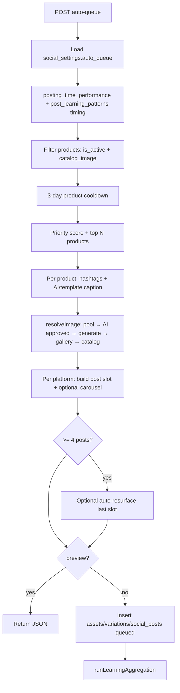

# Admin Social — Phase 3 Auto-Queue / Autopilot Behavior Audit

**Date:** 2026-05-19  
**Type:** Read-only behavior audit (no code changes)  
**Prerequisites:** Phases 2a–2e complete (status alignment, cron verified, `published` fallback removed)  
**Sources:** `004`, `006`, `012`, `013`, `015`, `docs/pSocial/pSocial_001.md`

---

## 1. Purpose

Document **exact current behavior** of auto-queue and autopilot-fill before any logic changes: what gets selected, queued, scheduled, captioned, and learned—and where the system can over-post, duplicate, or produce weak content.

**Out of scope for this audit:** posting cron, OAuth, public social page, AI prompt edits.

---

## 2. Files / functions inspected

| Layer | Path |
|-------|------|
| Edge | `supabase/functions/auto-queue/index.ts` (~1,500 lines) |
| Edge | `supabase/functions/autopilot-fill/index.ts` |
| Edge | `supabase/functions/auto-repost/index.ts` (UI-triggered; related) |
| Edge | `supabase/functions/ai-generate/index.ts` (invoked by auto-queue) |
| Edge | `supabase/functions/generate-social-image/index.ts` (optional pipeline) |
| Edge | `supabase/functions/instagram-insights/index.ts` (`learning_only` → auto-queue) |
| Admin UI | `js/admin/social/autoQueue.js` |
| Admin UI | `js/admin/social/autopilot.js` |
| Admin UI | `js/admin/social/imagePool.js` (feeds pool; not invoked by auto-queue directly) |
| Admin UI | `js/admin/social/analytics.js`, `postLearning.js` (learning tables; manual refresh) |
| HTML | `pages/admin/social.html` (Auto-Queue tab, autopilot card) |
| Schema | `social_posts`, `social_assets`, `social_variations`, `social_settings`, `hashtag_performance`, `posting_time_performance`, `post_learning_patterns`, `social_generated_images`, `image_blacklist`, `product_gallery_images` |
| Ops | `012` cron: `autopilot-fill-daily` 02:00 UTC; no dedicated auto-queue cron |

**No `social_auto_queue` table** — queue state is `social_posts` with `status` in (`queued`, `draft`).

---

## 3. How auto-queue is triggered

| Trigger | Mechanism | `preview` | Writes DB |
|---------|-----------|-----------|-----------|
| **Preview Posts** (`btnPreviewQueue`) | UI → `POST /auto-queue` with user session JWT | `true` | No |
| **Generate & Schedule** (`btnGenerateQueue`) | UI → `POST /auto-queue` | `false` | Yes |
| **Confirm Queue** (`btnConfirmQueue`) | Calls `generateAutoQueue()` after preview | `false` | Yes |
| **Autopilot-fill** | Service role → `POST /auto-queue` | `false` | Yes |
| **Instagram insights** | Service role → `{ learning_only: true }` | N/A | Updates learning tables only |

**Not cron-triggered** directly — only via autopilot-fill or admin UI.

### Request body (UI sends)

From `autoQueue.js` `getAutoQueueSettings()`:

- `count`, `platforms[]`, `postingTimes[]`, `captionTones[]`, `preview`

### Request body (auto-queue actually reads)

```ts
const { count, platforms, preview, learning_only } = body;
```

**Tones and posting times for a run come from `social_settings.setting_key = 'auto_queue'`**, not from the UI/autopilot request body (see risks).

---

## 4. Current auto-queue behavior (summary)

### 4.1 High-level flow



### 4.2 Product selection

| Rule | Implementation |
|------|----------------|
| Eligibility | `products.is_active = true`, `catalog_image_url` not null |
| Cooldown | **3 days** since `last_social_post_at` (updated when post **created**, not when published) |
| Priority score (max ~100) | **40%** recency (longer since last post = higher), **30%** category perf from `post_learning_patterns` (`category_performance`, min 3 samples), **20%** unused pool images (`used_count = 0`), **10%** flat “reserved” bonus |
| Count | Top `count` products by score (not `count` per platform) |

**No check:** inventory, sold-out, stock quantity, `requires_approval` workflow, duplicate product already in `queued` for future dates.

### 4.3 Image selection

Priority in `resolveImage()`:

1. **Image pool** — `social_assets` with `product_id` + `shot_type`, lowest `used_count`, then `last_used_at`
2. **Approved AI** — `social_generated_images.status = 'approved'`
3. If `image_pipeline.enabled` + `auto_generate` — catalog temp + **`generate-social-image`** call (auto-approve on success)
4. **Gallery** — `product_gallery_images` (minus `image_blacklist`)
5. **Catalog** — `catalog_image_url`

**Carousel (Instagram only):** 3+ pool or AI images; **50% random** skip carousel; 3–5 images shuffled.

**Diversity guard:** If last 2 queued/posted posts used same `shot_type`, swap to another pool asset when possible.

### 4.4 Platform targeting

- `platformList` from request `platforms` (UI/autopilot) — **honored**
- Each selected product → **one post per platform** in `platformList` (same `scheduled_for` index `i`, same caption base; non-first platforms get **template** caption regen, not AI)
- Pinterest: `pinterest_board_id` from `social_settings.pinterest_board_map` by `category_id` or default

### 4.5 Scheduling / times

| Source | When used |
|--------|-----------|
| `posting_time_performance` | If **≥ 10** total samples across rows → top 6 hours by `avg_engagement_rate` |
| `post_learning_patterns` (`timing` / `best_general_time`) | If sparse timing data |
| Default | ET hours `[10, 14, 18]` or `settings.posting_times` from **DB** `auto_queue` |
| `getNextPostingTimes()` | Maps ET hours to UTC; spreads across days until `count` slots |

**Timezone:** Eastern (`America/New_York`) for peak hours and UI time labels.

### 4.6 Captions & hashtags

| Step | Behavior |
|------|----------|
| Hashtags | `mergeHashtags`: `#karrykraze` + `hashtag_performance` (times_used≥2, avg_eng≥2) + category rows from `social_category_hashtags` |
| Caption | Try **`ai-generate`** `type: caption` (product, tone, **first platform only**) |
| Fallback | Up to 3 random **in-function templates** (`CAPTION_TEMPLATES` by tone) |
| Scoring | `scoreCaptionConfidence()` length/CTA/structure; &lt;50 → template loop; &lt;50 after loop → minimalist template |
| Urgency copy | Templates mention “sold out” / “low stock” **without inventory verification** |

### 4.7 Status & writes

| Table | Action |
|-------|--------|
| `social_assets` | Reuse first active per product (`.single()`) or insert; may overwrite `original_image_path` |
| `social_variations` | Per platform; reuse or insert |
| `social_posts` | `status: 'queued'`, `selection_metadata` JSONB, `source_asset_id`, UTM `link_url`, optional carousel fields |
| `products` | `last_social_post_at = now()` on each created post |
| `social_settings` | `autopilot_last_run` upsert after batch |

**`selection_metadata` fields (when not resurface):** `priority_score`, `score_breakdown`, `shot_type`, `caption_source`, `caption_confidence`, `caption_status`, `caption_tone`, `is_resurfaced: false`.

**UI does not read `selection_metadata`** (no matches in `js/admin/social/*`).

### 4.8 Auto-resurface (inside auto-queue)

When `generatedPosts.length >= 4` and ≥5 posted rows with `engagement_rate`:

- Compute median engagement
- Find `posted` posts **30+ days** old, above median
- **Replace the last generated slot** with resurface (template caption, `image_source: resurface`, reuses old `image_url`)
- **Does not call `auto-repost` edge function**

### 4.9 Learning loop (end of auto-queue)

`runLearningAggregation()` (also `learning_only` mode):

- Reads **Instagram `posted`** posts only
- Upserts `hashtag_performance`, `posting_time_performance`, `caption_element_performance`
- Uses `post_learning_patterns` for category scores in **next** product priority pass

**`postLearning.js`** maintains similar tables from admin analytics actions — parallel path, not required for auto-queue to run.

---

## 5. Current autopilot-fill behavior

| Step | Behavior |
|------|----------|
| 1 | Read `social_settings.autopilot` (`enabled`, `days_ahead`, `posts_per_day`, `platforms`, `tones`, `posting_times`) |
| 2 | If disabled → skip |
| 3 | Count `social_posts` `queued`/`draft` with `scheduled_for` between **tomorrow 00:00 UTC** and `days_ahead` horizon |
| 4 | `targetCount = days_ahead × posts_per_day × platforms.length` |
| 5 | `deficit = target - current`; if ≤0 skip |
| 6 | `postsToGenerate = ceil(deficit / platforms.length)` |
| 7 | `POST auto-queue` with service role: `{ count, platforms, tones, posting_times, preview: false }` |

**Cron (prod, doc 013):** `autopilot-fill-daily` at **02:00 UTC**, active.

**Gaps vs revamp plan (`pSocial_001`):**

- No **fail-stop after N consecutive errors**
- Body `tones` / `posting_times` **not consumed** by auto-queue (uses `auto_queue` settings row)
- Does **not** invoke `auto-repost` separately (resurface only inside auto-queue when batch ≥4)
- UI **Run Autopilot** uses hardcoded Supabase URL in `autopilot.js` (not `SUPABASE_URL` from env)

---

## 6. Admin UI controls

### Auto-Queue tab (`autoQueue.js` + `social.html`)

| Control | Calls | Notes |
|---------|-------|-------|
| Post count, platforms, times, tones | Passed in JSON | **Not applied server-side** for tones/times (see P1) |
| Preview Posts | `auto-queue` preview | Shows product, platform, schedule, caption snippet; **no** `selection_metadata` |
| Generate & Schedule | `auto-queue` write | Confirm dialog references `settings.platform` (**undefined** — bug in confirm string) |
| Confirm Queue | Re-runs generate after preview | Second confirm |
| Resurface section | `auto-repost` preview/generate | Separate from in-auto-queue resurface |

### Autopilot card (`autopilot.js`)

| Control | Behavior |
|---------|----------|
| Toggle | Saves `social_settings.autopilot` immediately on change |
| Days ahead / posts per day | Saved on Save + toggle |
| Platform checkboxes | Saved in `autopilot` settings |
| Run Now | `autopilot-fill` with user JWT |
| Last run | Reads `autopilot_last_run` |

**Approval:** No admin approve/reject step for auto-generated posts; all go to `queued` (not `pending_review` unless `postStatus === pending_review`, which normal path does not set).

**Transparency:** Preview is product-level summary only; no score breakdown, image source, or resurface flag in UI.

### Image pool (`imagePool.js`)

- Manual upload/tag; `shot_type` + `product_id` required for autopilot pool eligibility
- `ai-tag-assets` batch from UI — **not** called by auto-queue
- `used_count` incremented on publish (`process-scheduled-posts`), not on queue — freshness scoring uses `used_count` on assets

---

## 7. Analytics / learning inputs

| Data | Influences auto-queue? | How |
|------|------------------------|-----|
| `hashtag_performance` | Yes | Top tags with thresholds merged into hashtags |
| `posting_time_performance` | Yes | If ≥10 samples → peak hours for schedule |
| `post_learning_patterns` (timing) | Yes | Fallback peak hours |
| `post_learning_patterns` (category_performance) | Yes | Product priority 30% |
| `post_learning_patterns` (caption) | **No** direct read in auto-queue | Caption elements table updated but not read in selection |
| Post engagement (per post) | Indirect | Via aggregation; resurface uses `engagement_rate` |
| Missing metrics | Defaults | Mid category score (15/30), default hours, template hashtags |

**Poor performers:** Not excluded from product pool; only resurface **promotes** old hits. Low-performing products can still be selected via recency/fresh-image score.

**Insights dependency:** Learning aggregation needs Instagram `posted` rows with metrics — if insights cron fails, learning tables go stale (defaults used).

---

## 8. Risks / gaps (prioritized)

### P0 — can post wrong / duplicate / misleading content automatically

| ID | Risk | Evidence |
|----|------|----------|
| P0-1 | **UI tone/time settings ignored** | `autoQueue.js` sends `captionTones` / `postingTimes`; `auto-queue` only reads `social_settings.auto_queue` |
| P0-2 | **“Sold out” / urgency captions without stock check** | Template strings + AI may claim scarcity; no inventory field read |
| P0-3 | **Same product → multiple platforms same schedule index** | Inner loop `for (plat of platformList)` per product; can queue IG+FB+Pin for one product at `postingTimes[i]` |
| P0-4 | **Generate & Schedule skips preview** | Direct `preview: false`; Confirm path easy to misuse |
| P0-5 | **Autopilot over-fill formula** | `target = days_ahead × posts_per_day × platforms`; each auto-queue call creates `count` products × platforms posts — deficit math can overshoot |
| P0-6 | **Asset `.single()` per product** | Reuses arbitrary one active asset; may overwrite paths for multi-asset products |

### P1 — reliability / quality

| ID | Risk | Evidence |
|----|------|----------|
| P1-1 | **Autopilot body params ignored** | Sends `tones`, `posting_times`; auto-queue uses DB `auto_queue` key |
| P1-2 | **AI caption only for first platform** | Other platforms get template regen only |
| P1-3 | **3-day cooldown vs UI “14 day ready”** | `loadAutoQueueStats` uses 14-day window; server uses 3-day |
| P1-4 | **No duplicate guard in queue** | Same product can already be `queued` for future dates |
| P1-5 | **Auto-resurface replaces last slot** | May drop a fresh product post; resurface uses template not AI |
| P1-6 | **Carousel randomness** | 50% skip even with 3+ images — inconsistent format mix |
| P1-7 | **No autopilot fail-stop** | Errors throw 500; cron may retry; no circuit breaker |
| P1-8 | **`selection_metadata` not shown in UI** | Stored but never surfaced in admin |
| P1-9 | **Learning IG-only** | Pinterest/FB performance not in aggregation |
| P1-10 | **Confirm dialog bug** | `generateAutoQueue` uses `settings.platform` (undefined) |

### P2 — polish / future

| ID | Risk | Evidence |
|----|------|----------|
| P2-1 | Hardcoded URL in `autopilot.js` | `yxdzvzscufkvewecvagq.supabase.co` |
| P2-2 | `reserved` score always +10 | Not used for manual boost yet |
| P2-3 | `config.toml` missing many functions | Doc 015 — deploy tracking only |
| P2-4 | Two resurface paths | In-auto-queue vs `auto-repost` UI — different logic |

---

## 9. Recommended Phase 3a implementation (narrow — pick 1–2 first)

**Do not implement in this audit.** Suggested order:

### 3a-A — Request body wiring + settings persistence (foundation)

- Make `auto-queue` honor `captionTones` / `postingTimes` from request when present; fall back to `social_settings.auto_queue`
- On Auto-Queue UI save/preview/generate, upsert `auto_queue` settings so autopilot and manual runs align
- Fix `generateAutoQueue` confirm `platforms` label bug

**Why first:** Fixes P0-1 / P1-1 without changing selection philosophy.

### 3a-B — Preview transparency (dry-run UX)

- Extend preview JSON + UI to show: `priority_score`, `score_breakdown`, `image_source`, `caption_status`, `is_resurfaced`, `scheduled_for` (ET label)
- Optional: “dry run only” flag that never writes even if user mis-clicks Generate

**Why:** Addresses P0-4 / P1-8 / missing dry-run visibility.

### 3a-C — Duplicate & eligibility guards

- Skip products with `queued`/`processing` posts in horizon
- Optional: `inventory` / `is_active` / delisted checks before queue
- Per-batch dedupe: max one queued post per product per day

**Why:** P0-3, P0-2, P1-4.

### 3a-D — Autopilot safety

- Fail-stop after N errors in `autopilot_last_run`
- Reconcile deficit math with actual posts created (per platform)

**Why:** P0-5, P1-7.

**Recommended first slice:** **3a-A + 3a-B** (low behavior risk, high operator clarity). **3a-C** before any autopilot volume increases.

---

## 10. Intentionally not touched

- `auto-queue` / `autopilot-fill` logic (this pass)
- AI prompts in `ai-generate`
- Posting functions / cron
- Public social page
- `config.toml` bulk edit

---

## 11. Verification

```bash
rg "captionTones|postingTimes" js/admin/social/autoQueue.js
rg "const \\{ count" supabase/functions/auto-queue/index.ts
rg "selection_metadata" js/admin/social
git status --short
```

**App code changed:** No.
