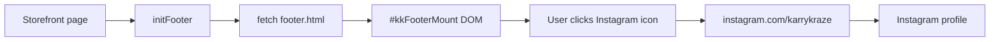
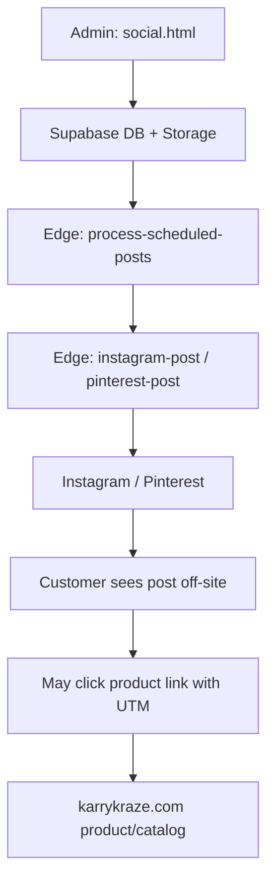

# Social Page System — Pipelines

Two pipelines exist: **customer follow links** (simple, static) and **admin content publishing** (complex, Supabase). They do not share a public HTML page.

---

## Pipeline A — Customer clicks footer Instagram icon

| Step | What happens |
|------|----------------|
| 1 | User loads any page with `#kkFooterMount` (e.g. home, catalog, product). |
| 2 | Page JS calls `initFooter()` from `js/shared/footer.js`. |
| 3 | `fetch('/page_inserts/footer.html')` returns HTML; injected into mount. |
| 4 | Optional: if logged-in admin, `is_admin` RPC unhides “Social Media” Help link. |
| 5 | User clicks Instagram icon in Connect column. |
| 6 | Browser opens `https://instagram.com/karrykraze` in a new tab (`target="_blank"`). |
| 7 | Instagram (Meta) serves profile/content — **off-site**. |

**Dependencies:** `kkFooterMount` in page HTML, `initFooter()` in page module, `page_inserts/footer.html`, service worker may precache footer (`sw.js`).

**No:** Supabase reads, analytics events, or internal routing on this path.

---

## Pipeline B — Customer from Contact or FAQ

Same external URLs as Pipeline A; markup lives in `pages/contact.html` or `pages/faq.html` instead of (or in addition to) the footer insert. Contact also runs `initFooter()`, so users may see **duplicate** social icon sets on one page.

---

## Pipeline C — Admin publishes social content (summary)

| Step | What happens |
|------|----------------|
| 1 | Admin opens `/pages/admin/social.html` (auth required). |
| 2 | `initAdminNav()` loads `page_inserts/admin-nav.html`. |
| 3 | `js/admin/social/index.js` loads data via `api.js` → Supabase tables (`social_posts`, `social_assets`, `social_settings`, …). |
| 4 | Admin connects platforms via OAuth edge functions (`instagram-oauth`, `pinterest-oauth`); tokens stored in `social_settings`. |
| 5 | Admin uploads/tags images → Storage bucket `social-media` + `social_assets` rows. |
| 6 | Admin schedules post or uses auto-queue / autopilot. |
| 7 | Cron / edge functions (`process-scheduled-posts`, `instagram-post`, `pinterest-post`, etc.) publish to Meta/Pinterest APIs. |
| 8 | Post may include **product links with UTM** pointing back to `karrykraze.com` — reverse direction from Pipeline A. |
| 9 | `instagram-insights` / learning jobs update metrics for admin analytics. |

**Customer site:** Does not render published posts; discovery is still via external platforms or direct product URLs in captions.

---

## Flowchart — Customer footer → Instagram

---

## Flowchart — Admin post → customer discovery (optional)

---

## Shared constants and configuration

| Item | Location | Used by |
|------|----------|---------|
| Public IG handle URL | Hardcoded in `page_inserts/footer.html`, `contact.html`, `faq.html` | Customer |
| OAuth redirect URI | `https://karrykraze.com/pages/admin/social.html` in edge functions + `index.js` | Admin |
| Platform tokens | `social_settings` table | Admin edge functions |
| Footer path | `FOOTER_HTML_PATH = '/page_inserts/footer.html'` in `footer.js` | Customer |

There is **no** central JS constant file for `@karrykraze` URLs on the customer side — URLs are duplicated in HTML.

---

## Relationship to other systems

| System | Relationship |
|--------|----------------|
| CTA label / QR | Separate; tracks package scans, not footer social |
| Coupon / SMS signup | No social page integration found |
| Reviews showcase | Social proof on-site; not the same as Instagram follow page |
| `docs/pSocial/` | Admin manager revamp; does not add `pages/social.html` |
