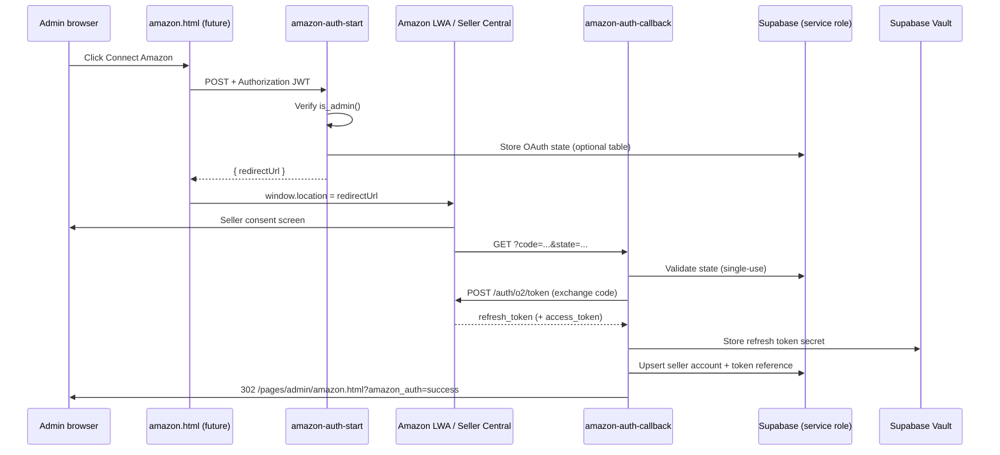

# Auth Edge Function Plan (Phase 2E)

## 1. Purpose

This document plans **Amazon SP-API / Login with Amazon (LWA)** authorization for the Karry Kraze Amazon Listings admin page (`pages/admin/amazon.html`).

**This is planning only.** No edge functions, secrets, frontend changes, or SP-API calls are implemented in this phase.

The goal is to connect Karry Kraze’s Seller Central account **safely**: refresh tokens stay server-side, admin UI receives connection metadata only, and all token reads/writes use the service role after an admin identity check.

Related baseline:

- Schema: [`013_supabase_schema.md`](013_supabase_schema.md) / `supabase/migrations/20260721_amazon_listings_schema.sql`
- SP-API research: [`012_official_sp_api_research.md`](012_official_sp_api_research.md) §11

---

## 2. Existing Schema Used

Phase 2E uses three auth-related tables from the Phase 2C migration. No schema changes are required for planning.

### `amazon_seller_accounts`

Non-secret seller metadata visible to authenticated admin clients (SELECT via RLS).

| Column | Role in auth flow |
|--------|-------------------|
| `seller_id` | SP-API merchant identifier (unique); upsert key on reconnect |
| `account_label` | Display name, e.g. “Karry Kraze US” |
| `region` | Endpoint group: `na`, `eu`, `fe` |
| `marketplace_ids` | Enabled marketplaces, e.g. `{ATVPDKIKX0DER}` |
| `is_active` | Whether account participates in sync |
| `authorized_at` | Set on successful OAuth |
| `last_token_refresh_at` | Updated when LWA access token is refreshed server-side |
| `token_status` | `not_connected` → `active` on connect; `revoked` / `expired` / `error` on failure |
| `scopes_roles_snapshot` | Non-secret JSON snapshot of granted roles/scopes |

**Important:** This table must never store refresh tokens, client secrets, or raw LWA responses.

### `amazon_auth_tokens`

**Service-role only** — no RLS policies for `authenticated` or `anon`; explicit REVOKE in migration.

| Column | Role in auth flow |
|--------|-------------------|
| `seller_account_id` | FK; one row per seller account (UNIQUE) |
| `vault_secret_name` | **Preferred** — reference to Supabase Vault secret holding refresh token |
| `lwa_refresh_token_encrypted` | Fallback only if Vault unavailable and project adds app-layer encryption |
| `token_status` | `active`, `revoked`, `expired`, `error` |
| `last_refresh_at` | Last successful LWA refresh |
| `last_error` | Safe, truncated error code/message for ops (no token content) |

**Important:** Browser and authenticated Supabase clients must not read this table. Edge functions use `SUPABASE_SERVICE_ROLE_KEY` only after admin verification.

### `amazon_marketplaces`

Reference catalog of supported marketplaces. US seed row: `ATVPDKIKX0DER` (Amazon.com, region `na`).

Used during auth to validate `marketplace_ids` against known rows and to default region when only US is enabled.

---

## 3. Proposed Edge Functions

Four functions under `supabase/functions/`, following existing conventions:

- Deno `serve` / `Deno.serve`
- Shared CORS headers (`Access-Control-Allow-Origin: *`, standard allow-headers)
- `createClient(SUPABASE_URL, SUPABASE_SERVICE_ROLE_KEY)` for token writes
- Admin guard before any privileged operation (see §7)

### Shared response conventions

| Context | Shape |
|---------|--------|
| JSON success (admin APIs) | `{ ok: true, ... }` or `{ success: true, ... }` — pick one at implementation; align with `ebay-oauth-callback` / `create-cta-label-link` |
| JSON error | `{ ok: false, error: "safe_code" }` with HTTP 4xx/5xx |
| OAuth callback completion | HTTP **302** redirect to admin page with query params (§10) |

---

### `amazon-auth-start`

**Status:** ✅ Implemented (Phase 2E.2) — see [`016_auth_start_callback_implementation.md`](016_auth_start_callback_implementation.md)

**Purpose:** Begin Amazon OAuth / Login with Amazon flow for an admin user.

**HTTP method:** `POST` (recommended) or `GET`

**Input:**

| Field | Source | Notes |
|-------|--------|-------|
| `Authorization: Bearer <jwt>` | Header | Required — admin Supabase session |
| `region` | JSON body or query | Optional; default from `AMAZON_SP_API_REGION` (`na`) |
| `marketplaceIds` | JSON body | Optional; default `[AMAZON_DEFAULT_MARKETPLACE_ID]` |
| `redirectAfter` | JSON body | Optional; post-auth admin path override |

**Output:**

- **Recommended:** `200` JSON `{ ok: true, redirectUrl: "https://sellercentral.amazon.com/apps/authorize/consent?..." }` — frontend sets `window.location.href`.
- **Alternative:** `302` redirect directly to Amazon (harder to attach JWT on navigation; only if using signed one-time start token).

**Auth requirement:** Valid Supabase JWT + `is_admin()` RPC (same pattern as `analytics-aggregate`, `ebay-manage-listing`).

**Tables read/written:**

| Table | Operation |
|-------|-----------|
| `amazon_oauth_states` (future) | INSERT state row — if table added at implementation |
| None otherwise | Generate state in memory/signing only |

**Responsibilities:**

1. Verify admin session (§7).
2. Generate cryptographically random `state` (e.g. `crypto.randomUUID()`).
3. Persist state securely (§8) with `created_by`, `expires_at` (~10 min), optional `redirect_after`.
4. Build Amazon authorization URL (official consent endpoint for seller region), including:
   - `application_id` ← `AMAZON_APP_ID`
   - `state`
   - `redirect_uri` ← `AMAZON_AUTH_REDIRECT_URI` (must match SP-API app registration)
   - Version / beta params per current SP-API docs
5. Return redirect URL (do not log full URL with state in production logs).

**Environment variables (names only):**

- `AMAZON_LWA_CLIENT_ID`
- `AMAZON_LWA_CLIENT_SECRET`
- `AMAZON_APP_ID`
- `AMAZON_SP_API_REGION`
- `AMAZON_AUTH_REDIRECT_URI`
- `SUPABASE_URL`
- `SUPABASE_SERVICE_ROLE_KEY`
- `SUPABASE_ANON_KEY` (for admin JWT validation)
- Optional: `AMAZON_OAUTH_STATE_SECRET`, `AMAZON_DEFAULT_MARKETPLACE_ID`

**Security notes:**

- Must not expose client secret in response.
- Must not skip admin check (contrast with legacy `ebay-oauth-callback`, which accepts anonymous POST).
- State must be single-use and short-lived.

---

### `amazon-auth-callback`

**Status:** ✅ Implemented (Phase 2E.2) — see [`016_auth_start_callback_implementation.md`](016_auth_start_callback_implementation.md)

**Purpose:** Handle Amazon OAuth redirect after seller consent.

**HTTP method:** `GET` (Amazon browser redirect)

**Input (query params):**

| Param | Required | Notes |
|-------|----------|-------|
| `code` | Yes (success path) | Authorization code — exchange once |
| `state` | Yes | Must match stored/signed state |
| `selling_partner_id` | Often present | Seller ID — validate against token response |
| `spapi_oauth_code` | Legacy/alternate | Handle per official docs if present instead of `code` |
| `error` / `error_description` | Denial path | User denied consent |

**Output:**

- HTTP **302** to admin page:
  - Success: `/pages/admin/amazon.html?amazon_auth=success`
  - Error: `/pages/admin/amazon.html?amazon_auth=error&reason=<safe_code>`
- No JSON body on happy path (browser redirect).

**Auth requirement:** **No browser JWT** on this request (Amazon server/browser redirect). Trust derives from **valid `state`** tied to admin user who started flow (§8). Optionally verify `state.created_by` still exists.

**Tables read/written:**

| Table | Operation |
|-------|-----------|
| `amazon_oauth_states` | SELECT + mark `used_at` |
| `amazon_seller_accounts` | UPSERT by `seller_id` |
| `amazon_auth_tokens` | UPSERT by `seller_account_id` |
| `amazon_marketplaces` | SELECT — validate marketplace IDs |

**Responsibilities:**

1. Validate `state` (exists, not expired, not used).
2. If `error` param → redirect with `reason=user_denied` (or mapped code).
3. Exchange authorization code for tokens via LWA:
   - `POST https://api.amazon.com/auth/o2/token`
   - `grant_type=authorization_code`, `code`, `client_id`, `client_secret`, `redirect_uri`
4. Parse response for **refresh token** (required) and any seller/marketplace metadata.
5. Resolve `seller_id` from callback params and/or token response / follow-up SP-API call if needed.
6. Upsert `amazon_seller_accounts` (§9).
7. Store refresh token via Vault (§5) into `amazon_auth_tokens`.
8. Set `token_status = 'active'`, `authorized_at = now()`.
9. Mark OAuth state used.
10. Redirect to admin page — **never** append tokens to URL.

**Security notes:**

- Do not log `code`, refresh token, access token, or full callback URL.
- Do not return tokens in redirect query string.
- Use service role for all DB/Vault writes.
- Callback URL registered in Amazon Developer Console must point to this function only.

---

### `amazon-auth-status`

**Status:** ✅ Implemented (Phase 2E.1) — see [`015_auth_status_implementation.md`](015_auth_status_implementation.md)

**Purpose:** Let admin UI determine whether Amazon is connected **without exposing tokens**.

**HTTP method:** `GET` (primary) or `POST`

**Input:**

| Field | Notes |
|-------|-------|
| `Authorization: Bearer <jwt>` | Required |
| `sellerAccountId` | Optional query/body — if omitted, return default/active account |

**Output (example — no secrets):**

```json
{
  "connected": true,
  "sellerAccountId": "uuid",
  "sellerId": "Axxxxxxxxxxxx",
  "region": "na",
  "marketplaceIds": ["ATVPDKIKX0DER"],
  "tokenStatus": "active",
  "authorizedAt": "2026-05-29T12:00:00.000Z",
  "lastTokenRefreshAt": "2026-05-29T13:00:00.000Z",
  "accountLabel": "Karry Kraze US"
}
```

When disconnected:

```json
{
  "connected": false,
  "tokenStatus": "not_connected"
}
```

**Auth requirement:** Admin JWT + `is_admin()`.

**Tables read/written:**

| Table | Operation |
|-------|-----------|
| `amazon_seller_accounts` | SELECT |
| `amazon_auth_tokens` | SELECT status fields only via service role — **never return token columns** |

**Security notes:**

- Response must omit `lwa_refresh_token_encrypted`, `vault_secret_name`, and any access token.
- Prefer reading `amazon_seller_accounts.token_status` for UI; join token table only for `last_refresh_at` / corroboration.
- Safe for frequent polling from admin page.

---

### `amazon-auth-disconnect`

**Status:** ✅ Implemented (Phase 2E.3) — see [`017_auth_disconnect_implementation.md`](017_auth_disconnect_implementation.md)

**Purpose:** Mark Amazon integration disconnected for admin user action.

**HTTP method:** `POST`

**Input:**

| Field | Notes |
|-------|-------|
| `Authorization: Bearer <jwt>` | Required |
| `sellerAccountId` | Optional; default active account |

**Output:**

```json
{ "ok": true, "disconnected": true, "sellerAccountId": "uuid" }
```

**Auth requirement:** Admin JWT + `is_admin()`.

**Tables read/written:**

| Table | Operation |
|-------|-----------|
| `amazon_seller_accounts` | UPDATE `token_status = 'revoked'`, optionally `is_active = false` |
| `amazon_auth_tokens` | UPDATE `token_status = 'revoked'` |

**Responsibilities:**

1. Admin-only disconnect.
2. **Do not** delete historical `amazon_listings`, mappings, or sync runs.
3. Optionally delete Vault secret in a later hardening pass — v1 may leave secret orphaned but mark revoked (document in ops runbook).
4. Do not expose whether Vault delete succeeded to client beyond `ok: true`.

**Security notes:**

- No token values in response.
- Idempotent: second disconnect returns success.

---

## 4. OAuth Flow Diagram



**Step summary:**

1. Admin clicks **Connect Amazon** (future UI).
2. Browser calls `amazon-auth-start` with admin JWT.
3. Edge function validates admin, creates state, returns Amazon authorization URL.
4. Browser redirects to Amazon.
5. Amazon redirects to `amazon-auth-callback?code=...&state=...` (registered redirect URI).
6. Callback validates state, exchanges code for refresh token.
7. Callback stores seller account + token reference (Vault).
8. Callback redirects to `/pages/admin/amazon.html?amazon_auth=success`.

---

## 5. Token Storage Strategy

### Preferred: Supabase Vault

Project already references Vault for cron secrets (`vault.decrypted_secrets` in `20260111_create_social_post_cron.sql`).

**Flow:**

1. On successful callback, create/update Vault secret, e.g. name `amazon_lwa_refresh_{seller_account_id}`.
2. Store only `vault_secret_name` in `amazon_auth_tokens`.
3. Leave `lwa_refresh_token_encrypted` NULL when Vault is used.
4. Future sync edge functions read secret via service role + Vault API/SQL (`vault.decrypted_secrets` or Supabase Vault helper).

### Fallback: encrypted column

Use `lwa_refresh_token_encrypted` only if:

- Vault is unavailable in target environment, **and**
- Implementation adds explicit application-layer encryption (key in env, not in DB).

**Do not** store plaintext refresh tokens in Postgres (unlike legacy `marketplace_tokens` for eBay).

### Access tokens

- Short-lived (~1 hour per SP-API docs).
- Generated server-side on demand via refresh grant; not returned to browser.
- Optional in-memory cache inside sync functions only — **no long-term** access token column in schema.

### Never

- Expose refresh token to browser or authenticated REST clients.
- Log token values.
- Include tokens in redirect URLs or `amazon-auth-status` responses.

---

## 6. Required Environment Variables

Proposed Supabase Edge Function secrets / env ( **no values in repo** ):

| Variable | Required | Purpose |
|----------|----------|---------|
| `SUPABASE_URL` | Yes | Supabase project URL |
| `SUPABASE_SERVICE_ROLE_KEY` | Yes | Service role client for token table + Vault |
| `SUPABASE_ANON_KEY` | Yes | Validate admin JWT via anon client + user header |
| `AMAZON_LWA_CLIENT_ID` | Yes | LWA client identifier |
| `AMAZON_LWA_CLIENT_SECRET` | Yes | LWA client secret (server only) |
| `AMAZON_APP_ID` | Yes | SP-API application ID for consent URL |
| `AMAZON_AUTH_REDIRECT_URI` | Yes | Must match Developer Console; points to `amazon-auth-callback` |
| `AMAZON_SP_API_REGION` | Yes | Default region group: `na`, `eu`, `fe` |
| `AMAZON_SP_API_ENDPOINT` | Yes | Regional SP-API host for later sync (e.g. `sellingpartnerapi-na.amazon.com`) |

**Optional:**

| Variable | Purpose |
|----------|---------|
| `AMAZON_DEFAULT_MARKETPLACE_ID` | Default `ATVPDKIKX0DER` when not specified |
| `AMAZON_AUTH_SUCCESS_REDIRECT` | Override success landing path |
| `AMAZON_AUTH_ERROR_REDIRECT` | Override error landing path |
| `AMAZON_OAUTH_STATE_SECRET` | HMAC key if using signed state instead of DB table |

---

## 7. Admin Auth / Access Control

### Project pattern (use this)

Several admin edge functions enforce:

1. Require `Authorization: Bearer <jwt>` header.
2. If JWT role is not `service_role`, create anon client with user JWT.
3. `caller.auth.getUser()` — reject if no user (`401`).
4. `caller.rpc("is_admin")` — reject if false (`403`).

**Reference implementations:**

- `supabase/functions/analytics-aggregate/index.ts`
- `supabase/functions/ebay-manage-listing/index.ts` (`decodeJwtRole` helper)

### Apply per function

| Function | Admin JWT + `is_admin()` |
|----------|--------------------------|
| `amazon-auth-start` | **Yes** |
| `amazon-auth-callback` | **No** — secured by OAuth state |
| `amazon-auth-status` | **Yes** |
| `amazon-auth-disconnect` | **Yes** |

### Service role usage

After admin check passes (start/status/disconnect), create service role client for:

- Reading/writing `amazon_auth_tokens`
- Vault secret create/read/delete
- Upserting seller accounts on callback (callback uses state → `created_by` for audit only)

**Do not** rely on frontend route hiding alone (`pages/admin/*` session gate in `footer.js` is UX, not API security).

### Legacy contrast (eBay)

| Aspect | eBay today | Amazon plan |
|--------|------------|-------------|
| OAuth start | Client-side redirect in `settings.html` | Server-mediated `amazon-auth-start` |
| OAuth callback | `ebay-oauth-callback` POST from browser, **no admin check** | Server redirect handler + state validation |
| State | Static string `state=ebay` | Random single-use state (§8) |
| Token storage | `marketplace_tokens` plaintext | Vault + service-role-only table |

---

## 8. State Validation / CSRF Protection

OAuth **state must be validated** on callback. The eBay integration’s static `state=ebay` is insufficient for Amazon.

### Option A — Database table (recommended for audit trail)

**Future table (not created in Phase 2E planning):** `amazon_oauth_states`

| Column | Type | Notes |
|--------|------|-------|
| `id` | uuid | PK |
| `state_hash` | text | Store SHA-256 of state, not raw state |
| `created_by` | uuid | `auth.users.id` of admin who started flow |
| `expires_at` | timestamptz | ~10 minutes from creation |
| `used_at` | timestamptz | Set on successful callback |
| `redirect_after` | text | Optional admin path |
| `region` | text | Optional |
| `marketplace_ids` | text[] | Optional |
| `created_at` | timestamptz | Default now() |

Index on `state_hash` where `used_at IS NULL`.

### Option B — Signed state token

If avoiding a table: HMAC-sign payload `{ userId, exp, nonce, region }` with `AMAZON_OAUTH_STATE_SECRET`; verify signature and expiry on callback.

### Validation rules (both options)

- Reject missing or expired state → redirect `reason=invalid_state`
- Reject reused state → redirect `reason=state_already_used`
- Bind state to admin user who initiated (prevents cross-user CSRF)

---

## 9. Seller Account Handling

### v1: One seller account

Karry Kraze likely connects a **single US seller** initially:

- Default region `na`
- Default marketplace `ATVPDKIKX0DER`
- One row in `amazon_seller_accounts`

### Future: Multiple accounts

Schema already supports multiple rows (unique `seller_id`). UI may later add account picker; `amazon-auth-status` accepts optional `sellerAccountId`.

### Region mapping

| `region` value | SP-API endpoint group |
|----------------|------------------------|
| `na` | North America |
| `eu` | Europe |
| `fe` | Far East |

Set from auth start request or env default; validate against `amazon_marketplaces.region`.

### Marketplace list

- Persist Amazon-returned marketplace participation in `marketplace_ids`.
- Intersect with enabled rows in `amazon_marketplaces`.
- Reject unknown IDs with safe error `unsupported_marketplace`.

### Reconnect / upsert

**Do not duplicate** seller accounts:

```sql
-- Logical upsert key
ON CONFLICT (seller_id) DO UPDATE ...
```

On reconnect for same `seller_id`:

1. Update `authorized_at`, `token_status = 'active'`, `marketplace_ids`, `scopes_roles_snapshot`.
2. Replace Vault secret / token row (same `seller_account_id`).
3. Preserve listing/mapping history linked to `seller_account_id`.

### Token reauthorization

If refresh fails (revoked/expired):

- Set `amazon_seller_accounts.token_status` and `amazon_auth_tokens.token_status` to `expired` or `error`.
- UI prompts **Reconnect** → same flow as initial connect (upsert, not new seller row).

---

## 10. Error Handling

### Callback redirect query params

| Result | URL |
|--------|-----|
| Success | `/pages/admin/amazon.html?amazon_auth=success` |
| Failure | `/pages/admin/amazon.html?amazon_auth=error&reason=<code>` |

Override base path via `AMAZON_AUTH_SUCCESS_REDIRECT` / `AMAZON_AUTH_ERROR_REDIRECT` if set.

### Safe `reason` codes (never raw Amazon/LWA messages)

| Code | Condition |
|------|-----------|
| `missing_code` | No authorization code on success path |
| `invalid_state` | State missing, expired, or signature invalid |
| `state_already_used` | Replay attempt |
| `user_denied` | Amazon `error=access_denied` or equivalent |
| `token_exchange_failed` | LWA token POST non-2xx |
| `missing_seller_id` | Cannot resolve seller ID after exchange |
| `unsupported_marketplace` | Marketplace not in `amazon_marketplaces` |
| `unsupported_region` | Region not in allowed set |
| `db_write_failed` | Seller account or token row upsert failed |
| `vault_write_failed` | Could not persist refresh token to Vault |
| `misconfigured` | Missing required env vars |

### JSON admin functions (`start`, `status`, `disconnect`)

Return `{ ok: false, error: "<same safe codes>" }` with appropriate HTTP status — do not leak stack traces or upstream JSON.

### Admin session missing

- `401` / `{ error: "Unauthorized" }` for missing JWT.
- `403` / `{ error: "Forbidden" }` for non-admin.

---

## 11. Logging

### Allowed

- Correlation / request id (generate per invocation)
- `seller_account_id` (uuid)
- Last 4 characters of `seller_id` if needed for support
- Function name + outcome (`success` / `failure`)
- Safe error codes from §10
- Duration metrics

Prefix logs: `[amazon-auth-start]`, `[amazon-auth-callback]`, etc. (matches `[ebay-oauth]` style).

### Never log

- Refresh token or access token
- `AMAZON_LWA_CLIENT_SECRET`
- Full OAuth callback URL (contains `code`)
- Raw LWA token exchange response body
- Vault secret plaintext

---

## 12. Future UI Wiring

**Not implemented in Phase 2E.** After edge functions ship:

| UI element | Behavior |
|------------|----------|
| Connect Amazon button | Visible when `amazon-auth-status.connected === false` |
| Sync Amazon button | Enable only when `tokenStatus === 'active'` |
| Connected panel | Show `sellerId`, region, marketplaces, `authorizedAt` from status endpoint |
| Reconnect / Disconnect | Call start flow again or `amazon-auth-disconnect` |
| Disconnected banner | When `tokenStatus` is `revoked`, `expired`, or `error` |
| URL params | Read `amazon_auth=success|error&reason=` on page load; show toast/banner |

Wire from `js/admin/amazon/` in Phase 2G; continue using admin JWT on function calls (never service role key in browser).

---

## 13. Implementation Checklist for Later

- [x] Create `amazon-auth-start` — **done:** [`016_auth_start_callback_implementation.md`](016_auth_start_callback_implementation.md)
- [x] Create `amazon-auth-callback` — **done:** [`016_auth_start_callback_implementation.md`](016_auth_start_callback_implementation.md)
- [x] Create `amazon-auth-status` — **done:** [`015_auth_status_implementation.md`](015_auth_status_implementation.md)
- [x] Create `amazon-auth-disconnect` — **done:** [`017_auth_disconnect_implementation.md`](017_auth_disconnect_implementation.md)
- [ ] Add env vars to Supabase project secrets
- [x] Decide Vault vs encrypted column — **Vault via** `amazon_store_lwa_refresh_token` RPC ([`016`](016_auth_start_callback_implementation.md))
- [x] Add OAuth state storage — **`amazon_oauth_states`** migration `20260722_amazon_oauth_states.sql`
- [x] Extract shared admin auth helper — `_shared/amazonAuthUtils.ts`
- [ ] Register `AMAZON_AUTH_REDIRECT_URI` in Amazon Developer Console
- [ ] Test Amazon redirect on staging
- [ ] Verify seller ID and marketplace IDs returned/stored correctly
- [x] Confirm server-side access token refresh works — **LWA refresh in** [`018_read_only_sync_prototype.md`](018_read_only_sync_prototype.md)
- [ ] Confirm browser cannot SELECT from `amazon_auth_tokens`
- [ ] Document Vault secret naming convention in ops notes

---

## 14. Recommended Next Phase

| Sub-phase | Scope |
|-----------|--------|
| **2E.1** | ✅ **`amazon-auth-status`** read-only — [`015_auth_status_implementation.md`](015_auth_status_implementation.md) |
| **2E.2** | ✅ **`amazon-auth-start`** + **`amazon-auth-callback`** — [`016_auth_start_callback_implementation.md`](016_auth_start_callback_implementation.md) |
| **2E.3** | ✅ **`amazon-auth-disconnect`** — [`017_auth_disconnect_implementation.md`](017_auth_disconnect_implementation.md) |
| **2F** | ✅ Read-only sync — [`018_read_only_sync_prototype.md`](018_read_only_sync_prototype.md) (`amazon-sync-listings`) |
| **2G** | Frontend live reads + Connect/Reconnect UI |

**2E.1 first** de-risks admin auth plumbing before handling OAuth redirects and secrets.

---

## Related Docs

- [`011_data_model_and_sync_strategy.md`](011_data_model_and_sync_strategy.md) — original edge function names
- [`012_official_sp_api_research.md`](012_official_sp_api_research.md) — LWA + roles (§11)
- [`013_supabase_schema.md`](013_supabase_schema.md) — auth tables + RLS

## Existing Project References

| Area | Location |
|------|----------|
| eBay token callback | `supabase/functions/ebay-oauth-callback/index.ts` |
| eBay token refresh | `supabase/functions/ebay-refresh-token/index.ts` |
| Admin auth guard | `supabase/functions/ebay-manage-listing/index.ts`, `analytics-aggregate/index.ts` |
| eBay client OAuth UX | `pages/admin/settings.html` (client-side start — **do not copy** for Amazon) |
| Vault usage | `supabase/migrations/20260111_create_social_post_cron.sql` |
| CORS / JSON helpers | `create-cta-label-link`, `sms-redirect` (302 pattern) |
