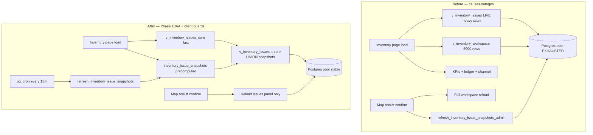

# Supabase Pool Exhaustion — Incident Report & Permanent Fix Runbook

**Status:** Active runbook (2026-06)  
**Project:** `yxdzvzscufkvewecvagq` (Karry Kraze)  
**Page affected:** `pages/admin/inventory.html`  
**Severity:** Critical — entire Supabase project goes **Unhealthy**; REST, auth, and storefront queries fail

---

## Summary

The inventory admin dashboard was designed to surface many issue types (mapping gaps, bundle returns, marketplace refunds, shipped-finalize audit, etc.). Over time, those counts were implemented as **live SQL view scans** on every page load. On Supabase’s shared Postgres pool (limited concurrent connections), a single admin session opening the inventory page — especially with hard refreshes or after Map Assist — could spawn **6+ parallel heavy queries** and starve the connection pool. The project then shows **Unhealthy**, health checks **abort**, and all API calls time out until Postgres is restarted.

This is **not** caused by storefront image traffic (Storage logs are normal). It is an **admin read-path architecture** problem.

---

## Symptoms

| Signal | What it means |
|--------|----------------|
| Supabase Dashboard → project status **Unhealthy** | Postgres not accepting connections in time |
| Logs: `GET \| ABORTED REQ \| …/health` | Infra health probe timed out waiting for DB |
| Browser: `Failed to load resource` / 500 / timeout on REST | Pool saturated; queries queue until timeout |
| Inventory page: KPIs/issues show mock/fallback data | Client timeouts trigger mock state |
| `npx supabase db query` fails or hangs | Same pool exhaustion |
| Recovery works briefly, then crashes again on refresh | Heavy view or browser-triggered snapshot RPC still live |

---

## Root cause (technical)

### 1. Live heavy `v_inventory_issues` view (Phase 10Z pattern)

Phase **10Z** (`20261019_inventory_phase10z_optimize_issues_view.sql`) inlined scans of expensive views into **`v_inventory_issues`**:

- `v_inventory_bundle_component_return_workflow_guidance`
- `v_inventory_bundle_summary_preview`
- `v_inventory_shipped_finalize_audit`
- `v_inventory_marketplace_restock_assist_candidates`
- `v_inventory_returns_restock_dashboard_summary`
- …and more

Every inventory page load called:

```http
GET /rest/v1/v_inventory_issues?select=…
```

That single HTTP request could run **15–180+ seconds** of SQL, holding a pool connection.

### 2. Browser-triggered snapshot refresh (pre-fix)

After Map Assist / finalize / issue workflow, the client called:

```http
POST /rest/v1/rpc/refresh_inventory_issue_snapshots_admin
```

That RPC runs the same heavy scans (with `statement_timeout = 180s`), **on top of** a full page reload (workspace + KPIs + ledger + issues). Mapping one order line could trigger **4–5 concurrent heavy queries**.

### 3. Parallel page load fan-out

Initial load (`loadLiveData` in `js/admin/inventory/state.js`) fires in parallel:

- KPIs  
- Ledger (40 rows)  
- Workspace (`v_inventory_workspace`, up to 5000 variants)  
- Channel status  
- Parcel summary  
- **Then** issues view (staggered +400ms, but still heavy if 10Z view is live)

One admin + one hard refresh + pg_cron snapshot job = pool exhaustion.

### 4. Small Supabase connection budget

Free/Pro micro instances expose a **small max connection count** to PostgREST. Long-running admin reads block checkout, webhooks, and cron — not because those are broken, but because connections are exhausted.

---

## Architecture: before vs after



---

## Permanent fixes (database)

### ✅ Fix A — Phase 10AA snapshot architecture (required)

**Migration:** `supabase/migrations/20261020_inventory_phase10aa_issues_snapshot.sql`

| Object | Role |
|--------|------|
| `v_inventory_issues_core` | Fast counts only (product scan + cheap joins). Safe on every page load. |
| `inventory_issue_snapshots` | Table holding **extended** issue counts (bundle, returns, audit, etc.). |
| `refresh_inventory_issue_snapshots()` | Heavy recompute — **service_role + cron only**. |
| `refresh_inventory_issue_snapshots_admin()` | Admin RPC (optional manual refresh; do not call from browser on every action). |
| `v_inventory_issues` | `UNION ALL` of core + snapshots — **reads are fast**. |
| pg_cron `inventory-issue-snapshots-every-15m` | Refreshes snapshots on schedule. |

**Deploy:**

```bash
npx supabase@2.106.0 db query --linked -f supabase/migrations/20261020_inventory_phase10aa_issues_snapshot.sql
```

**Verify:**

```bash
node scripts/verify-inventory-phase10aa-issues.mjs
```

Expect `v_inventory_issues` query **&lt; 3 seconds** and active cron job.

### ✅ Fix B — Phase 10AB missing-SKU correction

**Migration:** `supabase/migrations/20261021_inventory_phase10ab_missing_sku_product_code.sql`

Fixes false “Missing SKU” on ~212 variants that use `products.code` instead of `product_variants.sku`. Reduces noise and unnecessary issue scanning.

Deploy after 10AA (same command pattern).

### ⛔ Never apply Phase 10Z in production

**File:** `supabase/migrations/20261019_inventory_phase10z_optimize_issues_view.sql`

Header explicitly marks it **SUPERSEDED by 10AA**. Re-applying 10Z replaces the fast union view with a live heavy scan and **will bring outages back**.

### ✅ Fix C — Emergency lite view (stopgap only)

**File:** `scripts/supabase/emergency-recover-db.sql`

Use when the project is down **right now**. Replaces `v_inventory_issues` with a **core-only lite view**, unschedules all pg_cron jobs temporarily, then you restore crons after stability.

**Not a permanent architecture** — always follow with Phase 10AA.

---

## Permanent fixes (client / JS)

Already implemented in repo:

| Change | File | Effect |
|--------|------|--------|
| Staggered load — issues after core panels | `js/admin/inventory/state.js` | Avoids 6-way simultaneous DB hit |
| Issues panel timeout (45s) + mock fallback | `js/admin/inventory/state.js` | Page stays usable if DB slow |
| Post-mapping: **issues + queue only** | `js/admin/inventory/services/refreshInventoryData.js` | No workspace/KPI/ledger reload after Map Assist |
| Removed auto `scheduleIssueSnapshotRefresh()` after mapping | same | Snapshots refresh via cron only |
| Map Assist: don’t pass eBay listing id as Amazon UUID | `js/admin/inventory/ui/mappingAssistModal.js` | Fixes 400 on confirm (separate bug) |

### Recommended follow-ups (not yet implemented)

| Priority | Change | Rationale |
|----------|--------|-----------|
| High | Remove or gate **manual** “Refresh extended issues” button if it calls `refresh_inventory_issue_snapshots_admin` | One click = 180s heavy job |
| Medium | Paginate `v_inventory_workspace` (server-side RPC like Returns Dashboard 10X) | 5000-row select on every full load |
| Medium | Add UI note: “Extended issue counts refresh every ~15 min” | Sets operator expectations |
| Low | Supabase **compute upgrade** if mapping sessions are frequent | More headroom, not a substitute for 10AA |
| Low | Statement timeout on PostgREST role (e.g. 30s) | Fail fast instead of holding connections |

---

## Recovery procedure

### When project is Unhealthy

1. **Supabase Dashboard** → Settings → Infrastructure / Database → **Restart database**  
   Wait until status is **Healthy** (1–3 min).

2. **Automated recovery** (waits for REST, applies emergency SQL + 10AA + 10AB + crons):

   ```bash
   node scripts/supabase/wait-and-recover-db.mjs
   ```

3. **Manual fallback** if CLI times out:
   - Paste `scripts/supabase/emergency-recover-db.sql` into **SQL Editor** → Run  
   - Then paste and run `20261020_inventory_phase10aa_issues_snapshot.sql`  
   - Then paste and run `20261021_inventory_phase10ab_missing_sku_product_code.sql`  
   - Run `node scripts/supabase/restore-pg-cron-jobs.mjs`

4. **Verify:**

   ```bash
   node scripts/verify-inventory-phase10aa-issues.mjs
   node scripts/verify-inventory-page-load.mjs
   ```

5. **Hard-refresh** inventory admin (`Ctrl+Shift+R`) once.

### Operator guidelines (prevent recurrence)

- **Do not** spam hard refresh on the inventory page while DB is slow.  
- **Do not** open multiple inventory tabs during bulk mapping.  
- Map Assist / eBay Worklist: one batch at a time; wait for issues count to update.  
- Extended bundle/return issue counts may lag cron by up to **15 minutes** — that is expected.  
- If status flips Unhealthy again, restart DB first, then run recovery script.

---

## Verification checklist

After any recovery or migration apply:

- [ ] Supabase project status **Healthy**
- [ ] `node scripts/verify-inventory-phase10aa-issues.mjs` → PASS, issues query &lt; 3s
- [ ] `SELECT COUNT(*) FROM inventory_issue_snapshots` → &gt; 0 rows
- [ ] `SELECT jobname, active FROM cron.job WHERE jobname LIKE '%inventory-issue%'` → active
- [ ] Inventory page loads KPIs + issues without mock fallback
- [ ] Map Assist confirm succeeds (no 400 on `apply_inventory_mapping_assist`)
- [ ] After mapping one line, page does **not** hang for 2+ minutes

---

## Related files

| Path | Purpose |
|------|---------|
| `supabase/migrations/20261020_inventory_phase10aa_issues_snapshot.sql` | Permanent DB architecture |
| `supabase/migrations/20261021_inventory_phase10ab_missing_sku_product_code.sql` | Missing SKU false-positive fix |
| `supabase/migrations/20261019_inventory_phase10z_optimize_issues_view.sql` | **Do not apply** |
| `scripts/supabase/emergency-recover-db.sql` | Emergency lite view |
| `scripts/supabase/wait-and-recover-db.mjs` | Wait + recover + apply 10AA/10AB + crons |
| `scripts/supabase/restore-pg-cron-jobs.mjs` | Restore pg_cron after emergency |
| `scripts/verify-inventory-phase10aa-issues.mjs` | Post-deploy verification |
| `scripts/verify-inventory-page-load.mjs` | End-to-end page + DB probe |
| `js/admin/inventory/state.js` | Load orchestration + timeouts |
| `js/admin/inventory/services/refreshInventoryData.js` | Post-write refresh policy |

---

## Incident timeline (2026-06)

| Date | Event |
|------|-------|
| Early Jun | Inventory page timeouts; ~220 unmapped order lines blocking mapping workflow |
| Phase 10AA deployed | Snapshot architecture; issues REST ~131ms when live |
| Phase 10AB deployed | Missing SKU false alarm cleared (product code fallback) |
| Map Assist session | Confirm Mapping 400 — eBay listing id sent as Amazon UUID (fixed in JS) |
| Pool exhaustion returns | Hard): hard refresh + mapping + browser snapshot RPC → Unhealthy |
| Client guard | Post-mapping refresh reduced to issues panel only; snapshot cron-only |

---

## Decision record

**Why snapshots instead of a faster live view?**

Extended issue types depend on views that were built for **correctness and admin drill-down**, not for aggregate counts on every page load. Precomputing counts into `inventory_issue_snapshots` separates:

- **Read path** (must be fast, every page load)  
- **Compute path** (can be slow, runs on schedule or explicit admin action)

This pattern matches how production analytics dashboards treat expensive rollups: **materialize on write/schedule, read from table**.

**Why not just upgrade Supabase plan?**

More connections help marginally but do not fix **180-second queries** holding slots. Architecture change is required; compute upgrade is optional headroom.

---

## Next action for maintainers

1. Confirm **10AA + 10AB** are applied on linked production (run verify script).  
2. Confirm **10Z was never re-applied** after 10AA.  
3. After DB restart, run `wait-and-recover-db.mjs` once.  
4. Resume mapping work (eBay Worklist / Map Assist) with single-tab discipline.
