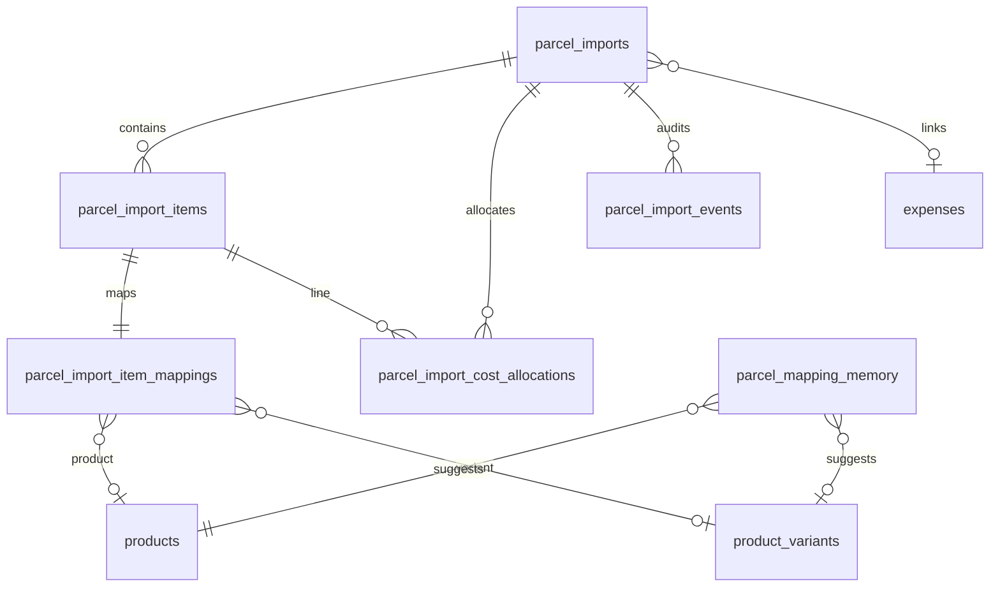

# Parcel Imports — Supabase Schema Sketch (Phase 5)

**Status:** Planning only — **no migrations, no application code changes**  
**Prerequisite:** Phases 1–4 complete locally ([001_wiring_plan.md](./001_wiring_plan.md))  
**UI contract (unchanged):** `pages/admin/parcelImports.html`  
**Local JS reference:** `js/admin/parcelImports/`

*Last updated: 2026-06-03*

---

## 1. Overview

This document sketches the Supabase database design needed to persist Parcel Imports **after** the browser-local parser, override editor, mapping workflow, and CPI preview engine are trusted.

**This is not a migration.** No SQL files, edge functions, or `api/*` modules should be created from this doc alone. The goal is to align schema decisions with:

- current in-memory state shapes (Phases 1–4)
- future phases: save draft, history, approval, weighted CPI updates, expense linkage, inventory receiving
- existing Karry Kraze tables where known (`products`, `product_variants`, `expenses`)

**Design principles**

| Principle | Rule |
|-----------|------|
| **Immutable approved snapshot** | Once `status = approved`, header/items/mappings/allocations used for CPI update should be frozen; later edits require void/reopen workflow |
| **Idempotent approval** | One approval per import must not double-apply product CPI or inventory |
| **Raw + normalized** | Store parsed normalized columns **and** `raw` JSON for audit/re-parse |
| **Overrides are first-class** | XLS baseline vs actual override values must both be recoverable |
| **Mapping memory is hint-only** | URLs and titles change; never auto-approve from memory alone |
| **Preview ≠ persist** | Live CPI preview stays in-browser; DB stores snapshots only on explicit save/approve |

---

## 2. Current local data shapes (Phases 1–4)

These objects exist only in memory today (`js/admin/parcelImports/state.js` and CPI modules). They are the source-of-truth for column naming and payload design.

### `parcel` (parsed header)

From `normalizeParcel()` / `state.parcel`:

```js
{
  parcelId,              // Baestao parcel ID string, e.g. "227461"
  sourceFileName,
  sourceFormat,          // "baestao_html_xls"
  importedAt,            // ISO date string from parse
  totalItems,
  parcelWeightGrams,
  chargedWeightGrams,    // often null in export
  totalItemFeeCny,
  shipmentFeeCny,
  insuranceCny,
  insuranceLabel,        // "Yes" / text
  insuranceYes,          // boolean
  serviceFeeCny,
  totalParcelChargeCny,
  effectiveFxRate,       // usually null from XLS
  usdEquivalent,         // usually null from XLS
  warnings: [],
  raw: {}                // footer KV + misc parser fields
}
```

### `items[]` (parsed line rows)

From `normalizeItemRow()`:

```js
{
  rowNumber,
  exportRowNo,
  sourceItemName,
  sellerName,
  baestaoOrderId,
  unitPriceCny,
  quantity,
  itemWeightGrams,
  sellerFreightCny,
  rowTotalCny,
  lineItemSubtotalCny,
  lineTotalCny,
  removePackage,
  raw: {},               // column-keyed cell values
  rowIssues: []
}
```

### `overrides` (manual actual charges)

From `state.overrides` / `state.xlsBaseline`:

```js
{
  parcelWeightGrams,
  chargedWeightGrams,
  shipmentFeeCny,
  serviceFeeCny,
  insuranceYes,          // true | false | null
  insuranceCny,
  totalParcelChargeCny,
  effectiveFxRate,
  usdEquivalent,
  dirtyFields: {}        // UI only — not persisted
}
```

`xlsBaseline` mirrors the same keys from parsed `parcel` at import time.

### `rowMappings[]` (local classification)

From `mapping/mappingState.js`:

```js
{
  rowNumber,
  exportRowNo,
  rowType,               // "Business Inventory" | "Personal / Excluded" | ...
  mappingStatus,         // "Needs Mapping" | "Matched" | ...
  mappedProductLabel,    // placeholder label until product_id wired
  mappedVariantLabel,
  notes,
  hasParserIssue
}
```

### `cpiPreview` (local allocation output)

From `cpi/cpiPreview.js` → `buildCpiPreview()`:

**Per row:**

```js
{
  rowNumber,
  sourceItemName,
  rowType,
  mappingStatus,
  quantity,
  itemWeightGrams,
  productCostCny,
  sellerFreightCny,
  parcelShippingShareCny,
  serviceShareCny,
  insuranceShareCny,
  fxPaymentShareCny,
  landedTotalCny,
  landedCpiCny,
  landedCpiUsd,
  includedInProductCpiPreview,  // matched business rows
  warnings: []
}
```

**Summary:**

```js
{
  businessRows, matchedRows, variantUncertainRows, personalRows, suppliesRows,
  needsMappingRows, productsAffected, readyToUpdate, rowsExcluded,
  totalShipmentFeeCny, totalAllocatedShipmentCny,
  weightedAverageLandedCpiCny, weightedAverageLandedCpiUsd,
  fulfilledCpiPreviewUsd, effectiveFxRate,
  breakdownProductCny, breakdownSellerFreightCny, ... // per-unit aggregates
}
```

**Global warnings:** FX missing, weight issues, mapping issues, volume-weight note, etc.

---

## 3. Status model

### Import status (`parcel_imports.status`)

Stored as `text` with a CHECK constraint (or Postgres enum in a later migration).

| DB value | Meaning |
|----------|---------|
| `draft` | Saved work-in-progress; editable |
| `needs_review` | Parsed/saved but validation warnings (mapping, overrides, parser) |
| `ready_to_approve` | All business rows matched or excluded; overrides valid; operator marked ready |
| `approved` | Final snapshot taken; CPI update applied (Phase 8); immutable |
| `voided` | Canceled / superseded; no further side effects |
| `error` | Parse/save/approve failed; requires operator attention |

**Transitions (sketch)**

```
upload/parse → draft
draft → needs_review (auto when warnings)
draft/needs_review → ready_to_approve (manual or auto when readyToUpdate)
ready_to_approve → approved (approve action, idempotent)
approved → voided (admin only, with audit — does not silently delete CPI history)
* → error (on failure)
```

**Duplicate imports:** Same `parcel_id` may appear in multiple imports (re-import, correction). Do **not** hard-unique `parcel_id` globally; use `(parcel_id, imported_at)` or `file_hash` to detect likely duplicates with a UI warning.

### Mapping status (`parcel_import_item_mappings.mapping_status`)

| DB value | UI label today |
|----------|----------------|
| `needs_mapping` | Needs Mapping |
| `matched` | Matched |
| `variant_uncertain` | Variant Uncertain |
| `personal_excluded` | Personal / Excluded |
| `parser_warning` | Parser Warning |

### Row type (`parcel_import_item_mappings.row_type`)

| DB value | UI label today |
|----------|----------------|
| `business_inventory` | Business Inventory |
| `personal_excluded` | Personal / Excluded |
| `supplies` | Supplies |
| `unknown` | Unknown |

**CPI / approval rules (from Phase 4 local preview)**

- `business_inventory` + `matched` → counts toward **products affected** and final CPI update
- `personal_excluded` → excluded from product CPI; **still included** in weight-based shipping allocation
- `supplies` → excluded from product CPI; included in shipping allocation
- `unknown` or non-matched statuses → blocks `ready_to_approve`

---

## 4. Table: `parcel_imports`

**Purpose:** One row per parcel import workflow (draft through approved).

### Identity & file metadata

| Column | Type | Notes |
|--------|------|-------|
| `id` | `uuid` PK | `gen_random_uuid()` |
| `parcel_id` | `text` NOT NULL | Baestao parcel ID from export |
| `source_file_name` | `text` | Original filename |
| `source_format` | `text` NOT NULL | e.g. `baestao_html_xls` |
| `file_size_bytes` | `bigint` NULL | From `File.size` |
| `file_hash` | `text` NULL | SHA-256 of file bytes for dedupe hint |
| `raw_file_storage_path` | `text` NULL | Optional Supabase Storage path if blobs stored |
| `status` | `text` NOT NULL | See §3 |
| `imported_at` | `timestamptz` NOT NULL | From parse / operator |
| `created_at` | `timestamptz` DEFAULT `now()` |
| `updated_at` | `timestamptz` DEFAULT `now()` |
| `approved_at` | `timestamptz` NULL | Set on approval |
| `approved_by` | `uuid` NULL | FK → `auth.users(id)` if available |
| `voided_at` | `timestamptz` NULL | |
| `voided_by` | `uuid` NULL | |
| `notes` | `text` NULL | Operator notes |

### XLS baseline (parsed, read-only snapshot at save)

| Column | Type |
|--------|------|
| `xls_total_items` | `integer` |
| `xls_parcel_weight_grams` | `numeric(12,2)` |
| `xls_charged_weight_grams` | `numeric(12,2)` |
| `xls_total_item_fee_cny` | `numeric(12,2)` |
| `xls_shipment_fee_cny` | `numeric(12,2)` |
| `xls_insurance_text` | `text` |
| `xls_insurance_cny` | `numeric(12,2)` |
| `xls_service_fee_cny` | `numeric(12,2)` |
| `xls_total_parcel_charge_cny` | `numeric(12,2)` |
| `raw_footer` | `jsonb` DEFAULT `'{}'` | Footer KV + parser metadata |

### Actual override values (current working copy)

| Column | Type |
|--------|------|
| `actual_parcel_weight_grams` | `numeric(12,2)` |
| `actual_charged_weight_grams` | `numeric(12,2)` |
| `actual_shipment_fee_cny` | `numeric(12,2)` |
| `actual_service_fee_cny` | `numeric(12,2)` |
| `actual_insurance_yes` | `boolean` |
| `actual_insurance_cny` | `numeric(12,2)` |
| `actual_total_charge_cny` | `numeric(12,2)` |
| `effective_fx_rate` | `numeric(12,6)` |
| `usd_equivalent` | `numeric(12,2)` |

### Approval / final snapshot (frozen at approve)

| Column | Type |
|--------|------|
| `final_total_allocated_cny` | `numeric(12,2)` |
| `final_weighted_landed_cpi_cny` | `numeric(12,4)` |
| `final_weighted_landed_cpi_usd` | `numeric(12,4)` |
| `final_fulfilled_cpi_preview_usd` | `numeric(12,4)` NULL | Placeholder outbound + landed |
| `products_affected_count` | `integer` DEFAULT `0` |
| `rows_excluded_count` | `integer` DEFAULT `0` |
| `rows_needing_mapping_count` | `integer` DEFAULT `0` |
| `approval_idempotency_key` | `text` NULL | Unique when set — prevents double approve |
| `cpi_update_applied_at` | `timestamptz` NULL | When product CPI writes completed |

### Expense linkage (see §11)

| Column | Type |
|--------|------|
| `expense_id` | `uuid` NULL | FK → `public.expenses(id)` ON DELETE SET NULL |

### Constraints & indexes

```sql
-- CHECK (status IN ('draft','needs_review','ready_to_approve','approved','voided','error'))
CREATE INDEX idx_parcel_imports_status ON parcel_imports (status);
CREATE INDEX idx_parcel_imports_imported_at ON parcel_imports (imported_at DESC);
CREATE INDEX idx_parcel_imports_parcel_id ON parcel_imports (parcel_id);
CREATE UNIQUE INDEX idx_parcel_imports_idempotency
  ON parcel_imports (approval_idempotency_key)
  WHERE approval_idempotency_key IS NOT NULL;
-- Optional duplicate hint (non-unique):
CREATE INDEX idx_parcel_imports_file_hash ON parcel_imports (file_hash)
  WHERE file_hash IS NOT NULL;
```

**Recommendation:** Keep XLS and actual columns on the header row for fast history queries; do not rely on JSON alone for fee totals.

---

## 5. Table: `parcel_import_items`

**Purpose:** Normalized line items from Baestao export.

| Column | Type | Notes |
|--------|------|-------|
| `id` | `uuid` PK | |
| `parcel_import_id` | `uuid` NOT NULL FK → `parcel_imports(id)` ON DELETE CASCADE |
| `row_number` | `integer` NOT NULL | Internal stable row key from parser |
| `export_row_no` | `integer` NULL | Baestao "No." column |
| `source_item_name` | `text` NOT NULL | Chinese title preserved |
| `seller_name` | `text` NULL | |
| `baestao_order_id` | `text` NULL | |
| `unit_price_cny` | `numeric(12,4)` NULL | |
| `quantity` | `integer` NULL | |
| `item_weight_grams` | `numeric(12,2)` NULL | Per-unit or line weight per parser convention |
| `seller_freight_cny` | `numeric(12,2)` DEFAULT `0` | |
| `row_total_cny` | `numeric(12,2)` NULL | |
| `line_item_subtotal_cny` | `numeric(12,2)` NULL | |
| `remove_package` | `text` NULL | Or `boolean` if normalized later |
| `raw` | `jsonb` DEFAULT `'{}'` | Full row cells + parser keys |
| `parser_warnings` | `jsonb` DEFAULT `'[]'` | Row-level issues |
| `created_at` | `timestamptz` DEFAULT `now()` |

### Constraints & indexes

```sql
UNIQUE (parcel_import_id, row_number)
CHECK (quantity IS NULL OR quantity >= 0)
CHECK (item_weight_grams IS NULL OR item_weight_grams >= 0)

CREATE INDEX idx_parcel_import_items_import ON parcel_import_items (parcel_import_id);
CREATE INDEX idx_parcel_import_items_order ON parcel_import_items (baestao_order_id);
CREATE INDEX idx_parcel_import_items_seller ON parcel_import_items (seller_name);
```

---

## 6. Table: `parcel_import_item_mappings`

**Purpose:** Per-line classification and product/variant mapping (1:1 with item).

| Column | Type | Notes |
|--------|------|-------|
| `id` | `uuid` PK | |
| `parcel_import_item_id` | `uuid` NOT NULL UNIQUE FK → `parcel_import_items(id)` ON DELETE CASCADE |
| `parcel_import_id` | `uuid` NOT NULL FK → `parcel_imports(id)` ON DELETE CASCADE | Denormalized for queries |
| `product_id` | `uuid` NULL FK → `public.products(id)` | NULL for personal/excluded/unmapped |
| `product_variant_id` | `uuid` NULL FK → `public.product_variants(id)` | Nullable variant |
| `mapped_product_label` | `text` NULL | Snapshot/debug; UI placeholder text |
| `mapped_variant_label` | `text` NULL | Snapshot/debug |
| `row_type` | `text` NOT NULL | See §3 |
| `mapping_status` | `text` NOT NULL | See §3 |
| `mapping_confidence` | `numeric(5,4)` NULL | 0–1 when suggested |
| `mapping_source` | `text` NULL | `manual`, `seller_history`, `title_match`, `sourcing_url`, `imported_placeholder` |
| `notes` | `text` NULL | |
| `created_at` | `timestamptz` DEFAULT `now()` |
| `updated_at` | `timestamptz` DEFAULT `now()` |

### Rules

- **Personal / excluded:** `product_id` and `product_variant_id` remain NULL; `row_type = personal_excluded`
- **Supplies:** may have NULL product_id; never counts toward CPI update
- **Matched business:** both `product_id` and usually `product_variant_id` required before approve

### Constraints & indexes

```sql
CHECK (row_type IN ('business_inventory','personal_excluded','supplies','unknown'))
CHECK (mapping_status IN ('needs_mapping','matched','variant_uncertain','personal_excluded','parser_warning'))

CREATE INDEX idx_piim_import ON parcel_import_item_mappings (parcel_import_id);
CREATE INDEX idx_piim_product ON parcel_import_item_mappings (product_id);
CREATE INDEX idx_piim_variant ON parcel_import_item_mappings (product_variant_id);
```

---

## 7. Table: `parcel_import_adjustments`

**Purpose:** Track manual override changes over time.

### Options considered

| Option | Description | Pros | Cons |
|--------|-------------|------|------|
| **A** | Current actual values only on `parcel_imports`; changes logged in `parcel_import_events` | Simple reads; fewer tables | Harder to query field-level history |
| **B** | One row per field change (`field_name`, `old_value`, `new_value`) | Fine-grained audit | More rows; typing old/new values |

### **Recommendation: Hybrid (A + events)**

1. **Authoritative current state** lives on `parcel_imports` actual_* columns (updated on Save Draft).
2. **Significant changes** append to `parcel_import_events` with payload:
   ```json
   { "field": "actual_shipment_fee_cny", "old": 585, "new": 1180 }
   ```
3. **Optional** `parcel_import_adjustments` table only if field-level SQL reporting is needed later.

If a dedicated adjustments table is added later:

| Column | Type |
|--------|------|
| `id` | `uuid` PK |
| `parcel_import_id` | `uuid` FK |
| `field_name` | `text` |
| `old_value` | `jsonb` |
| `new_value` | `jsonb` |
| `changed_by` | `uuid` NULL |
| `changed_at` | `timestamptz` DEFAULT `now()` |

**Do not block Phase 6 on adjustments table** — events + header columns are enough for v1.

---

## 8. Table: `parcel_import_cost_allocations`

**Purpose:** Persist CPI allocation lines — especially the **final** snapshot at approval.

| Column | Type | Notes |
|--------|------|-------|
| `id` | `uuid` PK | |
| `parcel_import_id` | `uuid` NOT NULL FK → `parcel_imports(id)` ON DELETE CASCADE |
| `parcel_import_item_id` | `uuid` NOT NULL FK → `parcel_import_items(id)` ON DELETE CASCADE |
| `allocation_run_type` | `text` NOT NULL | `preview` \| `final` |
| `allocation_method` | `text` NOT NULL | `weight_based` \| `equal_split` |
| `product_cost_cny` | `numeric(12,4)` | |
| `seller_freight_cny` | `numeric(12,2)` | |
| `parcel_shipping_share_cny` | `numeric(12,4)` | |
| `service_share_cny` | `numeric(12,4)` | |
| `insurance_share_cny` | `numeric(12,4)` | |
| `fx_payment_share_cny` | `numeric(12,4)` DEFAULT `0` | Reserved |
| `landed_total_cny` | `numeric(12,4)` | |
| `landed_cpi_cny` | `numeric(12,4)` | Per unit |
| `landed_cpi_usd` | `numeric(12,4)` NULL | |
| `effective_fx_rate` | `numeric(12,6)` NULL | Snapshot at run time |
| `included_in_product_cpi_preview` | `boolean` DEFAULT `false` | Matched business at run time |
| `included_in_final_product_cpi` | `boolean` DEFAULT `false` | True only on `final` run for approved rows |
| `warnings` | `jsonb` DEFAULT `'[]'` | |
| `created_at` | `timestamptz` DEFAULT `now()` |

### Indexes

```sql
CREATE INDEX idx_pica_import ON parcel_import_cost_allocations (parcel_import_id);
CREATE INDEX idx_pica_item ON parcel_import_cost_allocations (parcel_import_item_id);
CREATE INDEX idx_pica_run ON parcel_import_cost_allocations (parcel_import_id, allocation_run_type);
```

### **Recommendation: when to store**

| Run type | When to write | Retention |
|----------|---------------|-----------|
| `preview` | **Optional** on explicit **Save Draft** only | Replace prior preview rows for same import on each save |
| `final` | **Required** on **Approve** | Immutable; never overwritten |

**Do not** persist every live browser CPI recalculation (override keystroke, mapping change). Recompute preview in API on read until Save Draft.

On approve:

1. Re-run same allocation engine server-side (or trust client payload with server validation — prefer server recompute).
2. Insert `allocation_run_type = final` rows.
3. Copy summary totals to `parcel_imports.final_*` columns.

---

## 9. Table: `parcel_mapping_memory`

**Purpose:** Learn from manual mappings to suggest future matches (Phase 7).

| Column | Type | Notes |
|--------|------|-------|
| `id` | `uuid` PK | |
| `seller_name` | `text` NULL | Primary signal |
| `normalized_source_item_name` | `text` NULL | Lowercased/stripped/trigram candidate |
| `source_item_name_sample` | `text` NULL | Human-readable example |
| `source_url` | `text` NULL | Hint only — from `products.supplier_url` or manual |
| `source_url_hash` | `text` NULL | SHA-256 normalized URL |
| `product_id` | `uuid` NOT NULL FK → `products(id)` | |
| `product_variant_id` | `uuid` NULL FK → `product_variants(id)` | |
| `confidence_score` | `numeric(5,4)` NULL | Increases with `usage_count` |
| `usage_count` | `integer` DEFAULT `1` | |
| `last_used_at` | `timestamptz` | |
| `created_at` | `timestamptz` DEFAULT `now()` |
| `updated_at` | `timestamptz` DEFAULT `now()` |
| `notes` | `text` NULL | |

### Matching strategy (documentation only)

Weight signals in order:

1. Same `seller_name` + high similarity `normalized_source_item_name`
2. Prior manual mapping for same seller
3. `source_url_hash` match (weak — listing URLs change)
4. Price/weight similarity (tie-breaker only)

**Never** auto-approve from memory; suggestions only.

### Indexes

```sql
CREATE INDEX idx_pmm_seller ON parcel_mapping_memory (seller_name);
CREATE INDEX idx_pmm_url_hash ON parcel_mapping_memory (source_url_hash);
CREATE INDEX idx_pmm_product ON parcel_mapping_memory (product_id);
-- Later: GIN/trigram on normalized_source_item_name
```

**Upsert pattern:** On approved matched row, upsert memory keyed by `(seller_name, normalized_source_item_name, product_id, product_variant_id)`.

---

## 10. Optional table: `parcel_import_events`

**Purpose:** Audit trail for operator and system actions.

| Column | Type |
|--------|------|
| `id` | `uuid` PK |
| `parcel_import_id` | `uuid` NOT NULL FK → `parcel_imports(id)` ON DELETE CASCADE |
| `event_type` | `text` NOT NULL |
| `event_message` | `text` |
| `event_payload` | `jsonb` DEFAULT `'{}'` |
| `actor_id` | `uuid` NULL | `auth.users` |
| `created_at` | `timestamptz` DEFAULT `now()` |

### Event types (initial)

| `event_type` | When |
|--------------|------|
| `parsed` | Initial parse/save from upload |
| `draft_saved` | Save Draft |
| `override_changed` | Actual charge field changed (payload has field/old/new) |
| `mapping_changed` | Row type/product/variant/status changed |
| `status_changed` | draft → needs_review → ready_to_approve |
| `approved` | Approval + CPI update |
| `voided` | Import voided |
| `expense_linked` | expense_id set |
| `inventory_received` | Stock increment recorded (future) |
| `error` | Failure with stack/message in payload |

```sql
CREATE INDEX idx_pie_import ON parcel_import_events (parcel_import_id, created_at DESC);
```

**Recommendation:** Create this table in the **first** migration batch alongside `parcel_imports` — cheap insurance for approval debugging.

---

## 11. Expense linkage

### Known repo context (inspect before migration)

| Table | Location | Notes |
|-------|----------|-------|
| `public.expenses` | Business COGS/expenses admin (`js/admin/expenses/api.js`) | `id`, `expense_date`, `category`, `description`, `amount_cents`, `vendor`, `notes`, … |
| `personal_expenses` | Separate personal budget | **Not** the target for parcel imports |

Baestao workflow nuance (from wiring plan): operator often records **card-charged USD** manually in expenses. Baestao wallet **top-ups** may cover multiple parcels — defer top-up ledger.

### Options

| Option | Description | Recommendation |
|--------|-------------|----------------|
| **A** | `parcel_imports.expense_id` nullable FK → `expenses(id)` | **Preferred for v1** — one optional linked expense per import |
| **B** | Join table `parcel_import_expenses` | Use if one import must link many expenses |
| **C** | Manual USD metadata only on import header | Already covered by `usd_equivalent` + `effective_fx_rate` |

### **Recommendation**

- **Phase 9 first implementation:** nullable `parcel_imports.expense_id` → `public.expenses(id) ON DELETE SET NULL`.
- Expense category likely **`Inventory`** (see `20260221_align_expense_categories.sql` — Baestao purchases).
- Store `amount_cents` on expense in USD; preserve `effective_fx_rate` / `usd_equivalent` on import for reconciliation.
- **Do not** build Baestao top-up ledger in schema v1.
- Emit `expense_linked` event when FK set.

If many-to-many is needed later, add:

```sql
parcel_import_expenses (
  parcel_import_id uuid FK,
  expense_id uuid FK,
  link_type text,  -- 'primary_card_charge', 'baestao_top_up_share', ...
  PRIMARY KEY (parcel_import_id, expense_id)
)
```

---

## 12. Inventory receiving (future hook)

**Do not implement receiving until approval is idempotent and trusted.**

### Known repo context

- Stock appears to live on **`public.product_variants.stock`** (Amazon listing views sum variant stock).
- No dedicated `inventory_receipts` or `stock_movements` table was found in existing migrations (as of this sketch).

### Future options

| Approach | Notes |
|----------|-------|
| **A. New `inventory_receipts` table** | `parcel_import_id`, `parcel_import_item_id`, `product_variant_id`, `quantity`, `received_at`, `idempotency_key` |
| **B. Extend existing stock movement table** | Only if one exists after schema inspection |
| **C. Direct variant stock increment** | Simplest but poor audit trail — avoid without receipt row |

### Idempotency requirements

- Approval must not increment stock twice (`inventory_received_at` on import or unique receipt per `(parcel_import_item_id)`).
- Receiving is a **separate** explicit action after approve (Phase 10+).
- Personal/excluded and supplies rows: document whether stock increments — likely **no** for personal; **maybe** for supplies (open question).

---

## 13. RLS / security sketch

Exact policies TBD after inspecting how other admin tables (`expenses`, `products`, Amazon admin) enforce access.

| Rule | Intent |
|------|--------|
| **No anon access** | Parcel data contains PII (name/address in raw footer) |
| **Authenticated admin** | SELECT/INSERT/UPDATE on drafts for admin role |
| **Stricter approve** | `approved` transition only for trusted admin / service role |
| **Service role** | Edge functions for approve CPI update, inventory receive |
| **Approved immutability** | RLS or triggers block UPDATE on approved header/items/mappings/final allocations |
| **Storage** | Raw files in private bucket; signed URLs for admin only |

Align policy style with `expenses` (authenticated full access) rather than `personal_expenses` (anon policies).

---

## 14. Migration order recommendation

Future migration files (not created now):

| Order | File (suggested name) | Contents |
|-------|----------------------|----------|
| 1 | `YYYYMMDD_parcel_imports.sql` | `parcel_imports` + indexes + status check |
| 2 | `YYYYMMDD_parcel_import_items.sql` | Items + FK cascade |
| 3 | `YYYYMMDD_parcel_import_item_mappings.sql` | Mappings + FK to products/variants |
| 4 | `YYYYMMDD_parcel_import_cost_allocations.sql` | Allocation snapshots |
| 5 | `YYYYMMDD_parcel_import_events.sql` | Audit log |
| 6 | `YYYYMMDD_parcel_mapping_memory.sql` | Suggestion memory |
| 7 | `YYYYMMDD_parcel_imports_expense_fk.sql` | `expense_id` FK after confirming `expenses` schema |
| 8 | `YYYYMMDD_parcel_imports_rls.sql` | RLS policies |
| 9 | `YYYYMMDD_inventory_receipts.sql` | **Later** — only after Phase 8 approve stable |

**Triggers to plan (not implement now)**

- `updated_at` on `parcel_imports`, `parcel_import_item_mappings`
- Block UPDATE/DELETE on approved imports except void workflow
- Set `approval_idempotency_key` on approve

---

## 15. Open questions (answer before migration 001)

### Must inspect in repo

| # | Question | Known hint |
|---|----------|------------|
| 1 | Exact `products` columns for CPI write target | `unit_cost` on `products`; variant overrides: `unit_cost_override_cents` on `product_variants` |
| 2 | Is weighted average CPI stored today or computed on the fly? | Likely product-level `unit_cost` only — confirm |
| 3 | `expenses` table DDL in migrations vs dashboard-only | Referenced in `import-legacy-expenses.mjs`; `20260615_add_mileage_to_expenses.sql` alters it |
| 4 | Inventory model | `product_variants.stock` exists; no receipt table found |
| 5 | `product_variants` required for all SKUs? | Amazon admin maps to variant level — parcel imports should prefer variant_id |

### Product / business decisions

| # | Question |
|---|----------|
| 6 | Store raw uploaded file blob in Storage, or parsed `raw` JSON only? |
| 7 | Should `parcel_id` uniqueness warn on duplicate `file_hash` vs same `parcel_id` re-import? |
| 8 | Are approvals reversible, or only `void` + new import? |
| 9 | How should `supplies` rows affect expenses and CPI? (allocate cost but no SKU update) |
| 10 | Store `preview` allocations on every Save Draft, or only on demand? |
| 11 | Baestao top-up ledger: defer — how will multiple parcels share one card top-up later? |
| 12 | PII in footer: redact on save vs store encrypted raw blob? |
| 13 | Server-side re-parse on save vs trust client normalized payload? |
| 14 | Does `unit_cost` represent landed CPI or product-only cost today? |

---

## 16. Acceptance criteria (this document)

- [x] Schema sketch exists at `docs/pages/admin/parcelImport/implementation/002_schema_sketch.md`
- [x] No migrations created
- [x] No application code modified
- [x] Tables and statuses planned
- [x] Expense and inventory future hooks documented
- [x] Open questions listed

### Next recommended step

**Inspect existing schemas before writing migration 001:**

1. `public.products` + `public.product_variants` — CPI/cost columns, `supplier_url`, stock
2. `public.expenses` — confirm columns, RLS, category taxonomy for Inventory
3. Confirm no existing inventory receipt / stock ledger table
4. Decide raw file storage vs JSON-only for v1
5. Draft `003_migration_001_plan.md` with concrete SQL referencing inspected column names

---

## Appendix A — Entity relationship (sketch)



---

## Appendix B — Phase mapping

| Phase | Depends on schema |
|-------|-------------------|
| 6 Save draft / history | `parcel_imports`, `parcel_import_items`, `parcel_import_item_mappings`, optional preview allocations, events |
| 7 Mapping memory | `parcel_mapping_memory` |
| 8 Approve + CPI update | `final` allocations, idempotency, `products`/`product_variants` cost columns |
| 9 Expense linkage | `parcel_imports.expense_id` |
| 10+ Inventory receiving | `inventory_receipts` or stock ledger (TBD) |
