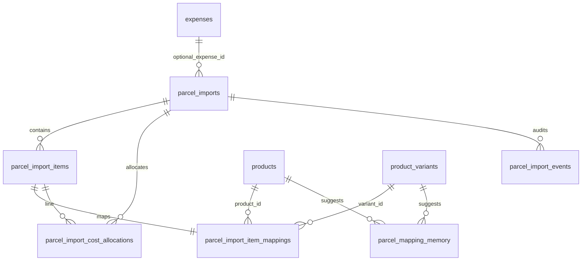

# Parcel Imports — Migration 001 Plan

**Status:** Planning only — **no SQL file, no app code changes**  
**Prerequisites:**

- [002_schema_sketch.md](./002_schema_sketch.md) — table purposes and relationships
- [003_existing_schema_inspection.md](./003_existing_schema_inspection.md) — live repo column names and patterns

**Goal:** Define exactly what the **first** Supabase migration should create for Parcel Imports persistence (Save Draft / Load History foundation).

*Last updated: 2026-06-03*

---

## 1. Purpose

This document is the **concrete implementation plan** for Migration 001. It specifies:

- Which tables to create
- Column names, types, constraints, and indexes
- RLS and `updated_at` trigger approach
- Creation order and rollback notes
- Pre-flight checks against live DDL

It is **not** the migration SQL itself. Phase 6 (Save Draft) application code must not depend on DB tables until Migration 001 is applied and validated.

**Design anchor:** Persist parcel import state first. **Do not** update `products.unit_cost` or `product_variants.stock` in this migration. CPI mirroring and inventory receiving belong to later migrations / approve flows.

---

## 2. Migration scope

### In scope (Migration 001)

| Item | Notes |
|------|-------|
| `parcel_imports` | Header + XLS baseline + actual overrides + final snapshot columns |
| `parcel_import_items` | Parsed line rows |
| `parcel_import_item_mappings` | Row type, status, product/variant FKs |
| `parcel_import_cost_allocations` | Preview + final allocation rows (schema only; app writes later) |
| `parcel_import_events` | Audit from day one |
| `parcel_mapping_memory` | Suggestion memory schema (no algorithm) |
| Constraints, checks, indexes | Per table below |
| `updated_at` triggers | Reuse `public.set_updated_at()` if present |
| RLS enable + policy sketch | Authenticated admin; no anon |
| Optional `expense_id` FK | Only if live `public.expenses.id` confirmed UUID |

### Out of scope (later migrations / phases)

| Item | Deferred to |
|------|-------------|
| Product CPI UPDATE on approve | Migration 002+ / approve RPC (Phase 8) |
| Approval stored procedure / edge function | Phase 8 |
| Expense auto-creation on approve | Phase 9 |
| Inventory receiving / `stock_ledger` writes | Phase 10+ |
| `inventory_receipts` table | Not planned for 001 |
| `parcel_import_adjustments` dedicated table | Events + header columns sufficient for v1 |
| Mapping suggestion engine | Phase 7 app code |
| Supabase Storage bucket for raw `.xls` blobs | Optional column `raw_file_storage_path` nullable; bucket later |
| Baestao top-up ledger | Future initiative |
| Triggers blocking UPDATE on `approved` rows | Migration 002 or approve hardening |
| Changes to `products` / `product_variants` | Never in 001 |

---

## 3. Naming convention

### Migration file

**Recommended:**

```
supabase/migrations/YYYYMMDDHHMMSS_create_parcel_imports.sql
```

Example (when written):

```
supabase/migrations/20260603120000_create_parcel_imports.sql
```

Repo also uses date-only prefixes (`20260721_amazon_listings_schema.sql`). Either is acceptable; prefer **timestamp suffix** if multiple migrations may land same day.

### Table naming

- Plural table names: `parcel_imports`, `parcel_import_items`, …
- Schema: `public`
- FK columns: `{table_singular}_id` → `parcel_import_id`, `parcel_import_item_id`
- Status/type values: **snake_case** in DB (`needs_mapping`, `business_inventory`) — map from UI labels in app layer

### Comments

Every table and non-obvious column should have `COMMENT ON` in the eventual SQL (especially `item_weight_grams` semantics and `allocation_run_type`).

---

## 4. Table creation order

Execute in this order when writing SQL:

| Step | Object | Depends on |
|------|--------|------------|
| 1 | `public.set_updated_at()` | Idempotent `CREATE OR REPLACE` (already in `20260721_amazon_listings_schema.sql`) |
| 2 | `parcel_imports` | `public.expenses` (optional FK) |
| 3 | `parcel_import_items` | `parcel_imports` |
| 4 | `parcel_import_item_mappings` | `parcel_import_items`, `parcel_imports`, `products`, `product_variants` |
| 5 | `parcel_import_cost_allocations` | `parcel_imports`, `parcel_import_items` |
| 6 | `parcel_import_events` | `parcel_imports` |
| 7 | `parcel_mapping_memory` | `products`, `product_variants` (standalone; no parcel FK) |
| 8 | Indexes | After all tables |
| 9 | `ENABLE ROW LEVEL SECURITY` + policies | After tables |
| 10 | `BEFORE UPDATE` triggers for `updated_at` | After tables |

**Why mappings before allocations:** Allocations reference `parcel_import_item_id`; mappings are 1:1 with items and should exist when saving draft bundles.

---

## 5. Detailed plan: `parcel_imports`

### Columns

| Column | Type | Null | Default | Notes |
|--------|------|------|---------|-------|
| `id` | `uuid` | NO | `gen_random_uuid()` | PK |
| `parcel_id` | `text` | NO | — | Baestao parcel ID; **not** globally unique |
| `source_file_name` | `text` | YES | — | Original upload filename |
| `source_format` | `text` | NO | `'baestao_html_xls'` | Matches `SOURCE_FORMAT` in JS |
| `file_size_bytes` | `bigint` | YES | — | From `File.size` |
| `file_hash` | `text` | YES | — | SHA-256 hex; duplicate hint |
| `raw_file_storage_path` | `text` | YES | — | Future Storage path; unused in v1 app |
| `status` | `text` | NO | `'draft'` | See CHECK below |
| `imported_at` | `timestamptz` | NO | `now()` | Parse / operator timestamp |
| `created_at` | `timestamptz` | NO | `now()` | |
| `updated_at` | `timestamptz` | NO | `now()` | Trigger-maintained |
| `approved_at` | `timestamptz` | YES | — | Set on approve (later) |
| `approved_by` | `uuid` | YES | — | Confirm FK → `auth.users(id)` live |
| `voided_at` | `timestamptz` | YES | — | |
| `voided_by` | `uuid` | YES | — | Confirm FK → `auth.users(id)` live |
| `notes` | `text` | YES | — | Operator notes |

**XLS baseline (parsed snapshot at save):**

| Column | Type |
|--------|------|
| `xls_total_items` | `integer` |
| `xls_parcel_weight_grams` | `numeric(12,2)` |
| `xls_charged_weight_grams` | `numeric(12,2)` |
| `xls_total_item_fee_cny` | `numeric(12,2)` |
| `xls_shipment_fee_cny` | `numeric(12,2)` |
| `xls_insurance_text` | `text` |
| `xls_insurance_cny` | `numeric(12,2)` |
| `xls_service_fee_cny` | `numeric(12,2)` |
| `xls_total_parcel_charge_cny` | `numeric(12,2)` |
| `raw_footer` | `jsonb` | DEFAULT `'{}'::jsonb` | Footer KV + parser metadata; may contain PII |

**Actual / override (current working copy):**

| Column | Type |
|--------|------|
| `actual_parcel_weight_grams` | `numeric(12,2)` |
| `actual_charged_weight_grams` | `numeric(12,2)` |
| `actual_shipment_fee_cny` | `numeric(12,2)` |
| `actual_service_fee_cny` | `numeric(12,2)` |
| `actual_insurance_yes` | `boolean` |
| `actual_insurance_cny` | `numeric(12,2)` |
| `actual_total_charge_cny` | `numeric(12,2)` |
| `effective_fx_rate` | `numeric(12,6)` |
| `usd_equivalent` | `numeric(12,2)` |

**Final approval snapshot (populated on approve later):**

| Column | Type | Default |
|--------|------|---------|
| `final_total_allocated_cny` | `numeric(12,2)` | — |
| `final_weighted_landed_cpi_cny` | `numeric(12,4)` | — |
| `final_weighted_landed_cpi_usd` | `numeric(12,4)` | — |
| `final_fulfilled_cpi_preview_usd` | `numeric(12,4)` | — |
| `products_affected_count` | `integer` | `0` NOT NULL |
| `rows_excluded_count` | `integer` | `0` NOT NULL |
| `rows_needing_mapping_count` | `integer` | `0` NOT NULL |
| `approval_idempotency_key` | `text` | — |
| `cpi_update_applied_at` | `timestamptz` | — |

**Expense linkage (conditional FK):**

| Column | Type | FK |
|--------|------|-----|
| `expense_id` | `uuid` | `REFERENCES public.expenses(id) ON DELETE SET NULL` |

> **Pre-flight:** Confirm `public.expenses.id` is `uuid` in live DDL before adding FK. If table missing on env, omit FK and add in Migration 001b.

### CHECK constraints

```text
status IN (
  'draft', 'needs_review', 'ready_to_approve',
  'approved', 'voided', 'error'
)

-- Non-negative money/weight (where column IS NOT NULL):
xls_parcel_weight_grams >= 0
actual_parcel_weight_grams >= 0
xls_shipment_fee_cny >= 0
actual_shipment_fee_cny >= 0
... (same pattern for other CNY fee columns)

effective_fx_rate IS NULL OR effective_fx_rate > 0
usd_equivalent IS NULL OR usd_equivalent >= 0
products_affected_count >= 0
rows_excluded_count >= 0
rows_needing_mapping_count >= 0
```

Do **not** CHECK-enforce `approved` ⇒ `approved_at IS NOT NULL` in 001 (approve flow not built yet).

### Indexes

| Index | Columns | Notes |
|-------|---------|-------|
| `idx_parcel_imports_status` | `(status)` | History filters |
| `idx_parcel_imports_imported_at` | `(imported_at DESC)` | Recent first |
| `idx_parcel_imports_parcel_id` | `(parcel_id)` | Lookup / duplicate warning |
| `idx_parcel_imports_file_hash` | `(file_hash)` WHERE `file_hash IS NOT NULL` | Partial |
| `idx_parcel_imports_expense_id` | `(expense_id)` WHERE `expense_id IS NOT NULL` | Partial |
| `idx_parcel_imports_idempotency` | `(approval_idempotency_key)` UNIQUE WHERE `approval_idempotency_key IS NOT NULL` | Partial unique |

---

## 6. Detailed plan: `parcel_import_items`

### Weight semantics (parser decision)

| Field | Meaning |
|-------|---------|
| `item_weight_grams` | **Per-unit weight** from Baestao `Weight(g)` column (matches `normalizeItemRow().itemWeightGrams`) |
| Allocation in app | `line_weight = item_weight_grams × quantity` when both present (`cpi/costAllocation.js`) |

Store **per-unit** weight in DB; do not precompute line total in column (derivable). Document via `COMMENT ON COLUMN`.

If future exports prove line-total weight, raw JSON preserves source cells for re-parse.

### Columns

| Column | Type | Null | Notes |
|--------|------|------|-------|
| `id` | `uuid` | NO | PK, `gen_random_uuid()` |
| `parcel_import_id` | `uuid` | NO | FK → `parcel_imports(id)` **ON DELETE CASCADE** |
| `row_number` | `integer` | NO | Parser-stable row key |
| `export_row_no` | `integer` | YES | Baestao "No." column |
| `source_item_name` | `text` | NO | Chinese title preserved |
| `seller_name` | `text` | YES | |
| `baestao_order_id` | `text` | YES | |
| `unit_price_cny` | `numeric(12,4)` | YES | |
| `quantity` | `integer` | YES | |
| `item_weight_grams` | `numeric(12,2)` | YES | Per-unit grams |
| `seller_freight_cny` | `numeric(12,2)` | YES | DEFAULT `0` |
| `row_total_cny` | `numeric(12,2)` | YES | XLS row total column |
| `line_item_subtotal_cny` | `numeric(12,2)` | YES | Derived/subtotal if parsed |
| `remove_package` | `text` | YES | Raw export value |
| `raw` | `jsonb` | NO | DEFAULT `'{}'` | Column-keyed cells |
| `parser_warnings` | `jsonb` | NO | DEFAULT `'[]'` | Row issues array |
| `created_at` | `timestamptz` | NO | DEFAULT `now()` |

No `updated_at` on items — replace-on-save strategy for draft updates (delete children + reinsert, or upsert by `row_number` in app). Events table captures changes.

### Constraints

```text
UNIQUE (parcel_import_id, row_number)
quantity IS NULL OR quantity >= 0
item_weight_grams IS NULL OR item_weight_grams >= 0
seller_freight_cny IS NULL OR seller_freight_cny >= 0
```

### Indexes

| Index | Columns |
|-------|---------|
| `idx_parcel_import_items_import` | `(parcel_import_id)` |
| `idx_parcel_import_items_row` | `(parcel_import_id, row_number)` |
| `idx_parcel_import_items_order` | `(baestao_order_id)` |
| `idx_parcel_import_items_seller` | `(seller_name)` |

---

## 7. Detailed plan: `parcel_import_item_mappings`

### Columns

| Column | Type | Null | Notes |
|--------|------|------|-------|
| `id` | `uuid` | NO | PK |
| `parcel_import_item_id` | `uuid` | NO | **UNIQUE** FK → `parcel_import_items(id)` ON DELETE CASCADE |
| `parcel_import_id` | `uuid` | NO | FK → `parcel_imports(id)` ON DELETE CASCADE |
| `product_id` | `uuid` | YES | FK → `public.products(id)` ON DELETE SET NULL |
| `product_variant_id` | `uuid` | YES | FK → `public.product_variants(id)` ON DELETE SET NULL |
| `mapped_product_label` | `text` | YES | UI snapshot / debug |
| `mapped_variant_label` | `text` | YES | UI snapshot / debug |
| `row_type` | `text` | NO | CHECK below |
| `mapping_status` | `text` | NO | CHECK below |
| `mapping_confidence` | `numeric(5,4)` | YES | 0–1 for suggestions |
| `mapping_source` | `text` | YES | `manual`, `seller_history`, `title_match`, `sourcing_url`, `imported_placeholder` |
| `notes` | `text` | YES | |
| `created_at` | `timestamptz` | NO | DEFAULT `now()` |
| `updated_at` | `timestamptz` | NO | DEFAULT `now()`; trigger |

### CHECK constraints

```text
row_type IN (
  'business_inventory', 'personal_excluded', 'supplies', 'unknown'
)
mapping_status IN (
  'needs_mapping', 'matched', 'variant_uncertain',
  'personal_excluded', 'parser_warning'
)
mapping_confidence IS NULL OR (mapping_confidence >= 0 AND mapping_confidence <= 1)
```

**Intentionally no DB rule** requiring `product_id` when `mapping_status = matched` — approve RPC validates in Phase 8.

**Personal / excluded:** `product_id` and `product_variant_id` expected NULL.

### Indexes

| Index | Columns |
|-------|---------|
| `idx_piim_import` | `(parcel_import_id)` |
| `idx_piim_product` | `(product_id)` WHERE `product_id IS NOT NULL` |
| `idx_piim_variant` | `(product_variant_id)` WHERE `product_variant_id IS NOT NULL` |
| `idx_piim_status` | `(parcel_import_id, mapping_status)` |

---

## 8. Detailed plan: `parcel_import_cost_allocations`

### Purpose

Persist CPI allocation lines. Schema supports both run types; **app behavior:**

| `allocation_run_type` | When app writes (Phase 6+) |
|-----------------------|----------------------------|
| `preview` | **Save Draft** — replace prior preview rows for same import |
| `final` | **Approve** (Phase 8) — insert once; immutable |

Migration 001 creates table only; no writer until API exists.

### Columns

| Column | Type | Null | Notes |
|--------|------|------|-------|
| `id` | `uuid` | NO | PK |
| `parcel_import_id` | `uuid` | NO | FK → `parcel_imports` CASCADE |
| `parcel_import_item_id` | `uuid` | NO | FK → `parcel_import_items` CASCADE |
| `allocation_run_type` | `text` | NO | `preview` \| `final` |
| `allocation_method` | `text` | NO | `weight_based` \| `equal_split` |
| `product_cost_cny` | `numeric(12,4)` | NO | DEFAULT `0` |
| `seller_freight_cny` | `numeric(12,2)` | NO | DEFAULT `0` |
| `parcel_shipping_share_cny` | `numeric(12,4)` | NO | DEFAULT `0` |
| `service_share_cny` | `numeric(12,4)` | NO | DEFAULT `0` |
| `insurance_share_cny` | `numeric(12,4)` | NO | DEFAULT `0` |
| `fx_payment_share_cny` | `numeric(12,4)` | NO | DEFAULT `0` |
| `landed_total_cny` | `numeric(12,4)` | NO | |
| `landed_cpi_cny` | `numeric(12,4)` | YES | Per unit; null if qty 0 |
| `landed_cpi_usd` | `numeric(12,4)` | YES | |
| `effective_fx_rate` | `numeric(12,6)` | YES | Snapshot at allocation time |
| `included_in_product_cpi_preview` | `boolean` | NO | DEFAULT `false` |
| `included_in_final_product_cpi` | `boolean` | NO | DEFAULT `false` |
| `warnings` | `jsonb` | NO | DEFAULT `'[]'` |
| `created_at` | `timestamptz` | NO | DEFAULT `now()` |

No `updated_at` — allocation rows are insert-only snapshots.

### CHECK constraints

```text
allocation_run_type IN ('preview', 'final')
allocation_method IN ('weight_based', 'equal_split')
-- non-negative numeric columns >= 0 where applicable
effective_fx_rate IS NULL OR effective_fx_rate > 0
```

### Indexes

| Index | Columns |
|-------|---------|
| `idx_pica_import` | `(parcel_import_id)` |
| `idx_pica_item` | `(parcel_import_item_id)` |
| `idx_pica_run` | `(parcel_import_id, allocation_run_type)` |

**Optional later:** UNIQUE `(parcel_import_item_id, allocation_run_type)` if exactly one row per item per run type is enforced.

---

## 9. Detailed plan: `parcel_import_events`

### Columns

| Column | Type | Null |
|--------|------|------|
| `id` | `uuid` | NO |
| `parcel_import_id` | `uuid` | NO FK CASCADE |
| `event_type` | `text` | NO |
| `event_message` | `text` | YES |
| `event_payload` | `jsonb` | NO DEFAULT `'{}'` |
| `actor_id` | `uuid` | YES | `auth.users` if confirmed |
| `created_at` | `timestamptz` | NO DEFAULT `now()` |

### `event_type` values (documented; optional CHECK)

```text
parsed
draft_saved
override_changed
mapping_changed
status_changed
preview_allocated
approved
voided
expense_linked
cpi_update_applied
inventory_received
error
```

Use TEXT without CHECK in 001 for forward compatibility; or CHECK with above list if team prefers strictness.

### Indexes

| Index | Columns |
|-------|---------|
| `idx_pie_import_created` | `(parcel_import_id, created_at DESC)` |
| `idx_pie_type` | `(event_type)` |

Append-only — no `updated_at`.

---

## 10. Detailed plan: `parcel_mapping_memory`

Standalone table — not FK-linked to a specific import (reused across imports).

### Columns

| Column | Type | Null | Notes |
|--------|------|------|-------|
| `id` | `uuid` | NO | PK |
| `seller_name` | `text` | YES | Primary matching signal |
| `normalized_source_item_name` | `text` | YES | Normalized Chinese/ASCII title |
| `source_item_name_sample` | `text` | YES | Human-readable example |
| `source_url` | `text` | YES | Hint only; listings change |
| `source_url_hash` | `text` | YES | SHA-256 normalized URL |
| `product_id` | `uuid` | NO | FK → `products(id)` ON DELETE CASCADE |
| `product_variant_id` | `uuid` | YES | FK → `product_variants(id)` ON DELETE SET NULL |
| `confidence_score` | `numeric(5,4)` | YES | |
| `usage_count` | `integer` | NO | DEFAULT `1` |
| `last_used_at` | `timestamptz` | NO | DEFAULT `now()` |
| `created_at` | `timestamptz` | NO | DEFAULT `now()` |
| `updated_at` | `timestamptz` | NO | Trigger |
| `notes` | `text` | YES | |

### Indexes

| Index | Columns |
|-------|---------|
| `idx_pmm_seller` | `(seller_name)` |
| `idx_pmm_url_hash` | `(source_url_hash)` WHERE NOT NULL |
| `idx_pmm_product` | `(product_id)` |
| `idx_pmm_normalized_name` | `(normalized_source_item_name)` |

**Upsert key (app, not DB unique in 001):** `(seller_name, normalized_source_item_name, product_id, product_variant_id)` — add UNIQUE in later migration if collisions are understood.

**Rule:** Memory suggests only; never auto-approve.

---

## 11. RLS plan

### Principles (from 003 inspection)

| Rule | Parcel Imports v1 |
|------|-------------------|
| Anon | **No policies** — default deny |
| Authenticated admin | Full CRUD on draft tables (match `expenses` pattern) |
| Service role | `FOR ALL` bypass for future edge functions (match `amazon_finance_transactions`) |
| Public catalog | N/A — parcel data is admin-only |

### Per-table approach

1. `ALTER TABLE ... ENABLE ROW LEVEL SECURITY` on all six tables.
2. Policies (names illustrative — exact SQL when migration written):

| Policy pattern | Role | Operations |
|----------------|------|------------|
| `{table}_authenticated_all` | `authenticated` | SELECT, INSERT, UPDATE, DELETE `USING (true) WITH CHECK (true)` |
| `{table}_service_role_all` | `service_role` | ALL |

3. **DELETE:** Allowed in v1 for draft cleanup; consider restricting DELETE on `approved` imports in Migration 002 via policy or trigger.
4. **No anon policies** on parcel tables.

> **Note:** `js/admin/expenses/api.js` uses anon key with page-level gate. Parcel Imports API should prefer **authenticated** Supabase session when auth is wired; RLS still blocks raw anon REST if key leaks.

### Grants

```text
GRANT SELECT, INSERT, UPDATE, DELETE ON parcel_* TO authenticated;
GRANT ALL ON parcel_* TO service_role;
```

Match Amazon finance grant style from `20260812_amazon_orders_phase_bc.sql`.

---

## 12. `updated_at` trigger plan

### Repo finding

`public.set_updated_at()` **exists** in:

- `supabase/migrations/20260721_amazon_listings_schema.sql` (lines 11–19)

```sql
CREATE OR REPLACE FUNCTION public.set_updated_at()
RETURNS TRIGGER LANGUAGE plpgsql AS $$
BEGIN
  NEW.updated_at = now();
  RETURN NEW;
END;
$$;
```

### Recommendation

| Table | Trigger |
|-------|---------|
| `parcel_imports` | `BEFORE UPDATE` → `set_updated_at()` |
| `parcel_import_item_mappings` | same |
| `parcel_mapping_memory` | same |
| `parcel_import_items` | **No trigger** (immutable per save batch or app-managed) |
| `parcel_import_cost_allocations` | **No trigger** (insert-only snapshots) |
| `parcel_import_events` | **No trigger** (append-only) |

Migration SQL should use idempotent pattern from Amazon schema:

```sql
CREATE OR REPLACE FUNCTION public.set_updated_at() ... -- if not exists
DROP TRIGGER IF EXISTS trg_parcel_imports_updated_at ON parcel_imports;
CREATE TRIGGER trg_parcel_imports_updated_at
  BEFORE UPDATE ON parcel_imports
  FOR EACH ROW EXECUTE FUNCTION public.set_updated_at();
```

**Fallback:** If linked DB lacks `set_updated_at`, migration 001 includes the function definition (copy from Amazon migration).

`update_expenses_updated_at()` is table-specific — **do not** reuse for parcel tables.

---

## 13. Rollback considerations

### Safe rollback order (DROP)

1. `parcel_import_events`
2. `parcel_import_cost_allocations`
3. `parcel_import_item_mappings`
4. `parcel_import_items`
5. `parcel_import_imports` ← **parcel_imports**
6. `parcel_mapping_memory` (independent; can drop anytime after step 5 if no FK from parcels)

### Notes

| Risk | Mitigation |
|------|------------|
| `expense_id` FK | DROP `parcel_imports` does not delete `expenses` (`ON DELETE SET NULL` on import side only) |
| Product data | **Untouched** — rollback does not affect `products` / `product_variants` |
| Child CASCADE | Dropping `parcel_imports` CASCADE drops items, mappings, allocations, events |
| Production data loss | Migration 001 on prod only after backup; test on staging first |

Do not drop `set_updated_at()` on rollback — shared by Amazon tables.

---

## 14. Migration validation checklist

Run after SQL is applied (manual or `supabase db query`):

### Schema existence

- [ ] All six tables exist in `public`
- [ ] `parcel_imports.expense_id` FK present (if pre-flight passed) or column exists without FK

### Constraints

- [ ] Invalid `status` rejected
- [ ] Negative `actual_shipment_fee_cny` rejected
- [ ] `UNIQUE (parcel_import_id, row_number)` on items enforced
- [ ] `UNIQUE (parcel_import_item_id)` on mappings enforced
- [ ] Duplicate `approval_idempotency_key` rejected when not null
- [ ] **Duplicate `parcel_id` allowed** across two import rows

### FK cascade

- [ ] Delete `parcel_imports` row cascades to items, mappings, allocations, events
- [ ] Delete `products` row sets mapping `product_id` NULL (SET NULL) or fails per FK choice — confirm `ON DELETE SET NULL`

### RLS

- [ ] Anon `SELECT` on `parcel_imports` returns permission denied
- [ ] Authenticated session can `INSERT` + `SELECT` draft row
- [ ] Service role can read/write

### Triggers

- [ ] `UPDATE parcel_imports` bumps `updated_at`

### Smoke insert (authenticated)

- [ ] Insert header with `status = draft`, one item, one mapping, one preview allocation, one event
- [ ] Read back joins on `parcel_import_id`

---

## 15. Decisions required before writing SQL

| # | Decision | Action |
|---|----------|--------|
| 1 | `public.expenses.id` type is `uuid` | `\d expenses` on linked DB or Dashboard |
| 2 | `public.products.id` / `product_variants.id` are `uuid` | Confirm before FK |
| 3 | `public.set_updated_at()` exists on target DB | `SELECT proname FROM pg_proc WHERE proname = 'set_updated_at'` |
| 4 | `approved_by` / `voided_by` FK to `auth.users(id)` | Confirm Supabase Auth used for admin approve |
| 5 | `raw_file_storage_path` in 001 vs defer column | **Recommend:** include nullable column; no bucket |
| 6 | RLS: authenticated full access vs read-only + service write | **Recommend:** authenticated full for v1 (expenses parity) |
| 7 | `event_type` CHECK constraint vs free text | **Recommend:** free text in 001 |
| 8 | UNIQUE one allocation per item per run type | Defer to 002 if needed |
| 9 | `parcel_mapping_memory` UNIQUE upsert key | Defer UNIQUE to after Phase 7 testing |

### Suggested pre-flight script (when ready)

```bash
npx supabase db query --linked -c "\d public.expenses"
npx supabase db query --linked -c "\d public.products"
npx supabase db query --linked -c "\d public.product_variants"
npx supabase db query --linked -c "SELECT proname FROM pg_proc WHERE proname = 'set_updated_at'"
```

---

## Pre-flight DDL check results

**Run date:** 2026-06-03  
**Target:** Linked project `yxdzvzscufkvewecvagq` (Karry Kraze Website)  
**Method:** `npx supabase db query --linked "<SQL>"` from repo root (Supabase CLI v2.105.0)

### Commands run

```powershell
cd d:\SMOJO\Online\Buisness\kk6\justinlmcneal.github.io

# 1–3: id column types
npx supabase db query --linked "SELECT table_name, column_name, data_type, udt_name FROM information_schema.columns WHERE table_schema = 'public' AND table_name IN ('expenses', 'products', 'product_variants') AND column_name = 'id' ORDER BY table_name;"

# 4: set_updated_at()
npx supabase db query --linked "SELECT n.nspname AS schema, p.proname, pg_get_function_identity_arguments(p.oid) AS args, pg_get_function_result(p.oid) AS result FROM pg_proc p JOIN pg_namespace n ON n.oid = p.pronamespace WHERE p.proname = 'set_updated_at' ORDER BY n.nspname;"

# 5: auth.users(id) type + existing public FK precedent
npx supabase db query --linked "SELECT table_schema, table_name, column_name, data_type, udt_name FROM information_schema.columns WHERE table_schema = 'auth' AND table_name = 'users' AND column_name = 'id';"
npx supabase db query --linked "SELECT n.nspname AS table_schema, c.relname AS table_name, con.conname, pg_get_constraintdef(con.oid) AS def FROM pg_constraint con JOIN pg_class c ON c.oid = con.conrelid JOIN pg_namespace n ON n.oid = c.relnamespace WHERE con.contype = 'f' AND pg_get_constraintdef(con.oid) ILIKE '%auth.users%' ORDER BY 1,2;"

# 6: RLS on admin reference tables
npx supabase db query --linked "SELECT c.relname AS table_name, c.relrowsecurity AS rls_enabled, pol.polname AS policy_name, CASE pol.polcmd WHEN 'r' THEN 'SELECT' WHEN 'a' THEN 'INSERT' WHEN 'w' THEN 'UPDATE' WHEN 'd' THEN 'DELETE' WHEN '*' THEN 'ALL' END AS cmd, pg_get_expr(pol.polqual, pol.polrelid) AS using_expr, pg_get_expr(pol.polwithcheck, pol.polrelid) AS with_check FROM pg_class c JOIN pg_namespace n ON n.oid = c.relnamespace LEFT JOIN pg_policy pol ON pol.polrelid = c.oid WHERE n.nspname = 'public' AND c.relname IN ('expenses', 'products', 'product_variants', 'amazon_listing_mappings', 'amazon_listing_drafts', 'social_settings') ORDER BY c.relname, pol.polname;"

# Sanity: tables exist; parcel tables not yet created
npx supabase db query --linked "SELECT to_regclass('public.expenses') AS expenses, to_regclass('public.products') AS products, to_regclass('public.product_variants') AS product_variants;"
npx supabase db query --linked "SELECT to_regclass('public.parcel_imports') AS parcel_imports, to_regclass('public.parcel_import_items') AS parcel_import_items;"
```

### Per-check results

| # | Check | Result |
|---|-------|--------|
| 1 | `public.expenses.id` type | **`uuid`** (`data_type` / `udt_name` both `uuid`). Table exists. PK on `id` confirmed. |
| 2 | `public.products.id` type | **`uuid`**. Table exists. PK on `id` confirmed. |
| 3 | `public.product_variants.id` type | **`uuid`**. Table exists. PK on `id` confirmed. |
| 4 | `public.set_updated_at()` exists | **Yes** — `public.set_updated_at()` → `trigger`, zero-arg. Safe to attach `BEFORE UPDATE` triggers without redefining the function. |
| 5 | `approved_by` / `voided_by` → `auth.users(id)` | **`auth.users.id` is `uuid`**. Live precedent in `public`: `promotions.created_by` and `site_settings.updated_by` both `REFERENCES auth.users(id) ON DELETE SET NULL`. Same pattern is safe for nullable audit columns. |
| 6 | Authenticated full-access RLS vs admin tables | **Consistent with plan.** `expenses`: RLS enabled; four `authenticated` policies (SELECT / INSERT / UPDATE / DELETE), all `USING (true)` / `WITH CHECK (true)` — no anon policies. `amazon_listing_mappings` / `amazon_listing_drafts`: `authenticated` ALL + `service_role` ALL. Parcel plan (§11) matches `expenses` + Amazon finance style. Note: `products` / `product_variants` use `is_admin()` for writes — different pattern, not the parcel-import target. |

### FK safety summary

| FK | Safe? | Notes |
|----|-------|-------|
| `parcel_imports.expense_id` → `public.expenses(id)` | **Yes** | Both sides `uuid`; `expenses` PK confirmed; recommend `ON DELETE SET NULL` as planned. |
| `parcel_import_item_mappings.product_id` → `public.products(id)` | **Yes** | Both `uuid`; PK confirmed. |
| `parcel_import_item_mappings.product_variant_id` → `public.product_variants(id)` | **Yes** | Both `uuid`; PK confirmed. |
| `parcel_mapping_memory.product_id` / `product_variant_id` | **Yes** | Same targets as above. |
| `approved_by` / `voided_by` / `actor_id` → `auth.users(id)` | **Yes** | Type match + live `ON DELETE SET NULL` precedent on `promotions` / `site_settings`. |

### `set_updated_at` reuse

**Confirmed reusable.** Function already deployed on linked DB; migration 001 should reference it in triggers only (no `CREATE OR REPLACE` needed unless a future env lacks it — keep idempotent fallback from §12).

### Blockers before writing SQL

**None.** All §15 DDL assumptions hold on the linked production-adjacent database:

- Target parent tables exist with `uuid` PKs.
- `parcel_imports` / `parcel_import_items` do not exist yet (clean create).
- `set_updated_at()` is present.
- `auth.users` FK pattern is established in this project.
- RLS approach (authenticated full CRUD, no anon, add `service_role` ALL) aligns with existing admin tables.

**Next step:** Write `supabase/migrations/YYYYMMDDHHMMSS_create_parcel_imports.sql` per this plan.

---

## 16. Acceptance criteria (this document)

- [x] `004_migration_001_plan.md` exists
- [x] No SQL migration file created
- [x] Exact tables and columns planned for Migration 001
- [x] Constraints, indexes, RLS, and triggers planned
- [x] Unresolved live-DDL checks listed (§15)
- [x] Clear next step: run pre-flight DDL checks, then write `YYYYMMDDHHMMSS_create_parcel_imports.sql`

---

## Appendix A — Entity relationships (Migration 001)



---

## Appendix B — Mapping: local JS → DB columns (Save Draft payload sketch)

| Local state | DB target |
|-------------|-------------|
| `parcel.*` XLS fields | `parcel_imports.xls_*`, `raw_footer` |
| `overrides.*` | `parcel_imports.actual_*`, `effective_fx_rate`, `usd_equivalent` |
| `items[]` | `parcel_import_items` |
| `rowMappings[]` | `parcel_import_item_mappings` |
| `buildCpiPreview().rows` | `parcel_import_cost_allocations` (`preview`) |
| Save action | `parcel_import_events` (`draft_saved`) |

---

## Appendix C — Next steps after Migration 001

| Step | Deliverable |
|------|-------------|
| 1 | Run §15 pre-flight on linked Supabase |
| 2 | Write `supabase/migrations/..._create_parcel_imports.sql` |
| 3 | Apply to staging; run §14 checklist |
| 4 | `005_api_save_draft_plan.md` — payload shape + upsert strategy |
| 5 | Phase 6 app: `api/parcelImportsApi.js` + history table wiring |

**Do not** start Phase 6 API until Migration 001 passes §14 on staging.
