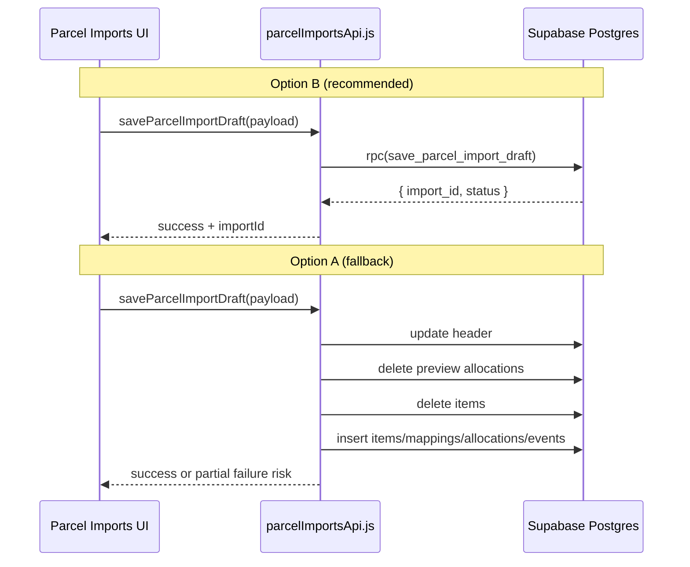

# Parcel Imports — Phase 6: Save Draft / Load History Plan

**Status:** Planning only — **no app code, no API module, no Supabase wiring**  
**Prerequisites:**

- Phases 1–4 local UI complete (`js/admin/parcelImports/`)
- [004_migration_001_plan.md](./004_migration_001_plan.md) applied
- [005_migration_001_validation.md](./005_migration_001_validation.md) passed

**Goal:** Define how browser-local parcel import state is persisted to Supabase and reloaded for history — **Save Draft** and **Load History** only.

*Last updated: 2026-06-08*

---

## 1. Purpose

This document plans **Phase 6** integration between the Parcel Imports admin page and Migration 001 tables. It covers:

- Normalized save payload shape and JS → DB column mapping
- API module signatures (to implement later)
- Create vs update draft rules
- Status calculation (`draft` / `needs_review` / `ready_to_approve`)
- Duplicate parcel/file detection
- Load History table and Load Draft rehydration
- UI button wiring, validation, errors, security, and testing

It does **not** implement code, wire Supabase, or start approval/expense/inventory flows.

---

## 2. Scope

### In scope

| Item | Notes |
|------|-------|
| Save new draft | First save after parse → insert header + children |
| Update existing draft | Re-save when `importId` in state; replace children |
| Replace child rows safely | Items, mappings, preview allocations on each save |
| Save preview allocation snapshot | `allocation_run_type = 'preview'` per item row |
| Load Previous Imports | List/query saved imports into history table |
| Load draft into UI | Rehydrate parse + overrides + mappings from DB |
| Duplicate parcel/file warning | Non-blocking; confirm UX later |
| Status calculation | Persist computed `status` on header |

### Out of scope (later phases)

| Item | Deferred to |
|------|-------------|
| Approve + Update CPI | Phase 8 |
| Product `unit_cost` / variant cost updates | Phase 8 |
| Expense auto-creation / Link Expense | Phase 9 |
| Inventory receiving / `stock_ledger` | Phase 10+ |
| `parcel_mapping_memory` upsert | Phase 7 |
| Raw file Storage bucket / `raw_file_storage_path` blob | Future |
| Edge functions (unless RPC chosen) | Migration 002 if RPC |
| Live product/variant search (real `product_id` FKs) | Phase 7+ |
| `allocation_run_type = 'final'` rows | Phase 8 approve |

---

## 3. Current local state sources

All state lives in `js/admin/parcelImports/state.js` (in-memory only today).

| State key | Source | Used for save |
|-----------|--------|---------------|
| `state.currentFile` | Upload (`events.js` → `setCurrentFile`) | `fileMeta.size`, `fileMeta.name`; hash from `File` bytes |
| `state.parcel` | `setParseResult` ← `parseBaestaoFileText().parcel` | XLS baseline columns + `parcel_id` |
| `state.items` | Parse result `items[]` | `parcel_import_items` |
| `state.xlsBaseline` | `buildXlsBaseline(parcel)` on parse | Immutable XLS snapshot at first parse; stored in `xls_*` columns |
| `state.overrides` | `initOverridesFromParcel` + user edits | `actual_*` columns on header |
| `state.overrideValidation` | `validateOverrides()` | Pre-save gate; not persisted directly |
| `state.rowMappings` | `initMappingFromItems` + `updateRowMappingField` | `parcel_import_item_mappings` |
| `state.errors` / `state.warnings` | Parser | Header `raw_footer` + row `parser_warnings`; drive `needs_review` |
| `state.derived` | `computeDerivedCounts` / `computeMappingCounts` | KPI snapshot fields on header at save |
| `buildCpiPreview()` output | `cpi/cpiPreview.js` | Preview allocations + summary KPIs |

### CPI preview output shape (save input)

```js
{
  rows: [{
    rowNumber, productCostCny, sellerFreightCny,
    parcelShippingShareCny, serviceShareCny, insuranceShareCny,
    fxPaymentShareCny, landedTotalCny, landedCpiCny, landedCpiUsd,
    includedInProductCpiPreview, warnings
  }],
  summary: {
    productsAffected, readyToUpdate, needsMappingRows,
    weightedAverageLandedCpiCny, weightedAverageLandedCpiUsd,
    fulfilledCpiPreviewUsd, effectiveFxRate, rowsExcluded, ...
  },
  warnings: []
}
```

### New state fields (Phase 6 — plan only)

Add to `createInitialState()` when implementing:

| Field | Purpose |
|-------|---------|
| `currentImportId` | `uuid` after first successful save |
| `saveStatus` | `idle` \| `saving` \| `saved` \| `error` |
| `saveMessage` | User-facing save feedback |
| `duplicateWarning` | Result of `checkDuplicateParcelImport` |
| `historyRows` | Cached list for Previous Imports table |

---

## 4. Save Draft payload shape

Single normalized payload assembled by a future `buildSaveDraftPayload()` helper (not coded yet):

```ts
{
  importId: string | null,          // null = create; uuid = update
  fileMeta: {
    name: string | null,
    sizeBytes: number | null,
    hash: string | null,            // SHA-256 hex
    sourceFormat: 'baestao_html_xls'
  },
  parcel: { ... },                  // state.parcel (parser shape)
  xlsBaseline: { ... },             // state.xlsBaseline (frozen at first save)
  overrides: { ... },               // state.overrides (without dirtyFields)
  items: [ ... ],                   // state.items
  mappings: [ ... ],                // state.rowMappings
  cpiPreview: { rows, summary, warnings },
  warnings: {
    parseErrors: [],
    parseWarnings: [],
    overrideErrors: [],
    cpiWarnings: []
  },
  statusIntent: 'draft' | 'needs_review' | 'ready_to_approve'  // computed; see §8
}
```

### Header: `parcel_imports`

| Payload / state | DB column | Notes |
|-----------------|-----------|-------|
| `fileMeta.name` | `source_file_name` | |
| `fileMeta.sourceFormat` | `source_format` | Default `baestao_html_xls` |
| `fileMeta.sizeBytes` | `file_size_bytes` | |
| `fileMeta.hash` | `file_hash` | SHA-256 hex |
| — | `raw_file_storage_path` | NULL in Phase 6 |
| `parcel.parcelId` | `parcel_id` | Required |
| `statusIntent` | `status` | See §8 |
| `parcel.importedAt` or `now()` | `imported_at` | ISO → timestamptz |
| `parcel.totalItems` | `xls_total_items` | |
| `parcel.parcelWeightGrams` | `xls_parcel_weight_grams` | |
| `parcel.chargedWeightGrams` | `xls_charged_weight_grams` | |
| `parcel.totalItemFeeCny` | `xls_total_item_fee_cny` | |
| `parcel.shipmentFeeCny` | `xls_shipment_fee_cny` | |
| `parcel.insuranceLabel` | `xls_insurance_text` | |
| `parcel.insuranceCny` | `xls_insurance_cny` | |
| `parcel.serviceFeeCny` | `xls_service_fee_cny` | |
| `parcel.totalParcelChargeCny` | `xls_total_parcel_charge_cny` | |
| `parcel.raw` + parser meta | `raw_footer` | jsonb: footer cells, `parseErrors`, `parseWarnings` |
| `overrides.parcelWeightGrams` | `actual_parcel_weight_grams` | |
| `overrides.chargedWeightGrams` | `actual_charged_weight_grams` | |
| `overrides.shipmentFeeCny` | `actual_shipment_fee_cny` | |
| `overrides.serviceFeeCny` | `actual_service_fee_cny` | |
| `overrides.insuranceYes` | `actual_insurance_yes` | |
| `overrides.insuranceCny` | `actual_insurance_cny` | |
| `overrides.totalParcelChargeCny` | `actual_total_charge_cny` | |
| `overrides.effectiveFxRate` | `effective_fx_rate` | |
| `overrides.usdEquivalent` | `usd_equivalent` | |
| `cpiPreview.summary.weightedAverageLandedCpiCny` | — | **Not** final columns; preview only in allocations |
| `cpiPreview.summary.productsAffected` | `products_affected_count` | Snapshot at save |
| `cpiPreview.summary.rowsExcluded` | `rows_excluded_count` | |
| `cpiPreview.summary.needsMappingRows` | `rows_needing_mapping_count` | |
| — | `final_*` columns | NULL in Phase 6 |
| — | `expense_id` | NULL in Phase 6 |
| — | `notes` | Optional operator notes (UI TBD) |

**Update rule for `xls_*`:** On **create**, copy from `parcel` / `xlsBaseline`. On **update**, preserve original `xls_*` from DB (do not overwrite with edited overrides). Only `actual_*` reflect working copy.

### Items: `parcel_import_items`

| Item field | DB column |
|------------|-----------|
| (generated on insert) | `id` |
| `importId` | `parcel_import_id` |
| `rowNumber` | `row_number` |
| `exportRowNo` | `export_row_no` |
| `sourceItemName` | `source_item_name` |
| `sellerName` | `seller_name` |
| `baestaoOrderId` | `baestao_order_id` |
| `unitPriceCny` | `unit_price_cny` |
| `quantity` | `quantity` |
| `itemWeightGrams` | `item_weight_grams` |
| `sellerFreightCny` | `seller_freight_cny` |
| `rowTotalCny` | `row_total_cny` |
| `lineItemSubtotalCny` | `line_item_subtotal_cny` |
| `removePackage` | `remove_package` |
| `raw` | `raw` |
| `rowIssues` + row-level parse warnings | `parser_warnings` |

### Mappings: `parcel_import_item_mappings`

| Mapping field | DB column | Transform |
|---------------|-----------|-----------|
| (item insert id) | `parcel_import_item_id` | Join on `row_number` |
| `importId` | `parcel_import_id` | |
| `mappedProductLabel` | `mapped_product_label` | |
| `mappedVariantLabel` | `mapped_variant_label` | |
| `rowType` (UI label) | `row_type` | See enum map below |
| `mappingStatus` (UI label) | `mapping_status` | See enum map below |
| — | `product_id` | **NULL** in Phase 6 (labels only) |
| — | `product_variant_id` | **NULL** in Phase 6 |
| — | `mapping_confidence` | NULL |
| — | `mapping_source` | `'imported_placeholder'` or `'manual'` |
| `notes` | `notes` | |

**UI label → DB enum** (from [002_schema_sketch.md](./002_schema_sketch.md) §3):

| UI (`constants.js`) | DB `row_type` |
|---------------------|---------------|
| `Business Inventory` | `business_inventory` |
| `Personal / Excluded` | `personal_excluded` |
| `Supplies` | `supplies` |
| `Unknown` | `unknown` |

| UI `MAPPING_STATUS` | DB `mapping_status` |
|---------------------|---------------------|
| `Needs Mapping` | `needs_mapping` |
| `Matched` | `matched` |
| `Variant Uncertain` | `variant_uncertain` |
| `Personal / Excluded` | `personal_excluded` |
| `Parser Warning` | `parser_warning` |

Implement `mapping/enumCodec.js` (planned) for encode/decode.

### Preview allocations: `parcel_import_cost_allocations`

One row per `cpiPreview.rows[]` entry:

| CPI row field | DB column | Fixed value |
|---------------|-----------|-------------|
| — | `allocation_run_type` | `'preview'` |
| — | `allocation_method` | From `buildWeightAllocation().method` → `weight_based` or `equal_split` |
| `productCostCny` | `product_cost_cny` | |
| `sellerFreightCny` | `seller_freight_cny` | |
| `parcelShippingShareCny` | `parcel_shipping_share_cny` | |
| `serviceShareCny` | `service_share_cny` | |
| `insuranceShareCny` | `insurance_share_cny` | |
| `fxPaymentShareCny` | `fx_payment_share_cny` | |
| `landedTotalCny` | `landed_total_cny` | Required NOT NULL |
| `landedCpiCny` | `landed_cpi_cny` | |
| `landedCpiUsd` | `landed_cpi_usd` | |
| `cpiPreview.summary.effectiveFxRate` | `effective_fx_rate` | Per row snapshot |
| `includedInProductCpiPreview` | `included_in_product_cpi_preview` | |
| — | `included_in_final_product_cpi` | `false` |
| `warnings` | `warnings` | jsonb array |

### Events: `parcel_import_events`

| When | `event_type` | `event_payload` (sketch) |
|------|--------------|----------------------------|
| First save after parse (create) | `parsed` | `{ itemCount, parcelId, fileHash }` |
| Every successful save | `draft_saved` | `{ status, productsAffected, rowCount }` |
| Override dirty on save (optional) | `override_changed` | `{ dirtyFields: [...] }` — only if any `dirtyFields` set |

`actor_id` = `session.user.id` when authenticated.

---

## 5. API module plan

**Create later:** `js/admin/parcelImports/api/parcelImportsApi.js`

Pattern: mirror `js/admin/expenses/api.js` — `@supabase/supabase-js@2` with `SUPABASE_URL` + `SUPABASE_ANON_KEY`, **authenticated session required** (see §16).

### Planned functions

```js
/**
 * Create or update from normalized payload.
 * Routes to create vs update based on payload.importId.
 * @returns {{ importId, status, duplicateWarning? }}
 */
export async function saveParcelImportDraft(payload)

/** Insert new header + children. */
export async function createParcelImportDraft(payload)

/** Update existing draft (status guard). */
export async function updateParcelImportDraft(importId, payload)

/**
 * List imports for Previous Imports table.
 * @param {{ status?: string, limit?: number, search?: string, cursor?: string }}
 */
export async function listParcelImports(options = {})

/**
 * Load full draft bundle for UI rehydration.
 * @returns {{ header, items, mappings, previewAllocations, events? }}
 */
export async function loadParcelImport(importId)

/**
 * Duplicate hints before save (non-blocking).
 * @returns {{ byParcelId: object[], byFileHash: object[] }}
 */
export async function checkDuplicateParcelImport({ parcelId, fileHash })
```

### Internal helpers (planned, same module or `api/parcelImportsMappers.js`)

- `buildSaveDraftPayload(state, fileMeta)`
- `encodeRowType(uiLabel)` / `decodeRowType(dbValue)`
- `encodeMappingStatus(uiLabel)` / `decodeMappingStatus(dbValue)`
- `computeStatusIntent(state, cpiPreview, warnings)`
- `sha256File(file)` → hex string

---

## 6. Save strategy

### Option A: Client multi-step (Supabase JS)

**Flow (update):**

1. `UPDATE parcel_imports` header
2. `DELETE FROM parcel_import_cost_allocations WHERE parcel_import_id = ? AND allocation_run_type = 'preview'`
3. `DELETE FROM parcel_import_items WHERE parcel_import_id = ?` (cascade deletes mappings)
4. `INSERT` items (batch)
5. `INSERT` mappings (batch)
6. `INSERT` preview allocations (batch)
7. `INSERT` event `draft_saved`

**Pros:** No new migration; matches `expenses/api.js` style; RLS `authenticated` ALL allows all steps.

**Cons:** Not atomic — partial failure leaves orphan/missing children; 5–7 round trips; harder rollback; race if two tabs save same draft.

### Option B: SQL RPC `save_parcel_import_draft(payload jsonb)`

**Flow:** Single `supabase.rpc('save_parcel_import_draft', { payload })` inside Postgres transaction.

**RPC responsibilities:**

- Validate `status` updatable (`draft`, `needs_review`, `ready_to_approve`)
- Upsert header; preserve `xls_*` on update
- Replace children atomically
- Insert preview allocations + events
- Return `{ import_id, status }`

**Pros:** Atomic; one round trip; consistent status; easier partial-failure handling; pattern for Phase 8 approve RPC.

**Cons:** Requires **Migration 002** (`save_parcel_import_draft` function); slightly more backend work before UI wiring.

### Recommendation: **Option B (RPC) for v1 implementation**

| Factor | Weight toward RPC |
|--------|-------------------|
| Child replace consistency | Delete items + reinsert mappings + allocations must succeed together |
| Partial save failure | Client multi-step can leave header updated but no items |
| Future approve RPC | Same transactional pattern |
| RLS | Both work with `authenticated`; RPC runs as invoker |
| Repo precedent | `expenses` is simple CRUD; parcel save is bundle replace |

**Phased delivery:**

1. **Migration 002** (small): `save_parcel_import_draft(jsonb)` + optional `list_parcel_imports` / `load_parcel_import` RPCs if list/join is heavy.
2. **Phase 6 app:** `parcelImportsApi.js` calls RPC for save; list/load can stay client `.from()` queries initially.

**Fallback:** If Migration 002 is delayed, prototype with Option A behind a `saveParcelImportDraftClientOrchestrated()` flag — **not** for production without retry/cleanup logic.

---

## 7. Draft create/update rules

### New draft (`importId == null`)

| Step | Action |
|------|--------|
| 1 | Insert `parcel_imports` with `status`, `xls_*` from parse, `actual_*` from overrides |
| 2 | Insert all `parcel_import_items` |
| 3 | Insert `parcel_import_item_mappings` (1:1 items) |
| 4 | Insert `parcel_import_cost_allocations` (`preview`) |
| 5 | Insert events: `parsed` (if first time from file) + `draft_saved` |
| 6 | Return `importId` → store in `state.currentImportId` |

### Existing draft update (`importId` set)

**Allowed only when** `status IN ('draft', 'needs_review', 'ready_to_approve')`.

| Step | Action |
|------|--------|
| 1 | Re-fetch header `status`; abort if `approved` or `voided` |
| 2 | `UPDATE parcel_imports` — `actual_*`, `status`, KPI counts, `file_hash` if changed; **do not** change `xls_*` |
| 3 | Delete preview allocations for import |
| 4 | Delete all items (cascade mappings) **or** delete mappings + items explicitly |
| 5 | Reinsert items + mappings from current state |
| 6 | Reinsert preview allocations |
| 7 | Insert `draft_saved` event |

### Blocked paths

| Condition | Behavior |
|-----------|----------|
| `status = 'approved'` | Save Draft disabled; show read-only message |
| `status = 'voided'` | Save Draft disabled |
| `status = 'error'` | Save allowed only after operator resets to draft (future) |
| No parse / zero items | Client blocks save (§13) |

---

## 8. Status calculation

Compute `statusIntent` in client before save (RPC may re-validate). **Conservative:** when unsure → `needs_review`.

### `ready_to_approve`

All must be true:

- `items.length > 0`
- `parcel.parcelId` present
- No blocking `overrideValidation.errors`
- No parser `errors` (warnings OK if mapping complete)
- `cpiPreview.summary.readyToUpdate === true` (from `cpiPreview.js`: `productsAffected > 0 && businessMappingIssues === 0`)
- Every `business_inventory` row has `mapping_status = matched` (UI: Matched)
- No `unknown` rows with unresolved mapping
- No `variant_uncertain` or `needs_mapping` on business rows

### `needs_review`

Any of:

- Parser `errors.length > 0`
- `overrideValidation.errors.length > 0`
- `cpiPreview.summary.needsMappingRows > 0`
- Any `parser_warning` on business rows
- Any `variant_uncertain`
- Any `unknown` row type
- `productsAffected === 0` but business rows exist
- CPI preview warnings include "not ready to update CPI"
- Missing FX when USD fields edited

### `draft`

- Fresh parse, user has not completed mapping review, or only placeholder mapping state
- OR explicit first save before mapping table touched (optional lenient path)

**Practical rule:** If not `ready_to_approve` and any issue above → `needs_review`; else if mappings still default/placeholder only → `draft`.

Persist counts on header at save: `products_affected_count`, `rows_excluded_count`, `rows_needing_mapping_count` from `cpiPreview.summary`.

---

## 9. Duplicate detection

| Signal | Strength | Behavior |
|--------|----------|----------|
| `file_hash` match | **Strong** | Warn: "This exact file was already imported on {date}" |
| `parcel_id` match | **Medium** | Warn: "Parcel {id} was imported before ({count} times)" |
| `source_file_name` match | **Weak** | Optional hint only; same filename ≠ same file |

**Rules:**

- No global UNIQUE on `parcel_id` (by design)
- Do **not** block save in Phase 6 — show inline warning banner; optional confirm dialog later
- `checkDuplicateParcelImport` queries:

```sql
-- by file_hash
SELECT id, parcel_id, imported_at, status
FROM parcel_imports
WHERE file_hash = $1
ORDER BY imported_at DESC LIMIT 5;

-- by parcel_id
SELECT id, imported_at, status, source_file_name
FROM parcel_imports
WHERE parcel_id = $1
ORDER BY imported_at DESC LIMIT 10;
```

Exclude `currentImportId` from results when updating.

---

## 10. File hash plan

**Recommendation: yes** — compute SHA-256 in browser on upload/save.

```js
async function sha256File(file) {
  const buf = await file.arrayBuffer();
  const hash = await crypto.subtle.digest('SHA-256', buf);
  return [...new Uint8Array(hash)].map(b => b.toString(16).padStart(2, '0')).join('');
}
```

| Field | Source |
|-------|--------|
| `file_hash` | SHA-256 of `state.currentFile` bytes |
| `file_size_bytes` | `file.size` |
| `source_file_name` | `file.name` |

**Caveats:**

- Re-load draft without re-upload: keep hash from DB; do not recompute unless user re-selects file
- Parse-from-fixture dev path: hash optional null
- Raw blob storage deferred; hash enables duplicate detection without Storage

---

## 11. Load History plan

Replace static placeholder rows in `pages/admin/parcelImports.html` **Previous Imports** section with data from `listParcelImports()`.

### Query (client v1)

```js
supabase.from('parcel_imports')
  .select(`
    id, parcel_id, status, imported_at,
    xls_total_items,
    actual_total_charge_cny,
    products_affected_count,
    rows_needing_mapping_count,
    expense_id,
    source_file_name
  `)
  .order('imported_at', { ascending: false })
  .limit(25)
```

Optional lightweight join for item count if `xls_total_items` null:

```js
.select('..., parcel_import_items(count)')
```

### Display columns

| Column | Source |
|--------|--------|
| Imported | `imported_at` (relative + absolute) |
| Parcel ID | `parcel_id` |
| Status | `status` badge (`draft` / `needs_review` / `ready_to_approve` / …) |
| Items | `xls_total_items` or count |
| Total charge | `actual_total_charge_cny` formatted ¥ |
| Landed CPI | Recompute from preview on open, or show `—` in list v1 |
| Products affected | `products_affected_count` |
| Needs mapping | `rows_needing_mapping_count` |
| Expense | Icon if `expense_id IS NOT NULL` |
| Actions | **Open Draft**, **Duplicate** (placeholder), **View Details** (placeholder) |

### Open Draft

Sets `currentImportId`, calls `loadParcelImport(id)`, rehydrates UI (§12).

### Duplicate (placeholder)

Phase 6: button disabled or "Coming soon" — copies parse into new local session without DB write until Phase 6b.

---

## 12. Load Draft back into UI

### `loadParcelImport(importId)` returns

```js
{
  header,           // parcel_imports row
  items,            // parcel_import_items[]
  mappings,         // parcel_import_item_mappings[]
  previewAllocations // optional; parcel_import_cost_allocations preview rows
}
```

### Rehydration map

| DB | Local state |
|----|-------------|
| `parcel_imports.parcel_id` + `xls_*` | Rebuild `state.parcel` via `headerToParcel()` |
| `xls_*` columns | `state.xlsBaseline` |
| `actual_*` columns | `state.overrides` (+ empty `dirtyFields`) |
| `parcel_import_items` | `state.items` |
| `parcel_import_item_mappings` | `state.rowMappings` (decode enums → UI labels) |
| `raw_footer` | Merge into parcel meta; restore parse warnings if stored |
| — | `state.currentFile` = null unless user re-uploads |
| — | `state.currentImportId` = `header.id` |

### CPI preview on load

**Recommendation: recompute** via `buildCpiPreview()` from rehydrated state — do not render stale DB preview rows as source of truth.

Optional: show "Last saved preview" diff in dev tooling only.

### Re-parse vs load

Loading draft **does not** re-run parser; it restores persisted snapshot. User can upload a new file to start a new session (`resetParseState`, `currentImportId = null`).

---

## 13. Validation before save

### Block save (hard)

| Check | Message |
|-------|---------|
| No items | "Nothing to save — parse a file first." |
| Missing `parcel.parcelId` | "Parcel ID is required." |
| `overrideValidation.errors` | Show first error; block until fixed |
| Invalid numeric overrides (negative fees, FX ≤ 0) | Block |
| Update on `approved`/`voided` | "This import cannot be edited." |

### Allow save as `needs_review` (soft)

- Parser warnings
- Unmapped / variant uncertain rows
- Missing weights on some rows
- CPI preview warnings

### Data integrity

- Strip `overrides.dirtyFields` before persist
- Coerce null quantities/weights to DB null (not NaN)
- Ensure every item has a mapping row (create default if missing)
- Every CPI preview row must have matching `parcel_import_item_id` after item insert

---

## 14. UI integration plan

### Buttons (`parcelImports.html` — wire in Phase 6, no HTML change in this doc pass)

| Button | Phase 6 behavior |
|--------|------------------|
| **Save Draft** | Enabled when parse success + items > 0 + valid overrides |
| Approve + Update CPI | Remains `disabled` / `title="not wired"` |
| Link Expense | Disabled |
| Receive Inventory | Disabled |

### Save Draft UX

1. Click → `saveStatus = saving`, disable button
2. Run duplicate check (parallel or before save)
3. Build payload → `saveParcelImportDraft()`
4. On success: `currentImportId`, `saveStatus = saved`, refresh Previous Imports
5. On error: `saveStatus = error`, show message, re-enable button
6. Show duplicate warning banner if matches found (non-blocking)

### New UI modules (planned)

| File | Role |
|------|------|
| `ui/saveDraft.js` | Button handler, status pill |
| `ui/historyTable.js` | Render Previous Imports from `listParcelImports` |
| `api/parcelImportsApi.js` | Supabase calls |
| `index.js` | Add `requireAdminSession()` before save/list (like expenses) |

### Session gate

Add `requireAdminSession()` in `index.js` on init — redirect or banner if no JWT (pattern from `js/admin/expenses/index.js`).

---

## 15. Error handling

| Layer | Behavior |
|-------|----------|
| User-facing | Status bar / toast near Save Draft: "Draft saved", "Save failed: …" |
| Dev | `console.error` with full Supabase error object |
| RLS / auth | "Sign in required" if no session |
| DB constraint | Map to friendly text: "Invalid status", "Duplicate row number" |
| Partial save (Option A only) | Show "Save incomplete — refresh and retry"; log importId for manual cleanup |
| Partial save (Option B RPC) | Single error; no partial state |
| Network | Retry once optional; otherwise manual retry |

---

## 16. Security / RLS

| Rule | Implementation |
|------|----------------|
| Client | `createClient(SUPABASE_URL, SUPABASE_ANON_KEY)` + **authenticated JWT** |
| No anon writes | RLS has no anon policies on parcel tables (validated in 005) |
| No service role in browser | Never embed service key in `env.js` |
| `actor_id` | Set from `session.user.id` on events |
| Page gate | `requireAdminSession()` on Parcel Imports page |

Matches `expenses` admin pattern; parcel data stays admin-only.

---

## 17. Testing plan

### Manual / browser

| # | Test |
|---|------|
| 1 | Log in as admin → open Parcel Imports |
| 2 | Upload `sample_baestao_waybill_227461.xls` → Save Draft → success |
| 3 | Edit override (charged weight) → Save again → same `importId`, updated `actual_*` |
| 4 | Change mapping row type → Save → mappings replaced |
| 5 | Reload page → Open Draft from history → UI restored |
| 6 | Upload same file again → duplicate `file_hash` warning |
| 7 | Save second import same `parcel_id` → warning, both rows in history |
| 8 | Previous Imports shows correct status badge and counts |

### SQL verification (after save)

```sql
SELECT COUNT(*) FROM parcel_import_items WHERE parcel_import_id = $id;
SELECT COUNT(*) FROM parcel_import_item_mappings WHERE parcel_import_id = $id;
SELECT COUNT(*) FROM parcel_import_cost_allocations
  WHERE parcel_import_id = $id AND allocation_run_type = 'preview';
-- counts should match item count

SELECT event_type, created_at FROM parcel_import_events
  WHERE parcel_import_id = $id ORDER BY created_at;
-- expect draft_saved (+ parsed on create)
```

### Regression

- Fixture Playwright scripts (`verify-parcel-phase3/4.mjs`) still pass locally without Supabase
- Save Draft does not alter `products` / `product_variants`

---

## 18. Acceptance criteria (this document)

- [x] `006_api_save_draft_plan.md` exists
- [x] No code created
- [x] Payload shape documented
- [x] Save strategy recommended (Option B RPC)
- [x] Create/update/load/history flows documented
- [x] Duplicate/file hash plan documented
- [x] UI integration documented
- [x] Testing plan documented

---

## 19. Implementation order (when coding starts)

| Step | Deliverable |
|------|-------------|
| 1 | Migration 002: `save_parcel_import_draft(jsonb)` RPC |
| 2 | `mapping/enumCodec.js` + `api/parcelImportsMappers.js` |
| 3 | `api/parcelImportsApi.js` |
| 4 | `state.js` extensions (`currentImportId`, save status) |
| 5 | `ui/saveDraft.js` + `ui/historyTable.js` |
| 6 | `index.js` session gate + event wiring |
| 7 | Manual test checklist §17 |

---

## 20. Unresolved questions before coding

| # | Question | Proposed default |
|---|----------|------------------|
| 1 | Migration 002 RPC in same sprint as UI, or client Option A first? | RPC first (Option B) |
| 2 | When to write `parsed` event — only create, or every re-upload? | Create only |
| 3 | Preserve `xls_*` on update if user re-parses same `importId`? | No re-parse on loaded draft; new file = new import |
| 4 | `product_id` FK when labels match catalog? | NULL until Phase 7 product search |
| 5 | List query: embed weighted CPI in SQL view or omit in history v1? | Omit in list; show on detail/open |
| 6 | `requireAdminSession` redirect URL? | Match expenses (`/pages/admin/login.html` or existing) |
| 7 | Confirm dialog on duplicate `file_hash`? | Warn only in Phase 6; confirm in 6b |
| 8 | Max history rows / pagination? | 25 default; cursor later |
| 9 | Store `allocation_method` on header for reproducibility? | On each preview allocation row only (already planned) |
| 10 | RPC `SECURITY DEFINER` vs invoker? | **Invoker** (`authenticated`) — RLS already permissive for admin |

---

## Appendix A — Option A vs B sequence diagram



---

## Appendix B — Related files

| Path | Role |
|------|------|
| `supabase/migrations/20260818_create_parcel_imports.sql` | Schema |
| `js/admin/parcelImports/state.js` | Local state |
| `js/admin/parcelImports/cpi/cpiPreview.js` | Preview builder |
| `js/admin/parcelImports/mapping/mappingState.js` | Mapping status |
| `js/admin/expenses/api.js` | Supabase client precedent |
| `pages/admin/parcelImports.html` | Save Draft + history UI shell |
