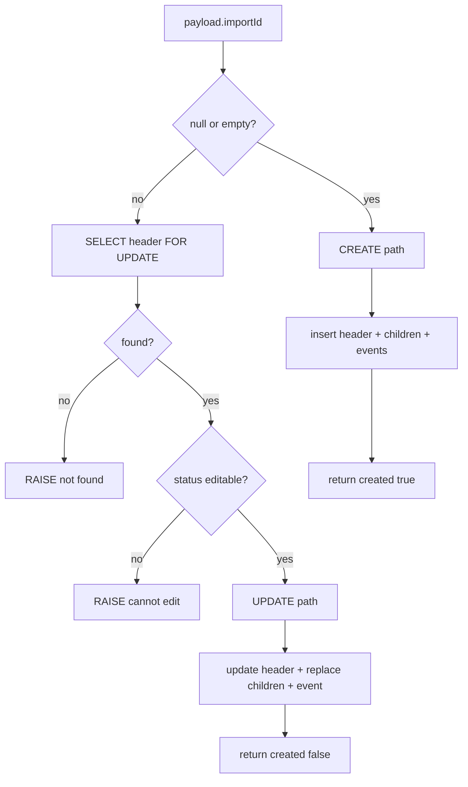

# Parcel Imports — Migration 002: Save Draft RPC Plan

**Status:** Planning only — **no SQL file, no app code, no API wiring**  
**Prerequisites:**

- [006_api_save_draft_plan.md](./006_api_save_draft_plan.md) — Phase 6 Save Draft / Load History plan
- [005_migration_001_validation.md](./005_migration_001_validation.md) — Migration 001 applied
- `supabase/migrations/20260818_create_parcel_imports.sql`

**Goal:** Plan Migration 002 SQL that adds `public.save_parcel_import_draft(payload jsonb)` — an atomic create/update for the parcel import draft bundle.

*Last updated: 2026-06-08*

---

## 1. Purpose

Migration 002 introduces a **single Postgres RPC** to persist Save Draft from the Parcel Imports admin page. One function call must atomically write:

- `parcel_imports` header
- `parcel_import_items`
- `parcel_import_item_mappings`
- `parcel_import_cost_allocations` (`allocation_run_type = 'preview'`)
- `parcel_import_events`

This migration exists because Phase 6 chose **Option B (RPC)** over client multi-step upserts — child replacement must not partially succeed.

**This document is not the SQL migration.** It defines function contract, validation, create/update flows, security, testing, and acceptance criteria before writing `supabase/migrations/YYYYMMDDHHMMSS_save_parcel_import_draft_rpc.sql`.

---

## 2. Scope

### In scope

| Item | Notes |
|------|-------|
| `public.save_parcel_import_draft(payload jsonb)` | Primary deliverable |
| Private helper functions (optional) | `parcel_safe_numeric`, `parcel_assert_enum`, etc. |
| Editable status guard | `draft`, `needs_review`, `ready_to_approve` only |
| Preserve `xls_*` on update | Never overwrite baseline from payload on update |
| Atomic child replace | Delete preview allocations → delete items (cascade mappings) → reinsert |
| Events | `parsed` on create; `draft_saved` every save |
| Return JSON | `import_id`, `status`, `created`, counts |
| `GRANT EXECUTE` | `authenticated` only |
| `REVOKE` from `anon` | Explicit deny |

### Out of scope

| Item | Deferred to |
|------|-------------|
| Approve RPC / CPI product updates | Phase 8 / Migration 003+ |
| `product_variants` / `products` writes | Phase 8 |
| Expense creation | Phase 9 |
| Inventory / `stock_ledger` | Phase 10+ |
| `parcel_mapping_memory` upsert | Phase 7 |
| Raw file Storage / `raw_file_storage_path` population | Future |
| `list_parcel_imports` / `load_parcel_import` RPC | Client `.from()` queries in Phase 6 |
| Product search / `product_id` resolution | Phase 7 |
| `override_changed` event | Optional later |
| `allocation_run_type = 'final'` | Phase 8 approve |

---

## 3. RPC signature

### Function

```sql
CREATE OR REPLACE FUNCTION public.save_parcel_import_draft(payload jsonb)
RETURNS jsonb
LANGUAGE plpgsql
SECURITY INVOKER
SET search_path = public
```

### Client call (planned)

```js
const { data, error } = await supabase.rpc('save_parcel_import_draft', { payload });
```

### Return shape

```json
{
  "import_id": "uuid",
  "status": "draft",
  "created": true,
  "item_count": 11,
  "allocation_count": 11
}
```

| Field | Type | Meaning |
|-------|------|---------|
| `import_id` | uuid string | Header PK (new or updated) |
| `status` | text | Persisted `parcel_imports.status` |
| `created` | boolean | `true` = insert path; `false` = update path |
| `item_count` | integer | Rows inserted in `parcel_import_items` |
| `allocation_count` | integer | Preview rows inserted in `parcel_import_cost_allocations` |

### Errors

Raise `EXCEPTION` with readable messages (caught by Supabase client as `error.message`):

```text
Authentication required
Invalid payload: expected JSON object
Missing parcel.parcelId
items must be a non-empty array
statusIntent must be draft, needs_review, or ready_to_approve
Import not found: {uuid}
Import cannot be edited: status is approved
Unknown allocation rowNumber: 99
Invalid row_type: Business Inventory
...
```

Use `RAISE EXCEPTION USING ERRCODE = 'P0001'` for application errors (consistent with other repo RPCs).

---

## 4. Security mode

### Recommendation: **SECURITY INVOKER**

| Factor | INVOKER | DEFINER |
|--------|---------|---------|
| RLS on parcel tables | `authenticated` ALL already grants full CRUD | Bypasses RLS — unnecessary |
| `auth.uid()` for `actor_id` | Natural caller identity | Must explicitly set / trust payload |
| Attack surface | Caller limited to own RLS policies | Elevated privileges |
| Repo precedent | Parcel tables designed for admin authenticated access | `rpc_import_amazon_orders` uses DEFINER to bypass `line_items_raw` RLS |

**Conclusion:** `SECURITY DEFINER` is **unnecessary for v1**. Parcel Import tables have permissive authenticated policies (validated in 005). INVOKER keeps writes attributable to the logged-in admin via RLS + `auth.uid()`.

### Auth requirements

1. `auth.uid() IS NOT NULL` — else `RAISE EXCEPTION 'Authentication required'`
2. Caller role: `authenticated` (browser JWT)
3. `GRANT EXECUTE ON FUNCTION public.save_parcel_import_draft(jsonb) TO authenticated`
4. `REVOKE EXECUTE ON FUNCTION public.save_parcel_import_draft(jsonb) FROM anon, public` (if needed)
5. No service role in browser

### `search_path`

`SET search_path = public` — standard hardening even for INVOKER.

---

## 5. Payload validation

Validation runs at the **start** of the function before any writes. Fail fast with readable errors.

### Structure

| Check | Rule | Error |
|-------|------|-------|
| Root | `payload` is jsonb object | `Invalid payload: expected JSON object` |
| `parcel` | object with non-empty `parcelId` | `Missing parcel.parcelId` |
| `items` | array, `jsonb_array_length > 0` | `items must be a non-empty array` |
| `mappings` | array (may be empty — RPC can synthesize) | `mappings must be an array` |
| `cpiPreview` | object with `rows` array | `cpiPreview.rows must be an array` |
| `cpiPreview.allocationMethod` | `weight_based` or `equal_split` | `Invalid allocationMethod` |
| `statusIntent` | `draft`, `needs_review`, `ready_to_approve` | `Invalid statusIntent` |
| `importId` | null or valid UUID text | `Invalid importId` |
| `fileMeta` | object (optional fields) | — |
| `overrides` | object | `Missing overrides object` |
| `xlsBaseline` | object (required on create) | `Missing xlsBaseline on create` |

### Per-item validation

| Field | Rule |
|-------|------|
| `rowNumber` | Required integer > 0; unique within `items` |
| `sourceItemName` | Non-empty string |
| `quantity` | null or integer ≥ 0 |
| `itemWeightGrams` | null or numeric ≥ 0 |
| `unitPriceCny`, `sellerFreightCny`, etc. | null or finite numeric ≥ 0 |
| String numerics | Reject `"NaN"`, `"Infinity"`, non-numeric strings |

### Per-mapping validation

| Field | Rule |
|-------|------|
| `rowNumber` | Must match an item `rowNumber` |
| `rowType` | DB enum only (see §9) |
| `mappingStatus` | DB enum only |
| `productId` / `productVariantId` | null or UUID (Phase 6: expect null) |

### Per-allocation validation

| Field | Rule |
|-------|------|
| `rowNumber` | Required; must match an item |
| `landedTotalCny` | Required numeric ≥ 0 |
| Cost/share fields | numeric ≥ 0 |
| `effectiveFxRate` | null or > 0 |

### Mapping coverage

- Every `items[]` row must have exactly one mapping (from payload or RPC-generated default)
- If `mappings` shorter than `items`, RPC may synthesize defaults:

```json
{
  "rowNumber": <n>,
  "rowType": "unknown",
  "mappingStatus": "needs_mapping",
  "mappedProductLabel": null,
  "mappedVariantLabel": null,
  "mappingSource": "imported_placeholder",
  "notes": null
}
```

- Duplicate `rowNumber` in mappings → error

### Numeric helpers (optional private functions)

```sql
-- parcel_jsonb_numeric(j jsonb, key text) → numeric NULL
-- Rejects NaN; uses (j->>key)::numeric in try/catch
```

Keep helpers in same migration file under `CREATE OR REPLACE FUNCTION parcel_*` — not exposed to client.

---

## 6. Create flow

**Condition:** `payload->>'importId'` is null, empty, or JSON `null`.

### Steps

| # | Action |
|---|--------|
| 1 | Validate payload (§5) |
| 2 | `INSERT INTO parcel_imports` — see column map §9 |
| 3 | Set `xls_*` from `xlsBaseline` / `parcel` (not from `overrides`) |
| 4 | Set `actual_*` from `overrides` |
| 5 | Set `status` = `statusIntent` |
| 6 | Set `raw_footer` = merge `parcel.raw` + `warnings.parseErrors` + `warnings.parseWarnings` |
| 7 | Set KPI counts from `cpiPreview.summary` |
| 8 | `imported_at` = `parcel.importedAt` if valid timestamptz else `now()` |
| 9 | Loop `items` → `INSERT parcel_import_items` → build `row_number → item_id` map |
| 10 | Loop `mappings` → `INSERT parcel_import_item_mappings` using map |
| 11 | Loop `cpiPreview.rows` → `INSERT parcel_import_cost_allocations` (`preview`) |
| 12 | `INSERT parcel_import_events` — `parsed` |
| 13 | `INSERT parcel_import_events` — `draft_saved` |
| 14 | Return `{ import_id, status, created: true, item_count, allocation_count }` |

### Columns left NULL on create

`expense_id`, `approved_at`, `approved_by`, `voided_at`, `voided_by`, `raw_file_storage_path`, all `final_*`, `approval_idempotency_key`, `cpi_update_applied_at`, `notes` (unless payload adds `notes` later).

---

## 7. Update flow

**Condition:** `payload.importId` is a valid UUID.

### Steps

| # | Action |
|---|--------|
| 1 | Validate payload (§5) |
| 2 | `SELECT * FROM parcel_imports WHERE id = importId FOR UPDATE` |
| 3 | If not found → `Import not found` |
| 4 | If `status IN ('approved', 'voided')` → `Import cannot be edited: status is {status}` |
| 5 | `UPDATE parcel_imports` — `actual_*`, `status`, file meta, KPI counts, `raw_footer` (optional merge) |
| 6 | **Do not update** `xls_*` columns (read baseline from existing row; ignore payload `xlsBaseline` for those columns) |
| 7 | `DELETE FROM parcel_import_cost_allocations WHERE parcel_import_id = $id AND allocation_run_type = 'preview'` |
| 8 | `DELETE FROM parcel_import_items WHERE parcel_import_id = $id` (cascade deletes mappings) |
| 9 | Reinsert items → rebuild `row_number → item_id` map |
| 10 | Reinsert mappings |
| 11 | Reinsert preview allocations |
| 12 | `INSERT parcel_import_events` — `draft_saved` only (no second `parsed`) |
| 13 | Return `{ import_id, status, created: false, item_count, allocation_count }` |

### Editable statuses

| Status | Update allowed |
|--------|----------------|
| `draft` | Yes |
| `needs_review` | Yes |
| `ready_to_approve` | Yes |
| `approved` | **No** |
| `voided` | **No** |
| `error` | **No** in v1 (future: explicit reset flow) |

### `FOR UPDATE`

Lock header row during child replace to reduce concurrent save races from two browser tabs.

---

## 8. Child replacement order

On **update** only (create has no deletes):

```
1. DELETE parcel_import_cost_allocations
     WHERE parcel_import_id = $id AND allocation_run_type = 'preview'

2. DELETE parcel_import_items
     WHERE parcel_import_id = $id
     -- ON DELETE CASCADE removes parcel_import_item_mappings

3. INSERT parcel_import_items (batch loop or INSERT…SELECT FROM jsonb_array_elements)

4. INSERT parcel_import_item_mappings (join row_number → new item ids)

5. INSERT parcel_import_cost_allocations (preview rows)
```

**Why allocations first:** No FK from allocations to mappings; deleting items cascade-deletes mappings but not allocations (allocations FK to items). Allocations must be deleted explicitly before items.

**Why not delete mappings explicitly:** Cascade from items is sufficient and avoids ordering bugs.

---

## 9. JSON path mapping

Canonical payload defined in [006_api_save_draft_plan.md](./006_api_save_draft_plan.md) §4. RPC reads **camelCase** JSON paths (app sends JS-shaped payload).

### Transform rule (enums)

**Recommendation:** App mapper (`parcelImportsMappers.js`) encodes UI labels → DB snake_case **before** RPC. RPC **validates DB values only** — rejects UI labels like `"Business Inventory"`.

| Payload path | DB column | Create | Update |
|--------------|-----------|--------|--------|
| `fileMeta.name` | `source_file_name` | set | set |
| `fileMeta.sizeBytes` | `file_size_bytes` | set | set |
| `fileMeta.hash` | `file_hash` | set | set |
| `fileMeta.sourceFormat` | `source_format` | set | set |
| `parcel.parcelId` | `parcel_id` | set | set (allow correction) |
| `statusIntent` | `status` | set | set |
| `parcel.importedAt` | `imported_at` | set | **preserve** existing |
| `xlsBaseline.*` / `parcel.*` | `xls_*` | set from baseline | **preserve DB** |
| `overrides.parcelWeightGrams` | `actual_parcel_weight_grams` | set | set |
| `overrides.chargedWeightGrams` | `actual_charged_weight_grams` | set | set |
| `overrides.shipmentFeeCny` | `actual_shipment_fee_cny` | set | set |
| `overrides.serviceFeeCny` | `actual_service_fee_cny` | set | set |
| `overrides.insuranceYes` | `actual_insurance_yes` | set | set |
| `overrides.insuranceCny` | `actual_insurance_cny` | set | set |
| `overrides.totalParcelChargeCny` | `actual_total_charge_cny` | set | set |
| `overrides.effectiveFxRate` | `effective_fx_rate` | set | set |
| `overrides.usdEquivalent` | `usd_equivalent` | set | set |
| `parcel.totalItems` | `xls_total_items` | set | preserve |
| `parcel.parcelWeightGrams` | `xls_parcel_weight_grams` | set | preserve |
| `parcel.chargedWeightGrams` | `xls_charged_weight_grams` | set | preserve |
| `parcel.totalItemFeeCny` | `xls_total_item_fee_cny` | set | preserve |
| `parcel.shipmentFeeCny` | `xls_shipment_fee_cny` | set | preserve |
| `parcel.insuranceLabel` | `xls_insurance_text` | set | preserve |
| `parcel.insuranceCny` | `xls_insurance_cny` | set | preserve |
| `parcel.serviceFeeCny` | `xls_service_fee_cny` | set | preserve |
| `parcel.totalParcelChargeCny` | `xls_total_parcel_charge_cny` | set | preserve |
| `warnings` + `parcel.raw` | `raw_footer` | jsonb build | merge or replace (see below) |
| `cpiPreview.summary.productsAffected` | `products_affected_count` | set | set |
| `cpiPreview.summary.rowsExcluded` | `rows_excluded_count` | set | set |
| `cpiPreview.summary.needsMappingRows` | `rows_needing_mapping_count` | set | set |

**`raw_footer` on update:** Replace entire `raw_footer` from payload (simpler v1). Parser warnings at save time are authoritative.

### Item paths → `parcel_import_items`

| Payload `items[]` | DB column |
|-------------------|-----------|
| `rowNumber` | `row_number` |
| `exportRowNo` | `export_row_no` |
| `sourceItemName` | `source_item_name` |
| `sellerName` | `seller_name` |
| `baestaoOrderId` | `baestao_order_id` |
| `unitPriceCny` | `unit_price_cny` |
| `quantity` | `quantity` |
| `itemWeightGrams` | `item_weight_grams` |
| `sellerFreightCny` | `seller_freight_cny` |
| `rowTotalCny` | `row_total_cny` |
| `lineItemSubtotalCny` | `line_item_subtotal_cny` |
| `removePackage` | `remove_package` |
| `raw` | `raw` |
| `rowIssues` (+ row warnings) | `parser_warnings` |

### Mapping paths → `parcel_import_item_mappings`

| Payload `mappings[]` | DB column |
|----------------------|-----------|
| (resolved item id) | `parcel_import_item_id` |
| (header id) | `parcel_import_id` |
| `mappedProductLabel` | `mapped_product_label` |
| `mappedVariantLabel` | `mapped_variant_label` |
| `rowType` | `row_type` — **DB enum** |
| `mappingStatus` | `mapping_status` — **DB enum** |
| `productId` | `product_id` |
| `productVariantId` | `product_variant_id` |
| `mappingSource` | `mapping_source` |
| `notes` | `notes` |

**Allowed `row_type`:** `business_inventory`, `personal_excluded`, `supplies`, `unknown`  
**Allowed `mapping_status`:** `needs_mapping`, `matched`, `variant_uncertain`, `personal_excluded`, `parser_warning`

### Allocation paths → `parcel_import_cost_allocations`

| Payload `cpiPreview.rows[]` | DB column |
|-----------------------------|-----------|
| — | `allocation_run_type` = `'preview'` |
| `cpiPreview.allocationMethod` | `allocation_method` |
| `productCostCny` | `product_cost_cny` |
| `sellerFreightCny` | `seller_freight_cny` |
| `parcelShippingShareCny` | `parcel_shipping_share_cny` |
| `serviceShareCny` | `service_share_cny` |
| `insuranceShareCny` | `insurance_share_cny` |
| `fxPaymentShareCny` | `fx_payment_share_cny` |
| `landedTotalCny` | `landed_total_cny` |
| `landedCpiCny` | `landed_cpi_cny` |
| `landedCpiUsd` | `landed_cpi_usd` |
| `effectiveFxRate` (row or summary) | `effective_fx_rate` |
| `includedInProductCpiPreview` | `included_in_product_cpi_preview` |
| — | `included_in_final_product_cpi` = `false` |
| `warnings` | `warnings` |

**App encoding for `allocationMethod`:** `costAllocation.js` returns `weight` / `equal` → mapper sends `weight_based` / `equal_split`.

---

## 10. Allocation mapping

### Linkage strategy

1. After item inserts, build temp map: `row_number integer → parcel_import_item.id uuid`
2. For each `cpiPreview.rows[]` element:
   - Read `rowNumber` (required)
   - Lookup `item_id` in map; if missing → `Unknown allocation rowNumber: N`
   - Insert allocation with `parcel_import_item_id = item_id`

### Count expectations

- `allocation_count` should equal `jsonb_array_length(cpiPreview.rows)`
- Typically equals `item_count` (one allocation per item)
- Mismatch allowed if app sends subset? **v1: require 1:1** — every item has exactly one allocation row; error if counts differ

### `landed_total_cny` NOT NULL

DB column has no default. RPC must always supply value from payload row.

---

## 11. Events

### `parsed` (create only)

```json
{
  "event_type": "parsed",
  "event_message": "Baestao file parsed and draft created",
  "event_payload": {
    "parcelId": "227461",
    "itemCount": 11,
    "fileHash": "abc…",
    "sourceFileName": "sample_baestao_waybill_227461.xls"
  },
  "actor_id": "<auth.uid()>"
}
```

### `draft_saved` (every save)

```json
{
  "event_type": "draft_saved",
  "event_message": "Draft saved",
  "event_payload": {
    "status": "needs_review",
    "itemCount": 11,
    "productsAffected": 3,
    "rowsNeedingMapping": 2,
    "rowsExcluded": 1
  },
  "actor_id": "<auth.uid()>"
}
```

### Not in RPC v1

- `override_changed` — client can add later when dirty-field tracking is sent in payload
- `mapping_changed` — too noisy on every save

---

## 12. Duplicate behavior

RPC **does not** check or block:

- Duplicate `parcel_id`
- Duplicate `file_hash`

Duplicate warnings remain in client `checkDuplicateParcelImport()` (006 §9). No new UNIQUE constraints in Migration 002.

---

## 13. Transaction behavior

`save_parcel_import_draft` is a single PL/pgSQL function → **one database transaction**.

| Outcome | Effect |
|---------|--------|
| Success | All inserts/deletes commit together |
| Any `RAISE EXCEPTION` | Full rollback — no orphan header without items |
| Constraint violation | Rollback entire save |

This atomicity is the primary justification for the RPC (006 §6 Option B).

---

## 14. RLS / permissions

With **SECURITY INVOKER**:

- Inserts/updates/deletes run as `authenticated` role
- Existing policies (`parcel_*_authenticated_all`) permit all operations
- `anon` has no policies → cannot execute meaningfully even if granted (still revoke EXECUTE)

### Migration 002 grants (planned)

```sql
REVOKE ALL ON FUNCTION public.save_parcel_import_draft(jsonb) FROM PUBLIC;
GRANT EXECUTE ON FUNCTION public.save_parcel_import_draft(jsonb) TO authenticated;
```

### `auth.uid()` null

```sql
IF auth.uid() IS NULL THEN
  RAISE EXCEPTION 'Authentication required';
END IF;
```

`actor_id` on events = `auth.uid()`.

---

## 15. Testing plan for RPC

### Fixture payload

Build JSON from `docs/pages/admin/parcelImport/fixtures/sample_baestao_waybill_227461.xls` parse output (11 rows, parcel `227461`). Store as `docs/pages/admin/parcelImport/fixtures/save_draft_payload_v1.json` when implementing tests (optional).

### SQL / RPC tests

| # | Test | Expected |
|---|------|----------|
| 1 | Call with valid payload, `importId` null | `created: true`, 11 items, 11 allocations, 2 events |
| 2 | Call again with returned `importId` | `created: false`, same counts, no duplicate children |
| 3 | Verify child counts after update | `COUNT(items)=11`, not 22 |
| 4 | Update `approved` import | Error: cannot edit |
| 5 | Update `voided` import | Error: cannot edit |
| 6 | Missing `parcel.parcelId` | Error before any write |
| 7 | Two imports same `parcel_id` | Both succeed |
| 8 | Allocation with bad `rowNumber` | Full rollback; no header row |
| 9 | Invalid `row_type` enum | Rollback |
| 10 | `xls_shipment_fee_cny` unchanged after override-only update | Baseline preserved |
| 11 | `auth.uid()` null (service role or direct SQL) | `Authentication required` |

### Validation script (planned)

`scripts/supabase/validate-parcel-migration-002-rpc.sql` — similar to 001 validator; uses `ROLLBACK` wrapper or test import cleanup by `parcel_id LIKE 'rpc-val-%'`.

### Authenticated client test

Phase 6 manual: logged-in admin calls `supabase.rpc('save_parcel_import_draft', { payload })` from browser; verify `actor_id` populated in events.

---

## 16. Migration validation checklist

Run after `supabase/migrations/…_save_parcel_import_draft_rpc.sql` applied (linked `-f` or `migration repair`).

### Function / grants

- [ ] `SELECT proname FROM pg_proc WHERE proname = 'save_parcel_import_draft'`
- [ ] `prosecdef = false` (INVOKER)
- [ ] `GRANT EXECUTE` to `authenticated` only
- [ ] `anon` cannot execute (permission denied)

### Functional

- [ ] Create path returns `created: true`
- [ ] Update path returns `created: false`
- [ ] Child replacement — no duplicate items after update
- [ ] Preview allocations replaced (not accumulated)
- [ ] Events: `parsed` + `draft_saved` on create; `draft_saved` only on update
- [ ] `xls_*` preserved on update when `actual_*` changed
- [ ] `approved` / `voided` update rejected
- [ ] Invalid payload rejected with readable error
- [ ] Error mid-save rolls back (no partial header)

### Safety grep

- [ ] No `UPDATE public.products`
- [ ] No `UPDATE public.product_variants`
- [ ] No `INSERT INTO stock_ledger`
- [ ] No `INSERT INTO expenses`
- [ ] No `approve` function created

---

## 17. Acceptance criteria (this document)

- [x] `007_migration_002_rpc_plan.md` exists
- [x] No SQL migration created
- [x] No app code changed
- [x] RPC signature and return shape planned
- [x] Create/update/validation/events documented
- [x] Testing plan documented
- [x] Next step identified: write Migration 002 SQL

---

## 18. Migration file plan

### Naming

```
supabase/migrations/20260819_save_parcel_import_draft_rpc.sql
```

Use timestamp **after** `20260818_create_parcel_imports.sql`.

### Contents (outline)

1. Optional helper functions (`parcel_jsonb_*`)
2. `CREATE OR REPLACE FUNCTION public.save_parcel_import_draft(payload jsonb)`
3. `REVOKE` / `GRANT EXECUTE`
4. `COMMENT ON FUNCTION`
5. Comment block: validation queries + sample `SELECT save_parcel_import_draft('…'::jsonb)` for manual test (rollback wrapper)

### Apply method

Same as Migration 001 (005 report):

```powershell
npx supabase db query --linked -f supabase/migrations/20260819_save_parcel_import_draft_rpc.sql
npx supabase migration repair --linked --status applied 20260819
```

---

## 19. Unresolved questions before SQL

| # | Question | Proposed default |
|---|----------|------------------|
| 1 | Require `allocation_count === item_count` strictly? | **Yes** — 1:1 in v1 |
| 2 | Update `parcel_id` on save if operator corrects typo? | **Yes** — allow on update |
| 3 | Update `imported_at` on re-save? | **No** — preserve original |
| 4 | Replace vs merge `raw_footer` on update? | **Replace** from payload |
| 5 | Accept `productId` UUID in payload when Phase 7 starts? | Schema ready; validate UUID format; FK optional |
| 6 | Synthesize missing mappings in RPC or require app to send full array? | **RPC synthesizes** defaults for missing rowNumbers |
| 7 | Single INSERT…SELECT from `jsonb_array_elements` vs loop? | **Loop in PL/pgSQL** for clearer errors (v1); optimize later |
| 8 | Include `notes` field in payload? | Optional text; null in v1 UI |
| 9 | Re-validate `statusIntent` server-side against mapping state? | **Trust client** in v1; RPC only checks enum membership |
| 10 | Test RPC via SQL Editor without JWT? | Use `SET LOCAL role` / authenticated E2E only; document JWT requirement |

---

## Appendix A — Create vs update decision



---

## Appendix B — Related documents

| Doc | Role |
|-----|------|
| [006_api_save_draft_plan.md](./006_api_save_draft_plan.md) | Payload shape, Phase 6 UI/API |
| [005_migration_001_validation.md](./005_migration_001_validation.md) | Schema + RLS baseline |
| [004_migration_001_plan.md](./004_migration_001_plan.md) | Table definitions |
| `scripts/supabase/validate-parcel-migration-001.sql` | Validation pattern |

---

## Appendix C — Next steps after Migration 002

| Order | Task |
|-------|------|
| 1 | Write + apply `20260819_save_parcel_import_draft_rpc.sql` |
| 2 | Run §16 checklist; add `validate-parcel-migration-002-rpc.sql` |
| 3 | Implement `js/admin/parcelImports/api/parcelImportsMappers.js` (encode enums) |
| 4 | Implement `parcelImportsApi.js` → `supabase.rpc('save_parcel_import_draft')` |
| 5 | Wire Save Draft button per 006 §14 |
